# ARTEX

## 목차

- [무엇을 하는 시스템인가](#무엇을-하는-시스템인가)
- [한국어 문서와 코드 읽기](#한국어-문서와-코드-읽기)
- [화면 미리보기](#화면-미리보기)
- [주요 기능](#주요-기능)
- [설치와 실행](#설치와-실행)
- [설정과 저장 위치](#설정과-저장-위치)
- [개발과 검증](#개발과-검증)
- [업데이트와 독립 저장소 관리](#업데이트와-독립-저장소-관리)
- [핵심 구조](#핵심-구조)
- [원본 라이선스와 고지](#원본-라이선스와-고지)

## 무엇을 하는 시스템인가

ARTEX 자체가 학습된 AI 모델을 포함하는 것은 아닙니다. 외부 LLM을 호출하고,
모델이 선택한 도구 실행과 결과 저장을 조정하는 **애플리케이션과 실행 엔진**입니다.
에이전트 세션, 도구, 대화 기록, 권한 처리의 기반은
[`norma` SDK v0.4.3](https://github.com/Autumn-27/norma/tree/v0.4.3)입니다.

| 구성 | 실제 역할 | 먼저 읽을 코드 |
| --- | --- | --- |
| 목표 분해 `goals` | 요청을 최종 목표와 범위로 정리한 뒤 작업 시작 | [server/goals.go](server/goals.go) |
| 계획 `planner` | 탐색 상태를 읽고 실행 의도·목표 판단 생성 | [agent/planner.go](agent/planner.go) |
| 실행 `worker` | 의도 하나를 수령해 도구 호출·관찰·발견 기록 | [agent/worker.go](agent/worker.go) |
| 작업 내 대화 `mainagent` | 사용자가 진행 상황을 묻고 방향을 조정 | [agent/mainagent.go](agent/mainagent.go) |
| 스케줄링 `Engine` | 계획자 1개와 실행자 N개의 생명주기·중단·재개 | [server/engine.go](server/engine.go) |
| 영속 저장 `db` | 작업·자산·탐색·활동·설정·증거 참조 관리 | [db/schema.sql](db/schema.sql) |
| 웹 화면 `web` | REST API와 SSE로 조회·수정·실시간 표시 | [화면 가이드](docs/ko/modules/web-pages.md) |

실행자 수의 기본값은 작업당 3개입니다. Go의 goroutine을 사용하며 에이전트마다
독립 운영체제 컨테이너가 자동 생성되는 구조는 아닙니다.

## 한국어 문서와 코드 읽기

| 문서 | 설명하는 내용 |
| --- | --- |
| [한국어 문서 안내](docs/ko/README.md) | 읽는 순서와 용어 |
| [전체 동작 해설](docs/ko/architecture.md) | 요청 → 계획 → 실행 → 저장 → 종료 |
| [전체 파일 지도](docs/ko/file-map.md) | 모든 원본 파일과 한국어 해설 위치 |
| [에이전트·컨텍스트](docs/ko/modules/agents.md) | 세션·도구 조립·압축·모델 전환·보조 질문 |
| [서버·API·실행 엔진](docs/ko/modules/server.md) | Manager·Engine·인증·SSE·복구 |
| [데이터베이스](docs/ko/modules/database.md) | 스키마·두 그래프·중복 제거·원자적 수령 |
| [지원 서비스](docs/ko/modules/services.md) | 트래픽·증거·승인·알림·보고서·업데이트 |
| [화면별 프런트엔드](docs/ko/modules/web-pages.md) | 페이지·탭·컴포넌트와 서버 데이터 |
| [프런트엔드 기반](docs/ko/modules/web-core.md) | API·훅·상태·공통 UI·테마·Mock |
| [실행·빌드·설정](docs/ko/development.md) | 스크립트·환경변수·로컬 빌드·테스트 |
| [Skill·참고 스크립트](docs/ko/skills.md) | Skill 문서와 실행 코드의 연결 |
| [트래픽 증거 상세](docs/ko/traffic-evidence.md) | 증거 바인딩·ID·보고서 버전·내보내기 |
| [개선·다른 분야 응용](docs/ko/improvements.md) | 한계·수정 우선순위·다른 분야 확장 |
| [검증 기록](docs/ko/validation.md) | 실제 검증 범위와 미실행 항목 |
| [변경 기록](CHANGELOG.md) | 원본 버전과 한국어 해설판의 변화 |

주석은 파일의 역할과 핵심 로직 가까이에 있습니다. 테스트에도 검증하는 계약과
예외 상황을 설명합니다. JSON·잠금 파일·이미지·라이선스처럼 주석을 넣으면 형식이나
원문이 훼손되는 파일은 파일 지도와 설정 문서에서 설명합니다.

### 화면 용어

| 원문 | 한국어 | 코드 개념 |
| --- | --- | --- |
| 仪表盘 | 대시보드 | 전체 활동·통계 |
| 任务 | 작업 | `task` |
| 探索链路 | 탐색 경로 | 탐색 노드와 관계 |
| 意图 | 실행 의도 | `intent`, 실행자가 수령하는 단위 |
| 事实 | 관찰 사실 | `fact`, 관찰·추론 기록 |
| 发现 / 漏洞 | 발견 사항 / 취약점 | `finding` |
| 资产 | 자산 | `asset` |
| 流量录制 | 트래픽 기록 | 프록시를 통과한 HTTP |
| 拦截审批 | 실행 차단·승인 | `intercept` |
| 复测 | 재검증 | `retest` |
| 提示 | 추가 지시·힌트 | `hint` |
| 冷区摘要 | 비활성 영역 요약 | `digest` |

## 화면 미리보기

원본 [온라인 데모](https://artex-demo.vercel.app/)는 화면 참고 자료입니다.
저장소의 Mock 모드는 예시 데이터를 사용하므로 실제 실행 결과의 증명이 아닙니다.

| 대시보드 | 작업 목록 |
| :---: | :---: |
| 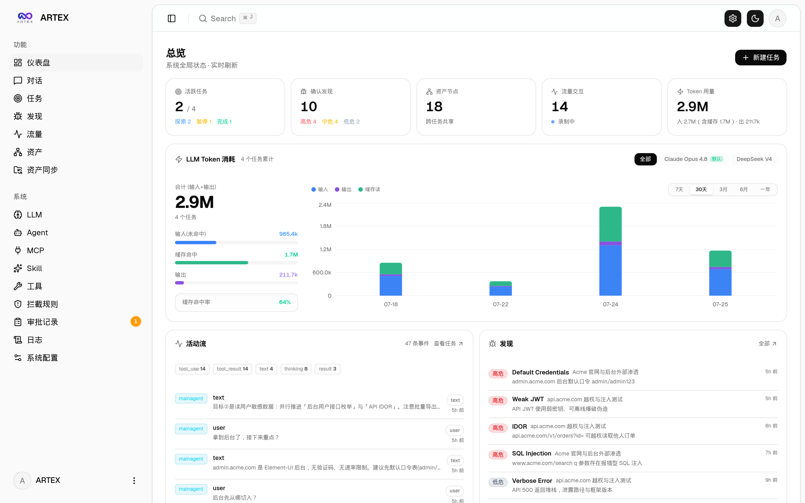 | 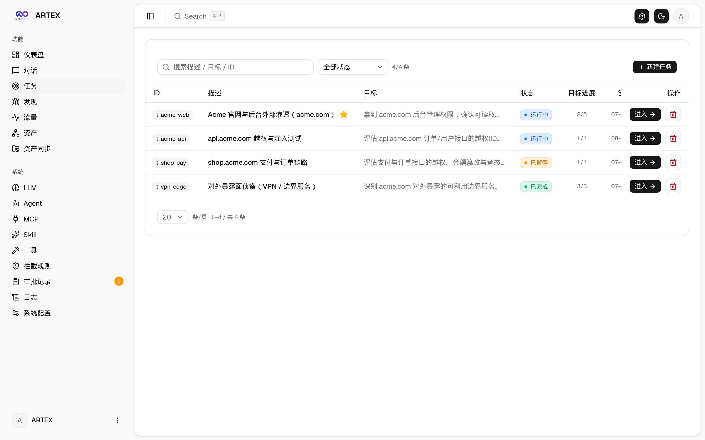 |

| 실행 세션·도구 호출 | 탐색 그래프 |
| :---: | :---: |
| 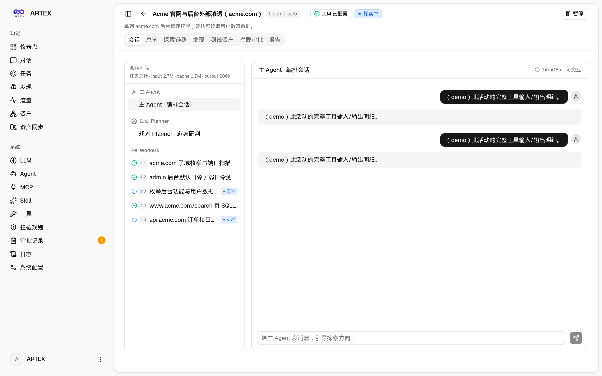 | 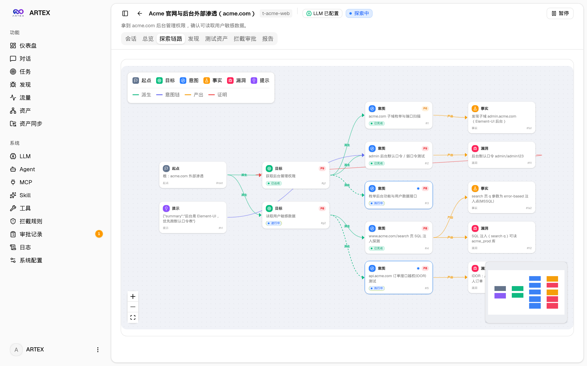 |

| 발견 사항 | 자산 |
| :---: | :---: |
| 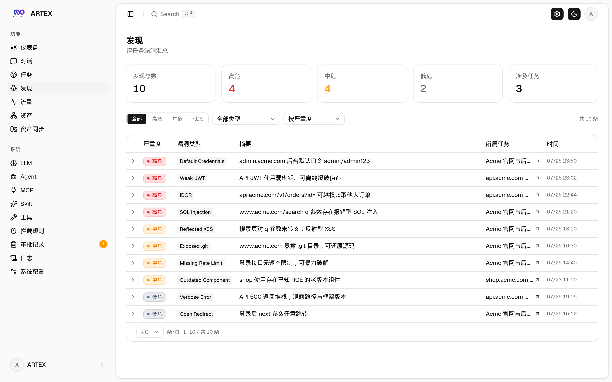 | 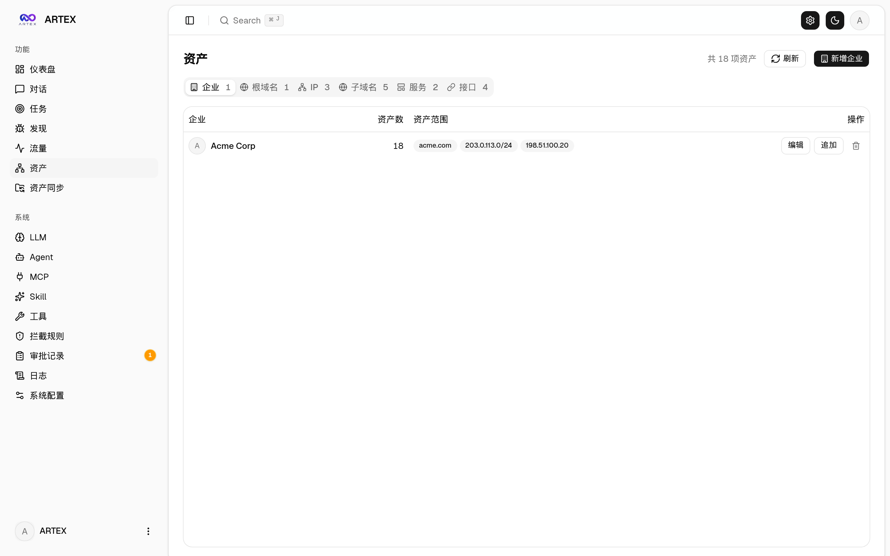 |

| 자산 커버리지 그래프 |
| :---: |
| 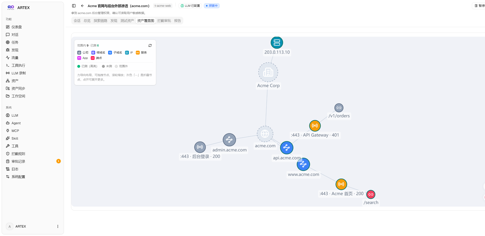 |

| 트래픽 | 사용자 대화 |
| :---: | :---: |
| 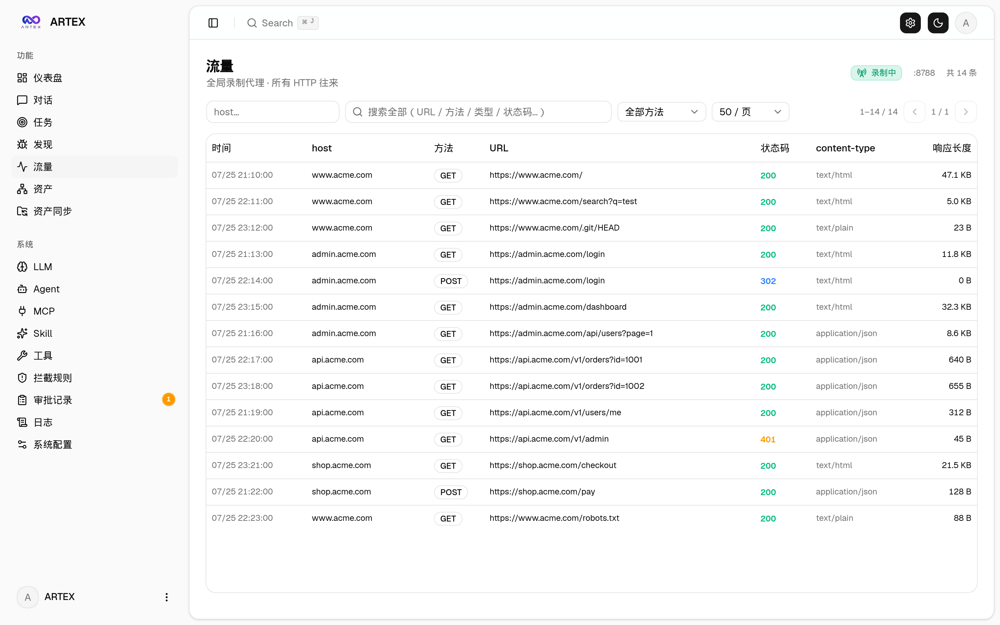 |  |

| 에이전트 설정 | LLM 설정 |
| :---: | :---: |
| 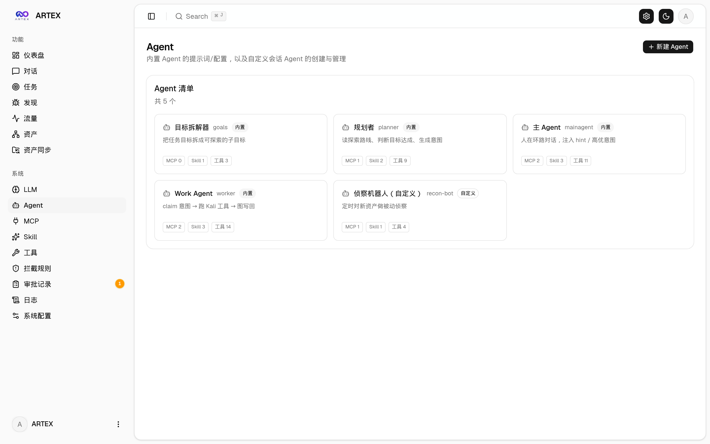 | 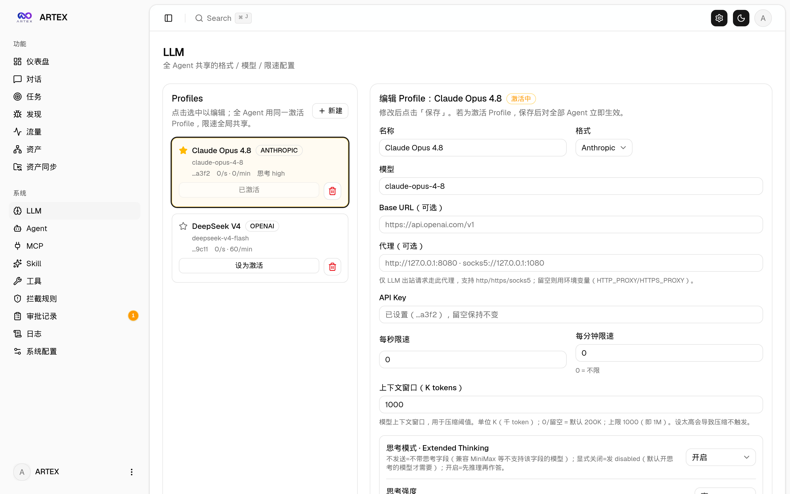 |

| 실행 승인 | 백엔드 로그 |
| :---: | :---: |
| 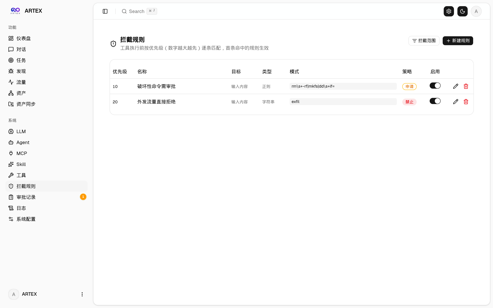 | 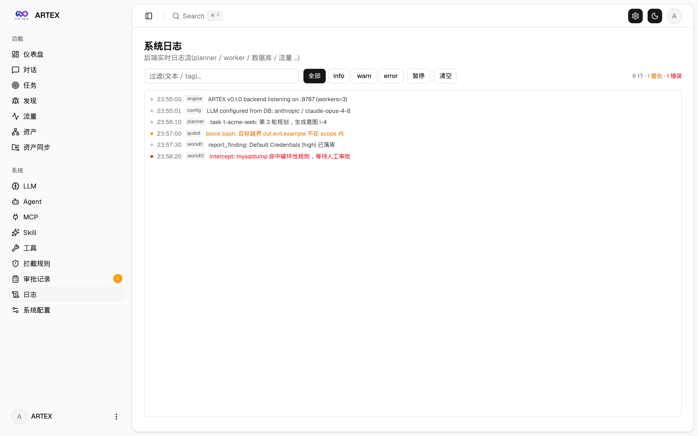 |

## 주요 기능

- **작업과 탐색 그래프**: 목표·의도·관찰·발견·힌트를 연결해 진행 근거를 추적합니다.
- **공유 자산 저장소**: 도메인·IP·서비스·앱·엔드포인트를 작업 간 재사용합니다.
- **사용자 개입**: 대화·힌트·승인·일시 중지·재개로 방향을 조정합니다.
- **증거 보존**: 발견 사항에 HTTP 요청·응답 스냅샷을 연결하고 보고서를 생성합니다.
- **수동 재검증**: 발견 사항별 독립 세션으로 재검증합니다. 정상 완료한 결과가 `fixed`일 때 처치 상태를 갱신하며 기존 증거는 유지합니다.
- **MCP·Skills·사용자 도구**: 외부 도구와 절차 문서를 에이전트에 연결합니다.
- **ScopeSentry 동기화**: 주소·API Key를 설정하고 프로젝트·작업·유형별 자산을 가져옵니다.
- **LLM 설정·기록**: 모델 전환·토큰 계측·선택적 요청 본문 기록을 관리합니다.
- **알림**: DingTalk·Feishu·WeCom·Webhook·Telegram·이메일로 실시간/묶음 전송합니다.

승인 상세 UI의 원본 참고 출처는
[AegisHook CallDetail](https://github.com/RuoJi6/AegisHook/blob/main/web/src/components/CallDetail.vue)이며
기존 ARTEX 컴포넌트와 테마를 사용합니다. 원본의 기타 참고 프로젝트는
[Cairn](https://github.com/oritera/Cairn)입니다.

## 설치와 실행

### 이 저장소의 소스로 실행하기

Go는 [go.mod](go.mod)의 `1.26.3`을 기준으로 맞추세요. 프런트엔드에는 Node.js/npm이
필요하며 원본 릴리스 CI는 Node.js 22를 사용합니다. PostgreSQL과 외부 LLM도 필요합니다.
다음은 로컬 학습 환경에서의 절차입니다.

```bash
git clone https://github.com/Chang-Daegyu/ARTEX.git
cd ARTEX

# 실제 PostgreSQL 주소·포트·계정·암호를 설정합니다.
# skill_dir은 설치 위치에 맞추거나 빈 문자열로 바꿉니다.
cp config.example.json config.json

cd web
npm ci
npm run build:static
cd ..

# Go에 포함할 정적 파일 디렉터리를 먼저 만듭니다.
mkdir -p server/webui/dist
cp -R web/out/. server/webui/dist/

CGO_ENABLED=0 go build -tags embedui -trimpath -o artex ./cmd/artex
./start.sh -addr 127.0.0.1:8787 -proxy 127.0.0.1:8788
```

`http://localhost:8787`을 열고 최초 `/setup`에서 관리자 암호를 설정합니다.
로그인 이름은 원본 코드에서 `ARTEX`로 고정되어 있습니다. 비공개 저장소 복제에는
본인의 GitHub 인증이 필요합니다. LLM은 화면에서도 설정할 수 있습니다.

`start.sh`는 종료 코드에 따라 프로그램을 재실행하는 스크립트입니다.
Windows에서는 `start.bat`를 사용합니다. `0`은 종료, `75`는 요청된 재시작,
나머지는 최대 60초까지 늘어나는 대기 후 재시작입니다.

### 원본 설치 스크립트와 Docker Compose

```bash
./install.sh
```

스크립트는 Docker 또는 로컬 컴파일을 선택하게 합니다. Docker가 없으면 설치 절차도
제안하며, 로컬 방식은 기존 PostgreSQL 또는 Docker DB를 선택합니다.
**기본 앱 이미지는 `autumn27/artex:${ARTEX_TAG:-latest}`입니다.**
Compose 실행은 이 저장소의 소스 빌드가 아니라 원본 배포 이미지를 실행합니다.

```bash
cp .env.example .env
# .env의 POSTGRES_PASSWORD를 실제 값으로 설정합니다.
docker compose up -d
```

Compose는 PostgreSQL 16과 앱을 실행하며 `./data`, `./skills`, `pgdata` 볼륨을 씁니다.
앱 포트 `8787`은 기본 파일에서 모든 인터페이스에, 프록시 `8788`은 호스트
`127.0.0.1`에 바인딩됩니다.

### 릴리스·자체 이미지 빌드

[원본 Releases](https://github.com/Autumn-27/ARTEX/releases)는 원본 배포 바이너리입니다.
이 저장소 소스를 빌드하려면 앞의 명령 또는 다음 스크립트를 사용합니다.

```bash
# 원본 지원 대상 5종: Linux/macOS amd64·arm64, Windows amd64
./build.sh --release

# 필요한 대상만 선택할 수 있습니다.
ARTEX_TARGETS=linux/amd64,windows/amd64 ./build.sh --release
```

`build.sh`에는 npm·Go 외에 `rsync`, ZIP 생성 시 `zip`이 필요합니다.
기본은 Go linker 최적화와 ZIP 압축이며 UPX는 사용하지 않습니다.
`--upx`는 호환성을 확인한 환경에서 선택하는 원본 옵션입니다.

Dockerfile은 **미리 컴파일한 바이너리를 넣는 실행 이미지**입니다.
`dist/<아키텍처>/artex`를 먼저 준비해야 합니다. 자세한 구성은
[실행·빌드 문서](docs/ko/development.md)를 확인하세요.

## 설정과 저장 위치

### PostgreSQL

`config.example.json`의 예제 포트는 `5433`입니다. 실제 DB 포트와 맞추세요.

```json
{
  "database": {
    "host": "127.0.0.1",
    "port": 5432,
    "user": "artex",
    "password": "여기에 실제 암호를 설정",
    "dbname": "artex",
    "sslmode": "disable"
  },
  "skill_dir": ""
}
```

`ARTEX_PG_DSN`은 파일 DB 설정보다 우선합니다. 파일의 `database.dsn`이 있으면 개별
필드보다 우선합니다. `ARTEX_CONFIG`는 설정 파일 경로, `ARTEX_SKILL_DIR`는 Skill
디렉터리입니다. `skill_dir`이 비어 있으면 기본 `skills/`를 사용합니다.

### LLM·MCP

`ANTHROPIC_API_KEY` 또는 `OPENAI_API_KEY`를 환경변수로 제공하거나 LLM 설정 화면에서
등록합니다. 선택 변수는 `ARTEX_LLM_PROVIDER`, `ARTEX_LLM_MODEL`,
`ARTEX_LLM_BASE_URL`, `ARTEX_LLM_PROXY`입니다. 실제 비밀값은 저장소에 커밋하지 않습니다.

원격 MCP는 Streamable HTTP와 구형 SSE를 지원합니다. 구형 SSE는 보통 `/sse`에서
연결을 열고 서버가 알리는 메시지 주소로 JSON-RPC를 보냅니다.
URL과 `Authorization=Bearer <token>` 같은 헤더는 해당 서버 규격에 맞춥니다.

### 데이터

| 위치 | 내용 |
| --- | --- |
| PostgreSQL | 작업·자산·탐색·활동·설정·발견·증거 메타데이터 |
| `data/traffic` | HTTP 기록의 SQLite 인덱스와 큰 본문 파일 |
| `data/evidence` | 발견 사항에 연결한 독립 증거 본문 |
| `data/tasks` | 실행 의도별 작업 디렉터리·산출물 |
| 실행 파일 기준 `jwt.key` | 서명 키. 현재는 일반 작업 데이터 디렉터리 밖에 저장 |
| `skills/` | 절차 문서와 참고 스크립트 |

원본 문서 일부의 “`data/` 안에 `jwt.key`가 있다”는 설명은 현재 구현과 다릅니다.
기본 Compose의 `/app/data` 바인딩만으로 `/app/jwt.key`까지 보존되지 않습니다.
DB·증거·작업 파일·서명 키를 구분해서 백업 구조를 정하세요.

### HTTPS 역방향 프록시와 SSE

프런트엔드·API·SSE는 같은 백엔드 포트에서 제공됩니다. 기본은 같은 출처의 SSE이므로
`NEXT_PUBLIC_SSE_BASE`를 따로 설정할 필요가 없습니다. 역방향 프록시에서는
SSE 버퍼링을 끄고 긴 읽기 제한 시간을 적용해야 합니다.

```nginx
location / {
    proxy_pass http://127.0.0.1:8787;
    proxy_set_header Host $host;
    proxy_set_header X-Forwarded-Proto $scheme;
    proxy_buffering off;
    proxy_cache off;
    proxy_read_timeout 3600s;
    proxy_http_version 1.1;
    proxy_set_header Connection "";
}
```

SSE를 다른 도메인으로 분리할 때만 `NEXT_PUBLIC_SSE_BASE`를 **빌드 시점**에 설정합니다.
빌드한 뒤 컨테이너 환경변수만 바꿔도 적용되는 설정이 아닙니다.

## 개발과 검증

```bash
./dev.sh
# 백엔드 :8787 / 프록시 127.0.0.1:8788 / Next 개발 화면 :5173
```

개별 실행은 `go run ./cmd/artex`, `cd web && npm run dev`입니다.
화면만 보는 Mock은 `cd web && NEXT_PUBLIC_MOCK=1 npm run dev`로 실행합니다.

기존 테스트는 `go test ./...`에 포함되지만 DB 의존 테스트에는 별도 PostgreSQL이
필요합니다. 설정이 없으면 건너뛰는 테스트도 있어, 명령 종료만으로 모든 통합 검증이
수행되었다고 판단하면 안 됩니다. 새로 만든 전용 테스트 DB를 사용하세요.

한국어판에서 실제 수행한 검증과 미실행 항목은 [검증 기록](docs/ko/validation.md)에 구분했습니다.

## 업데이트와 독립 저장소 관리

**페이지의 원클릭 업데이트는 원저자의 릴리스를 조회합니다.**
`selfupdate`의 저장소 상수는 원본 경로이므로, 자체 빌드를 원본 배포 바이너리로
교체할 수 있습니다. 수정본을 유지하려면 이 저장소를 `git pull --ff-only`로 갱신하고
소스 빌드를 다시 수행하세요.

원본 업데이트는 ZIP 다운로드 → SHA-256 검사 → 새 바이너리 `-h` 확인 →
`artex.new` 대기 → 재시작 시 교체 순서입니다. 이전 바이너리 롤백은 지원하지만 DB까지
되돌리는 것은 아닙니다. Docker 안에서 바이너리만 바꾸면 컨테이너 재생성 때 이미지의
바이너리로 돌아갑니다. 개발 버전에서는 자동 업데이트가 비활성화됩니다.

`update.sh`는 Docker 이미지 갱신 또는 로컬 재컴파일을 선택합니다.
원본 스크립트의 실행 언어와 동작은 유지했으며 한국어 주석과
[개발 문서](docs/ko/development.md)에서 설명합니다. DB 스키마는 시작 시 멱등 적용되므로
업데이트 전 백업과 변경 기록 확인이 필요합니다.

원본을 다시 가져올 때는 [출처 문서](UPSTREAM.md)의 기준 커밋과 비교하여 필요한 변경을
검토·반영하고 한국어 해설도 함께 갱신하세요. `go.mod`의 원본 모듈 경로 유지는
GitHub Fork 관계와 별개입니다.

## 핵심 구조

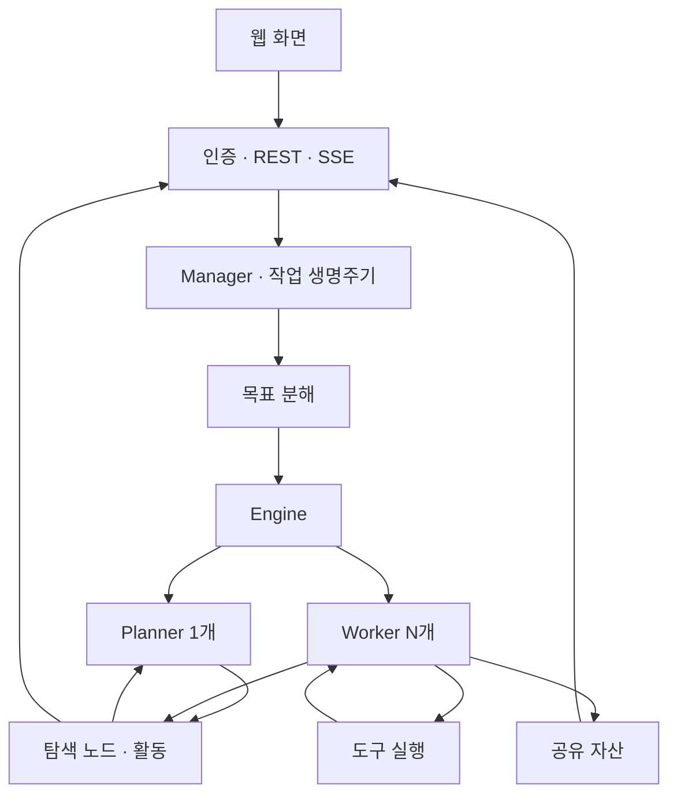

### 두 그래프와 근거 연결

자산 저장소는 **무엇을 대상으로 하는가**, 탐색 그래프는 **무슨 근거로 무엇을 했는가**를
표현합니다. `exploration_anchors(node_id, asset_id)`가 둘을 연결합니다.
자산 간 연결은 저장 필드에서 계산하며 별도 그래프 DB를 사용하지 않습니다.

계획자는 `graph_overview`로 상태를 읽고 `add_intent`로 의도를 추가합니다.
실행자는 DB의 조건부 UPDATE에 성공했을 때만 의도를 수령합니다.
결과를 기록하면 계획자가 다시 깨어나 다음 방향을 정합니다.

### 실행 기록과 컨텍스트

전체 과거 기록을 매번 모델에 넣지 않습니다. 최근 상태 요약을 먼저 넣고 필요하면
`node_detail`, `search_all_worker_traces`, `get_worker_trace`로 원본을 추가 조회합니다.
비활성 탐색 영역은 `digest`로 요약하지만 원본 노드는 남깁니다.

계획자의 각 회차는 새 Session입니다. 작업별 todolist는 계획자 객체의 메모리에서
회차 사이에 공유되며 프로세스 재시작까지 영속 저장된다는 뜻은 아닙니다.
실행자는 의도별 transcript를 재개할 수 있지만 외부 도구의 부작용까지 정확히 한 번만
발생한다고 보장하지 않습니다.

### 관찰·발견·증거의 의미

`fact`에 저장되었다는 사실만으로 내용의 참·거짓을 독립 검증한 것은 아닙니다.
SHA-256은 증거 바이트의 무결성을 확인하며 모델의 해석이 맞는지를 증명하지 않습니다.
HTTP 캡처는 기본 비활성이고 활성화해도 설정된 프록시를 통과한 트래픽이 대상입니다.
모든 네트워크 동작이 자동 기록되는 구조는 아닙니다.

승인·모델 판정·범위 제한의 적용 지점은 [지원 서비스](docs/ko/modules/services.md),
개선 제안은 [개선 문서](docs/ko/improvements.md)에 정리했습니다.

## 원본 라이선스와 고지

루트 [LICENSE](LICENSE)는 원본 **GNU Affero General Public License v3.0** 전문이며,
[web/LICENSE](web/LICENSE)의 기존 MIT 고지도 보존합니다. 권리·의무는 해당 원문이 기준입니다.
원본 README는 수정 프로그램을 네트워크로 제공할 때 대응 소스 제공 의무를 설명하며,
별도의 사용 제한과 면책도 명시합니다.

다음은 원저자 고지의 한국어 번역입니다. 이를 완화하거나 다른 라이선스로 대체하지 않습니다.

> ARTEX는 개인 학습, 소스 코드 연구, 로컬 기술 검증을 위한 프로젝트입니다.
> 온라인 시스템이나 웹사이트에 실제 테스트를 수행하는 데 사용하지 말 것을 원저자가 명시합니다.
>
> 허용 범위는 소스 읽기·학습·연구와 로컬 격리 환경에서의 기술 원리 검증이며,
> 개인 학습·학술 연구·코드 검토 등의 비공격적 목적을 포함합니다.
>
> 원저자는 온라인 웹사이트·서비스·네트워크 시스템에 대한 스캔·탐색·이용·공격을,
> 승인 여부나 본인 소유 여부와 관계없이 금지한다고 고지합니다. 실제 침투 테스트,
> 공격·방어 대항, 운영 환경 사용도 금지한다고 명시합니다. 불법 침입, 정보 절취,
> 갈취, 서비스 거부, 파괴 행위 및 해당 국가·지역 법률 위반 이용을 금지합니다.
>
> 사용자는 관련 네트워크 보안·정보 보호·컴퓨터 범죄 법률을 준수할 책임을 집니다.
> 원문은 중국의 네트워크보안법·데이터보안법·개인정보보호법과 관련 해석도 예시로 듭니다.
> 이용에 따른 법적 책임과 결과는 사용자에게 있다고 고지합니다.
>
> 프로젝트는 현 상태 그대로 제공되며 명시적·묵시적 보증을 하지 않습니다.
> 원저자와 기여자는 이용에 따른 직·간접 손해, 데이터 손실, 시스템 손상,
> 법적 분쟁에 책임을 지지 않는다고 고지합니다. 다운로드·설치·사용은 고지를
> 읽고 이해하여 동의한 것으로 본다고 원문에 명시되어 있습니다.

원문은 AGPL 자체가 사용 목적을 제한하는 것은 아니며 위 제한은 저자의 별도 고지라고
구분합니다. 정확한 표현은 [보존한 README](docs/upstream/README.md)의 마지막 절을 확인하세요.

원본 커뮤니티 안내: WeChat 공개 계정 **SecSentry**와
[원본 QR 이미지](screenshots/wx.png)를 보존합니다.
