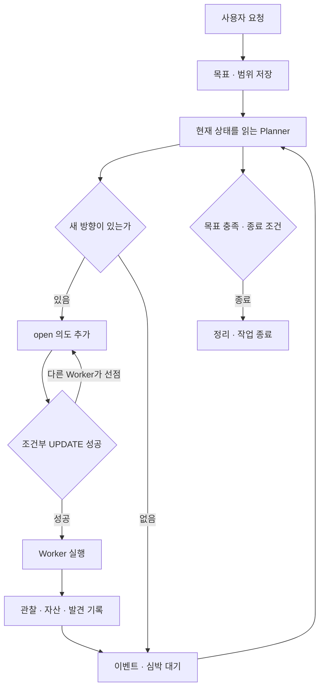
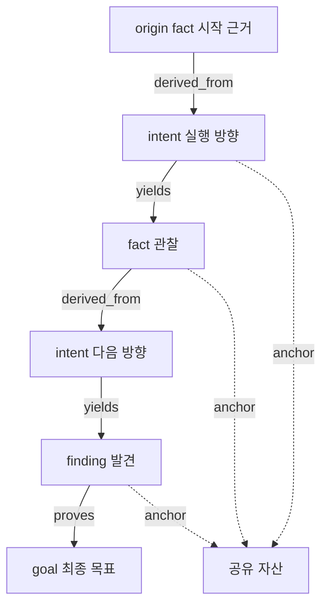

# ARTEX 전체 동작 해설

[문서 안내](README.md) · [파일 지도](file-map.md) · [서버](modules/server.md) · [에이전트](modules/agents.md)

## 1. 프로그램의 정체

ARTEX는 외부 LLM이 도구를 선택하고 관찰을 해석하도록 연결하는 Go 애플리케이션입니다.
실행 모델의 가중치를 포함하거나 이 저장소에서 모델을 학습하는 파이프라인은 아닙니다.
[go.mod](../../go.mod)는 `norma v0.4.3`을 사용하며, ARTEX가 작업·자산·증거·UI 같은
도메인 기능을 담당하고 Norma가 모델 세션과 도구 실행의 기반을 제공합니다.

웹은 Next.js로 개발하고 정적 파일로 내보내 Go에 포함할 수 있습니다.
`embedui` 태그 없이 개발하면 프런트 개발 서버와 백엔드를 별도로 실행합니다.
실제 경계는 [server/webui_embed.go](../../server/webui_embed.go),
[web/next.config.mjs](../../web/next.config.mjs)에 있습니다.

## 2. 부팅과 작업 시작

[cmd/artex/main.go](../../cmd/artex/main.go)는 설정·경로·서명 키·서버를 준비합니다.
[Manager](../../server/manager.go)는 DB store, 실행 중 작업, 트래픽 및 관련 서비스의
생명주기를 관리합니다. [server.go](../../server/server.go)에서 라우트와 에이전트,
도구·Skill·MCP 및 설정을 조립합니다.

사용자가 작업을 만들면 [goals.go](../../server/goals.go)가 목표와 범위를 해석합니다.
목표 분해는 제한된 모델 호출이며 실패 시 원래 요청을 하나의 목표로 사용하는 경로가 있습니다.
이 초기 단계가 끝난 뒤 실행 엔진을 시작하여, 목표가 없는 상태에서 계획자가 먼저
달리는 경쟁을 줄입니다. DB에 저장된 작업 상태와 실제 실행 중인 엔진 상태는 별도이므로
시작·중단·복구의 순서를 `Manager`와 `Engine`에서 함께 읽어야 합니다.

## 3. 계획자와 실행자의 반복

[Engine.Run](../../server/engine.go)은 작업당 계획자 루프 1개와 Worker goroutine N개를
만듭니다. 기본 Worker 수는 3입니다. 이벤트를 모아 계획자를 깨우며 주기적인 심박도 있습니다.
계획자가 한 번 깨어났다고 반드시 새 작업을 만드는 것은 아닙니다. 새 정보나 유효한 방향이
없으면 의도를 0개 만들고 끝낼 수 있습니다.

Worker는 후보 frontier를 조회하고 [ClaimIntent](../../db/exploration.go)의 조건부
UPDATE를 시도합니다. `id`, `exploration_id`, `kind='intent'`, `state='open'`이 맞는
행만 `running`으로 바꾸고 소유자를 기록합니다. 수정 행 수가 1이어야 수령 성공입니다.
후보 조회를 동시에 했더라도 한 의도를 둘이 동시에 수령하지 않도록 하는 장치입니다.
이 경로는 `SELECT ... FOR UPDATE SKIP LOCKED`를 사용하는 방식이 아닙니다.

동일 의도의 동시 수령 방지와, 서로 다른 의도가 같은 일을 반복하지 않는다는 보장은
다릅니다. 의미가 비슷한 의도 두 개를 계획자가 생성하는 문제는 별도입니다.

## 4. 역할별 권한과 책임

| 역할 | 보통 하는 일 | 실제 구현을 읽을 때 확인할 점 |
| --- | --- | --- |
| goals | 목표·범위 추출 | 실패 대체 경로와 호출 횟수 제한 |
| planner | 의도 생성·상태 판단·방향 조정 | 매 회차 새 세션, 도구 목록이 실제 권한 |
| worker | 한 의도 실행·관찰·발견 | 의도별 세션 재개와 종료 정리 |
| mainagent | 작업 내 사용자 질문·지시 처리 | 사용자 입력을 탐색 변경으로 연결 |
| auto / pentest | 플랫폼 대화 또는 독립 에이전트 | 모든 대화가 동일한 Engine을 타지는 않음 |
| reporter | 발견 내용을 보고서로 작성 | 증거 확인·바인딩·버전 확인 |
| retester | 요청받은 발견 재검증 | 수동 시작, `fixed` 결과의 반영 조건 |
| judge | 도구 승인 판단 | 선택적 승인 보조이며 발견 검증기와 다름 |

“계획만 한다”라는 프롬프트와 코드가 실제로 제공하는 도구는 구분해야 합니다.
계획자의 기본 도구에는 Bash도 포함됩니다. 역할 분리를 강제하려면 도구 목록과
공통 실행 경계의 정책을 함께 제한해야 하며, 이번 해설판에서 이 동작은 수정하지 않았습니다.

## 5. 두 그래프

### 자산: 대상으로 삼는 객체

[assets](../../db/assets.go)는 전역 공유 객체이며 회사·작업 범위로 접근 맥락을 정합니다.
유형은 `root_domain`, `subdomain`, `ip`, `service`, `app`, `endpoint`입니다.
모델이 제출한 원시 정보를 프로그램이 정규화하고 유형별 중복 키로 UPSERT합니다.

자산 그래프의 연결은 부모 필드와 범위를 이용하여 조회 시 합성합니다.
별도 자산 edge 테이블이나 Neo4j가 필요하지 않습니다.
`TemplatePath` 보조 함수가 있다는 사실만으로 엔드포인트 저장이 숫자 경로를 자동으로
`{id}`로 합친다고 해석하면 안 됩니다. 현재 자산 삽입의 정규화 경로를 따로 확인하세요.

### 탐색: 작업이 진행된 근거

[exploration_nodes](../../db/exploration.go)에 `begin`, `goal`, `intent`, `fact`,
`finding`, `hint`, `digest` 등을 기록합니다. `spawns`, `derived_from`, `yields`,
`proves`, `covers` 관계로 어디에서 나온 작업과 결론인지를 추적합니다.

`exploration_anchors`는 탐색 노드와 자산을 연결합니다. 따라서 특정 발견의 근거를
거슬러 올라갈 수도 있고, 특정 자산에서 어떤 의도가 실행되었는지 찾아갈 수도 있습니다.

위 그림은 대표적인 근거 연결입니다. `add_intent`는 부모로 fact/finding을 받고 없으면
작업의 시작 fact를 사용합니다. goal이 계획의 목적이라고 해서 DB에 항상 goal→intent
직접 edge를 만드는 것은 아닙니다. 그래프에 근거 연결이 있다고 해서 문장 의미가 자동 검증되는 것은 아닙니다.
유효 ID·노드 유형·작업 소속 검사와 내용의 참·거짓 판단은 다른 단계입니다.
관찰의 `confidence=observed|inferred`와 원본 도구 출력을 함께 읽으세요.

## 6. 기록을 모두 저장해도 모델에는 일부만 넣는다

[graph_overview](../../agent/tools.go)는 현재 목표·힌트·의도·최근 관찰·발견·요약을
유한한 창으로 제공합니다. 오래된 내용은 `node_detail` 및 Worker 실행 기록 조회로
필요할 때 가져옵니다. 일부 집계는 잘린 목록 길이에 기반하므로 큰 작업에서는 정확한
전체 COUNT와 구분해야 합니다.

작업 간 참고는 직접 지정한 원본 작업을 읽는 한 단계 상속입니다. 연결된 모든 작업을
재귀 탐색하여 무제한으로 문맥에 넣는 구조가 아닙니다.

[coldgraph.go](../../agent/coldgraph.go)는 활성 의도와 관련 노드를 보호하고, 오래된
완료 의도·사실을 묶어 요약 대상으로 만듭니다. [compaction.go](../../agent/compaction.go)는
원본과 요약의 관계를 남기며, 더 큰 요약도 원본을 기준으로 재구성합니다.
모델 대화창 길이를 줄이는 세션 압축과, 탐색 그래프를 요약하는 이 압축은 별개입니다.

계획자는 각 회차에 새 세션을 만들지만 todolist는 같은 계획자 객체 메모리에서 공유합니다.
프로세스 재시작 후에도 이 메모리가 자동 보존되는 것은 아닙니다.
반면 Worker는 의도별 transcript를 재개합니다. 큰 도구 결과는 파일로 남기고
모델에는 잘린 결과와 파일 경로를 보여주는 방식도 사용합니다.

## 7. 도구와 Skill

[assembly.go](../../agent/assembly.go)는 도구 노출, 선택, 발견 후속 절차, panic 처리 등을
조립합니다. 서버의 [assembly.go](../../server/assembly.go)는 Skill·MCP 설정을 연결합니다.
지연 도구는 처음부터 모든 schema를 모델에 넣는 비용을 줄이고 Skill 활성화 후 사용할 수
있게 합니다. 다만 MCP 연결 자체와 도구 설명 지연 노출은 다른 개념입니다.

도구는 DB 쓰기만 하는 것부터 파일·셸·HTTP·브라우저·외부 MCP까지 다양합니다.
그래서 프롬프트에 적힌 제한보다 실제 호출 경계의 권한·승인·타임아웃이 중요합니다.
관련 적용 지점과 한계는 [지원 서비스](modules/services.md)에 설명합니다.

## 8. 트래픽과 증거

[traffic](../../traffic/traffic.go)은 설정된 프록시를 통과한 HTTP를 기록합니다.
캡처는 기본 OFF이며 HTTPS에는 인증서 신뢰 설정과 패스스루 상황이 있습니다.
작은 본문은 SQLite에, 큰 본문은 별도 blob에 저장합니다.

[evidence](../../evidence/store.go)는 발견에 연결한 HTTP를 별도 스냅샷으로 보관합니다.
원본 트래픽을 정리해도 이 증거 본문은 독립적으로 유지할 수 있습니다.
파일을 먼저 저장·검증하고 DB 트랜잭션으로 참조를 기록하므로, 실패하면 미참조 파일이
남을 수 있어도 부분적인 업무 레코드를 커밋하지 않도록 설계합니다.

보고서에는 읽었던 `evidence_version`이 연결됩니다. 증거가 바뀌면 오래된 버전으로
생성한 보고서가 최신 내용을 반영했다고 주장하지 못하게 합니다.
SHA-256은 바이트 무결성을 검사하며 관찰 해석의 정확성을 보증하지 않습니다.

## 9. 화면 갱신과 중단·복구

활동의 원본은 DB이며 SSE는 이를 화면에 전달하는 통로입니다. 서버는 구독과 과거 기록
재생을 조합하고 프런트는 ID로 중복을 제거합니다. 메모리 브로드캐스터의 버퍼가 가득 차면
이벤트 유실 가능성이 있으므로 SSE만 무손실 메시지 큐로 해석하면 안 됩니다.

Worker에는 작업 예산·일시 중지·종료 요청에 따른 정리 경로가 있습니다. 프로세스 재시작 시
실행 중이던 의도를 다시 받을 수 있게 복구하는 것은 유용하지만, 이미 실행된 외부 명령의
부작용을 자동 취소하거나 정확히 한 번 실행되게 만드는 것과는 다릅니다.

## 10. 이 구조에서 배울 핵심

모델이 선택하는 계획, 사람이 검토하는 근거, 프로그램이 강제하는 상태 전이를 분리하면
긴 실행을 추적하고 재사용하기 쉽습니다. ARTEX에서 특히 배울 부분은 전역 객체와 작업별
추론 기록의 분리, 조건부 상태 전이, 원본을 보존하는 요약, 버전이 있는 증거입니다.
각 요소를 다른 분야로 옮기는 구체적 설계는 [개선·응용 문서](improvements.md)에 있습니다.
