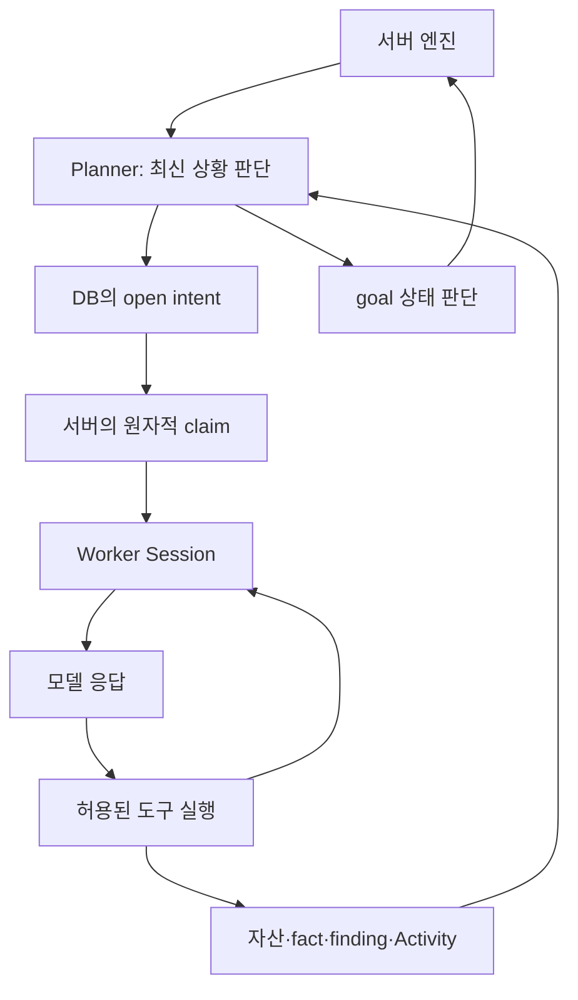

# Agent·모델 호출·문맥 관리 코드 해설

이 문서는 `agent/`, `llmpool/`, `llmrec/`, `sidequestion/`의 **66개 Go 파일**을 따라 읽기 위한 안내입니다. 모든 해당 Go 파일에 한국어 파일 해설을 추가했고 주요 함수에는 입력·출력·상태 변경·설계 이유를 더 설명했습니다. 원래 영어·중국어 주석과 실행 문자열은 보존했습니다.

## 1. 이 계층이 담당하는 일

ARTEX는 여기서 모델을 학습시키지 않습니다. [go.mod](../../../go.mod)에 고정한 Norma SDK의 `agentcore.Session`과 `llm.Provider`를 사용하여 외부 모델의 응답과 도구 실행을 이어 갑니다. ARTEX 고유 기능은 작업 그래프, 역할별 도구, 파일 경로, 승인 연결, 활동 기록, 장기 문맥 복원 등의 조립에 있습니다.

`Provider`는 모델 API 호출 방법을 숨기는 인터페이스이고 `Session`은 대화 메시지와 여러 모델/도구 회차를 관리합니다. 같은 Provider를 여러 역할이 공유할 수 있어도 각 Session의 메시지가 하나로 합쳐지는 것은 아닙니다. 전역 공유 자산과 작업별 탐색 그래프가 지속 문맥의 중심입니다.

### 역할과 실행 경계

| 역할 | 진입 함수 | 입력과 주요 산출 | 이전 문맥 방식 |
| --- | --- | --- | --- |
| 목표 분해 | `DecomposeGoalsWithProvider` | 사용자 목표/설명 → goal·allow/deny 제약·명시 scope | 단발 실행, 최대 8회차, 저장된 goal 재조회 |
| Planner | `Planner.Plan` | 최신 상황·트리거 → 새 intent·목표 met·Worker 수정/중지 | 매 회차 새 Session, 그래프와 메모리 TodoStore |
| Worker | `Worker.Execute` / `ExecuteWithMessage` | 이미 할당된 intent → 자산·fact·finding 및 실행 기록 | intent별 안정 키로 transcript Resume |
| MainAgent | `MainAgent.Chat` | 작업 안의 사용자 질문 → 설명·hint·intent·goal·제약·steer | 작업/대화 구간의 transcript Resume |
| 일반/사용자 정의 대화 | `ChatAgent.Chat` | 사용자 메시지 → 역할에 허용된 도구와 답변 | conversation의 sessionID로 Resume |
| Reporter / Retester | 각각 기본 프롬프트 및 서버 대화 실행 | 한 finding의 보고서 작성 / 재검증 결과 | 서버가 별도 대화와 도구를 연결 |
| 독립 질문 `/btw` | `SideQuestionService.Respond` | 주 문맥 복사본+질문 → 별도 답변/사용량 | 독립 이력과 요약, 도구 실행 없음 |

자동 Planner가 일반적인 intent 생성자이지만 MainAgent도 사람의 지시로 intent를 넣을 수 있습니다. 따라서 원본의 “sole intent generator” 문구는 역할 의도를 설명하며 모든 생성 경로를 독점한다는 코드 계약으로 해석하면 안 됩니다. [planner.go](../../../agent/planner.go), [mainagent.go](../../../agent/mainagent.go), [tools.go](../../../agent/tools.go)를 함께 보면 구분이 명확합니다.

## 2. 작업 한 번이 모델·도구 루프를 도는 과정

1. **서버가 준비합니다.** task/exploration 저장소와 모델 경로를 만들고 목표를 분해합니다. 서버 엔진이 Planner와 Worker 실행을 관리하며 intent claim도 서버/DB 계층이 담당합니다.
2. **역할 도구를 조립합니다.** 해당 run의 `ToolSet`에 task ID, owner intent, 저장소, 통지 콜백을 넣고 `AugmentTools`를 호출합니다.
3. **system과 현재 입력을 나눕니다.** 역할 규칙·제약·출력 경로를 system에 넣습니다. Planner의 최신 상황은 user 입력에 넣고, Worker의 한 intent와 그 대상 자산은 system에 유지합니다.
4. **Norma Session을 만듭니다.** Provider, 도구, 지연 스키마, 프록시·작업 폴더, 시간·회차·출력 예산, transcript, 압축, 수습 단계 등을 옵션으로 전달합니다.
5. **필요한 역할만 대화를 재개합니다.** Worker/MainAgent/ChatAgent는 해당 키의 저장 대화를 Resume합니다. 과거 Skill 호출로 도구 해제 상태도 복원합니다. Planner는 이 Resume 경로를 사용하지 않습니다.
6. **모델이 다음 동작을 선택합니다.** Session은 모델 응답과 도구 결과를 반복해서 연결합니다. ARTEX의 `captureRunSession`은 그 이벤트를 Activity로 변환합니다.
7. **구조화 결과를 저장합니다.** `record_fact`, `insert_assets`, `report_finding` 등의 handler가 DB와 증거 계층에 기록합니다. 도구 성공 후 통지가 다음 Planner 판단을 유발합니다.
8. **종료 이유를 서버에 돌려줍니다.** Worker는 `TerminalReason`, 이번 쓰기 건수, 오류를 반환합니다. 완료·예산 소진·차단·일시 정지 등의 상태 전이는 서버 엔진이 결정합니다.

이 그림의 claim은 `Worker.Execute` 내부에 없습니다. 실제 구현은 [server/engine.go](../../../server/engine.go)와 [db/exploration.go](../../../db/exploration.go)의 조건부 상태 갱신에 있습니다. 동시 Worker가 같은 intent를 잡는 일을 줄이는 DB 계약과 모델이 비슷한 의미의 intent를 중복 생성하는 문제는 별개입니다.

## 3. ToolSet: 모델의 말을 상태 변경으로 바꾸는 곳

### 각 데이터가 의미하는 것

| 데이터 | 의미 | 주요 도구/함수 |
| --- | --- | --- |
| goal | 마지막에 달성해야 하는 결과 | `setGoals`, `proveGoal` |
| intent | Worker 한 번이 맡을 실행 방향 | `addOneIntent`, `addIntent` |
| fact | 실제 관찰 또는 해석, 부정 결과도 포함 | `recordOneFact`, `recordFact` |
| finding | 취약점으로 등록한 결과 | `addFinding` / 도구명 `report_finding` |
| hint | 사람이 전달한 전략·보충 정보 | `addOneHint`, `addHint` |
| asset | 도메인/IP/서비스/앱/endpoint 등 공유 대상 | `insertAssets` |
| digest | cold 원본 노드 묶음의 요약 뷰 | `Compactor`, `expandDigest` |
| constraint | 허용/금지 작업 규칙 문장 | `setConstraints`, `constraintBlock` |

`ToolSet`은 한 run의 변수입니다. `taskID`는 서버가 정하고 `ownerNode`는 자산의 발견 경위를 기록할 현재 intent입니다. `WriteCounts`는 이 run에서 성공한 사실·자산·취약점 저장 작업 수이며, 중복 Upsert까지 포함할 수 있으므로 “새로운 고유 자산 수”와 동일하지 않습니다.

`addOneIntent`는 부모 ID가 현재 또는 직접 연결 작업의 fact/finding인지 확인합니다. 자산 앵커가 있으면 차단/허용 규칙을 검사하고, 명시 부모가 없으면 origin fact에 연결합니다. 이 검사는 존재와 종류를 확인하며 부모 관찰의 진실·신선도·추론의 타당성을 증명하지 않습니다.

`recordOneFact`는 summary를 요구하고 intent 소유권을 확인한 뒤 fact를 `confirmed`로 저장합니다. evidence와 confidence는 현재 선택 항목입니다. 따라서 `confirmed`를 “독립적인 검증기가 사실임을 증명했다”로 읽으면 안 됩니다. 일반 관찰과 부정 결과를 별도 fact로 남기고 Planner가 증거를 재확인하도록 하는 설계입니다.

`proveGoal`은 현재 작업의 goal과 현재/직접 연결 작업의 fact·finding 연결을 허용합니다. `proves`를 쓰고 goal을 `met`로 표시한 뒤 모든 goal이 완료되었는지 확인합니다. 목표를 실제 만족하는 의미 판단은 모델에 있으며 현재 `Link`/`SetNodeState` 오류는 이 도구에서 무시하고 전달된 `reason`도 별도 영속 기록하지 않습니다. 이는 번역 과정에서 수정한 것이 아니라 코드를 읽을 때 알아야 하는 개선 지점입니다.

### 취약점 ID와 증거의 주의점

`report_finding`의 결과 첫 줄은 탐색 노드 ID입니다. JSON의 `finding_id`는 독립 findings 테이블의 ID이며 `finding_node_id`는 탐색 노드 ID입니다. `get_finding_traffic`와 `bind_finding_traffic`에는 독립 ID가 필요하지만 기존 `update_finding_report`의 이름이 `finding_id`인 인자는 탐색 노드 ID를 받습니다. [finding_workflow.go](../../../agent/finding_workflow.go)가 이 계약을 공통 안내합니다.

`FindingRecorder.Record`는 실제 HTTP 증거의 확인·복사·DB 원자적 기록을 소유한 서비스로 작업을 넘깁니다. Agent가 증거 본문을 직접 꾸미거나 복사하지 않습니다. 트래픽이 없는 TCP 관찰 등은 텍스트 증거로 정상 기록할 수 있습니다. 자동 바인딩 스위치가 꺼지면 관련 도구/선택 인자를 제거하고 이미 실행 중인 세션의 쓰기도 최신 설정을 다시 확인합니다.

## 4. 도구 조립·지연 공개·승인의 실제 차이

[assembly.go](../../../agent/assembly.go)의 순서는 다음과 같습니다.

| 순서 | 처리 | 책임 |
| --- | --- | --- |
| 1 | 역할 기본 도구 + `ToolAugment` | 가시 Skill·MCP 도구를 더하고 연결 cleanup을 받음 |
| 2 | `ToolResolve` | DB의 활성화/역할 바인딩/설명/schema/default 적용 |
| 3 | `findingWorkflowTools` | 최종 남은 도구에 ID·증거 계약 안내 적용 |
| 4 | `guardPanic` | handler panic을 도구 오류로 변환 |
| 5 | `deferredSystem` / UnlockSet | 이름 노출·스키마 지연·Skill 전용 호출 해제 연결 |

`toolcatalog.go`는 도구의 설명과 기본값을 편집 가능하게 하지만 Go handler 자체를 DB 문자열로 교체하지 않습니다. `injectDefaults`는 scalar만 취급하고 누락·null·빈 문자열에 기본값을 넣습니다. `false`와 `0`은 입력값으로 유지합니다. 도구가 카탈로그에 있다는 것과 역할에 활성 바인딩되어 있다는 것도 다릅니다. `goal_met`는 기본적으로 어느 역할에도 바인딩하지 않습니다.

지연 도구는 스키마를 필요할 때 보여 주는 방식입니다. 서버가 MCP 연결과 `tools/list`를 이미 수행할 수 있으므로 **스키마 지연 공개와 연결 지연은 구분**해야 합니다. `seedUnlockFromHistory`는 과거 Skill 이름을 재생해 해제 집합만 복원하며 그 도구 동작을 다시 실행하지 않습니다.

현재 Worker는 받은 Hooks를 `Options.Hooks`에 연결하고 ChatAgent도 Guard가 있으면 연결합니다. Planner와 MainAgent의 Options 조립에는 같은 대입이 없습니다. 또한 모든 역할의 `PermissionMode`와 기본 도구 구성, 개별 도구 내부 호출 경로를 함께 보아야 합니다. 자연어 제약, 도구 공개, 권한 훅, 운영체제 격리는 서로 다른 계층이며 `guardPanic`은 보안 승인기가 아닙니다.

## 5. 문맥을 오래 유지하는 세 가지 방식

### 5.1 Session의 대화 압축

`Config.CompactionWindow`는 사용자 설정 K를 토큰 수로 바꾸며 기본 200K, 최소 32K, 최대 1000K를 사용합니다. 이는 실제 공급자 모델 능력 조회가 아니라 로컬 설정 해석입니다. `Compaction` 옵션은 Norma가 같은 Provider를 이용해 긴 대화를 정리하도록 합니다. 큰 도구 출력은 `cmd-output` 파일로 보존하고 모델에 일부와 파일 위치를 보여 주도록 SDK에 연결합니다.

실험 설정 `enableNoa`는 기본 압축과 별도의 noa 어댑터를 선택합니다. 성공 시 기본 `Compaction`을 비우고 실패 시 경고와 함께 기본 경로를 유지합니다. 이 호출부는 archive/session/warn만 전달하므로 모델별 실제 창 크기가 자동 전달된다고 가정하지 않습니다.

### 5.2 탐색 그래프의 cold digest

원본 DB 전체를 모델 입력에 매번 복제하지 않고 활성 부분은 최근 요약으로, 오래 쉬는 부분은 digest로 보여 줍니다.

1. `open/running/paused` intent, 그 모든 조상, 그 직접 자식을 hot으로 보호합니다.
2. hot이 아닌 fact·종료 intent만 cold 후보로 봅니다. goal/finding/hint/begin/digest는 접지 않습니다.
3. 연속 6 Planner 회차 동안 cold여야 하고, 관련 후보 묶음은 최소 2개여야 합니다.
4. 실제 간선으로 연결된 후보를 먼저 묶고, 공통 부모를 둔 남은 단독 노드도 묶습니다. 부모는 문맥 앵커로만 사용합니다.
5. 미요약 후보 20개에 이르면 minor, 활성 digest 8개면 major를 시도합니다. 탐색당 동시 압축 1개, 종료 후 60초 간격, 최대 5분입니다.
6. major는 원본으로 돌아가 묶음을 재계산하며 요약의 요약을 반복하지 않습니다. 멤버/앵커 내용 버전 해시가 그대로면 모델 호출 없이 재사용합니다.
7. 모델 호출 중 노드가 다시 활성화될 수 있으므로 저장 전에 hot을 재확인합니다. 원본은 지우지 않고 `covers`로 요약이 어느 원본을 대표하는지 남깁니다.

복원 경로는 **`cold_digests` 본문 → `expand_digest` 멤버 목록 → `node_detail` 전체 증거**입니다. 출력에서 오래된 digest를 생략해도 ID를 별도 남깁니다. 압축 코드의 전체 그래프 로드는 서버 메모리 계산을 위한 것이며 전체가 모델에 전송되는 것은 아닙니다.

overview에는 별도의 조회·표시 한도가 있습니다. 현재 예를 들어 open intent 30개, recent fact 20개, recent done 12개, recent finding 10개, digest 15개를 보여 줍니다. fact/finding 전체 수처럼 보이는 값도 최대 1000개 조회 길이로 만들어지는 부분이 있습니다. 표시 목록에 없는 것이 DB에도 없다는 뜻은 아니며 대형 작업에서는 정확한 계수·페이지 조회를 강화할 여지가 있습니다.

### 5.3 `/btw`의 독립 문맥 복사본

독립 질문은 위 주 Session에 새 tool loop를 만들지 않습니다. 구체 Provider가 선택된 뒤 주 요청을 깊은 복사하고 별도 서비스가 그 스냅샷과 최근 문답으로 답합니다. 부모 ID·버전·모델 신원으로 복구하고, 과거 문답은 ordinal 기반 롤링 요약으로 관리합니다.

메시지를 줄일 때 도구 호출/결과 쌍을 끊지 않고 요약 호출도 최대 12번으로 제한합니다. 최초 문맥 초과에서 아직 출력이 없을 때만 더 줄여 한 번 재시도합니다. 원본 주 transcript, 작업 그래프, 도구 실행 경로는 이 서비스가 소유하지 않습니다. 자세한 설명은 [sidequestion README](../../../sidequestion/README.md)와 [예산 문서](../../../sidequestion/CONTEXT_BUDGET.md)에 있습니다.

## 6. 모델 오류·원본 기록·사용량

### 설정과 전송

[provider.go](../../../agent/provider.go)는 환경 변수 또는 UI 입력을 Provider 설정으로 바꿉니다. OpenAI Chat Completions와 Responses, Anthropic Messages는 경로와 형식이 다릅니다. UI가 전체 endpoint를 입력해도 SDK가 경로를 두 번 붙이지 않도록 끝 경로를 제거합니다. 출력 `MaxTokens`와 전체 `ContextWindowK`는 각각 응답 상한과 로컬 문맥 압축 기준입니다.

HTTP 전송 래퍼는 context의 session ID를 선택 헤더에 넣고 원본 요청/응답을 캡처합니다. 명확한 계정 잔액 소진을 알리는 429만 402로 정규화하여 SDK의 같은 계정 재시도를 피하게 합니다. 일반 RPM/TPM 속도 제한, 인증, 5xx까지 소진으로 간주하지 않습니다. `TestConnection`은 실제 모델 호출이며 HTTP가 통했더라도 답변 본문이 비어 있으면 실패합니다.

### Pool과 Registry

[llmpool/pool.go](../../../llmpool/pool.go)의 일반 Pool은 우선순위가 정해진 후보를 건강 상태와 문맥 추정으로 거릅니다. 같은 Rank 그룹의 첫 시도 위치는 돌아갑니다. 어떤 스트림 이벤트라도 소비자에게 전달한 뒤에는 다른 모델에 같은 요청을 다시 보내지 않습니다. 한 번도 출력하지 않은 상태에서만 안전하게 전환하며, 비스트리밍 `Complete`는 중간 출력이 없는 별도 경로입니다.

Registry는 일시적 실패 기본 3회 또는 확정적 실패 1회에 냉각 상태를 설정합니다. 기본 1분→5분→30분이며 정책 설정으로 조절합니다. Pool을 다시 만들어도 Registry는 공유할 수 있습니다. 이 일반 Pool과 서버의 [task_llm.go](../../../server/task_llm.go) 작업별 라우터는 구분해서 읽어야 합니다. 현재 task의 전환 조건을 일반 Pool 설명만으로 단정하지 않습니다.

### 기록은 두 층이다

| 층 | 내용 | 설정 및 한계 |
| --- | --- | --- |
| `llm_usage` | 모델·프로필·작업·역할·입출력/cache 토큰·시간·상태 | 원문 녹화와 독립하여 계속 계측 |
| normalized `LLMRecord` | 읽기 쉬운 요청/응답 재구성 | 설정으로 활성화, 도구 schema 전체 대신 이름 등 일부만 기록 |
| raw Capture | 실제 전송 요청 및 읽힌 HTTP/SSE 응답 바이트 | 같은 설정의 무거운 기록, 재시도별 상태와 본문을 보존 |

`Recorder.Stream`은 입력·출력 usage가 다른 이벤트에서 도착하는 경우 `Add`로 합칩니다. `finish`의 한 번만 실행되는 플래그와 defer가 오류·취소·소비자 조기 종료에도 중복 계측을 막습니다. task ID는 context의 명시값을 우선하고 `exp<N>`의 N은 exploration ID입니다. `WithWorker`는 Judge 등 별도 호출 역할을 귀속시킵니다.

원문 캡처는 마스킹/암호화를 수행하지 않습니다. 사용량이 공급자에서 오지 않으면 0이 기록될 수 있으므로 이를 무료 호출로 해석하지 않습니다. 원문에서 여러 HTTP 시도를 합칠 때는 구분 헤더를 넣으므로 그 전체 문자열을 단일 HTTP 응답 본문으로 생각해서도 안 됩니다.

## 7. 시간 예산·취소·종료 진단

`TaskClock`은 작업 전체 마감과 최종 Planner 회차 여부를 context에 넣습니다. `clampMaxDuration`은 run 자체 시간과 남은 작업 시간 중 작은 값을 사용하고, SDK의 0 이하=무제한 규칙 때문에 최소 1초를 유지합니다. `wrapupSettlementForTask`는 실제 Timeout/MaxTurns에 따라 전체 작업 종료 문구 또는 이번 run 마무리 문구를 고릅니다.

`AbortCause`는 사용자 정지, 목표 완료, Planner의 Worker 중지, 삭제, 서버 종료를 기계 코드와 설명으로 구분합니다. `terminalText`는 마지막 도구가 아직 실행 중인지와 생성한 부분 답, 누적 사용량, 실제 원인을 활동 기록에 남깁니다. 이 표시 코드가 상태 전이를 실행하는 것은 아닙니다.

`Resume`은 대화 재개 기능입니다. 이미 외부 도구가 파일을 쓰거나 요청을 보낸 뒤 프로세스가 중단된 경우 DB 기록과 부작용 사이를 자동으로 원상복구하지 않습니다. 다른 분야로 재사용할 때는 별도의 action ID, 멱등 키, 완료 확인, 보상 동작을 설계해야 합니다.

## 8. 테스트를 읽는 방법

각 `_test.go`의 상단 한국어 해설은 검증 목적을, `Test...` 함수는 구체 사례를 보여 줍니다. HTTP 테스트 서버·가짜 Provider·제어 가능한 스트림을 사용한 검사는 실제 외부 모델 품질 검증과 다릅니다. DB 테스트도 독립된 폐기 가능한 PostgreSQL에서 실행해야 합니다. 이 문서는 주석 변경 과정에서 실제 외부 모델이나 대상 시스템을 실행했다고 주장하지 않습니다.

특히 다음은 설계 의도를 이해하는 데 유용합니다.

- `coldgraph_test.go`: 살아 있는 분기 하나가 조상을 보호하고 모든 분기가 끝난 뒤에만 요약되는 이유.
- `blackboard_inheritance_test.go`: source 작업 문맥은 읽을 수 있지만 소유 작업 밖으로 쓰지는 못하는 이유.
- `finding_recorder_test.go`: 선택 증거가 없을 수 있는 정상 사례와 잘못된 증거가 전체 기록을 실패시켜야 하는 사례.
- `provider_capture_e2e_test.go`: 래퍼 단위뿐 아니라 실제 Norma Provider 경계를 확인하는 이유.
- `llmpool/pool_test.go`: 첫 이벤트 전달 이후에는 다른 모델에 재전송하지 않는 이유.
- `sidequestion/context_test.go`: 문답 수 제한 외 토큰 제한, 도구 쌍 경계, 요약 실패 시 메모리 불변성이 필요한 이유.

## 9. 다른 분야로 재사용할 때 바꿀 부분

아래는 현재 기능의 설명이 아니라 **수정 설계 제안**입니다.

| 재사용할 구조 | 유지할 원칙 | 분야에 맞게 교체할 부분 |
| --- | --- | --- |
| Planner/Worker 분리 | 판단 주기와 한 번의 작업 책임 분리 | 보안 intent를 문서 검증·품질 점검·데이터 정리 단위로 변경 |
| fact/finding/evidence | 관찰과 결론 및 출처 연결 | finding을 결함·불일치·연구 결과로 일반화하고 분야별 독립 verifier 추가 |
| 자산 앵커 | 대상 객체와 실행 경위 연결 | URL/IP 대신 문서 버전, 음원, 주문, 실험 샘플 등의 ID와 버전 |
| cold digest | 원본을 보존하며 파생 요약과 복원 경로 제공 | 우선순위·신선도·대상 변경 시 무효화 규칙 |
| 독립 질문 | 실행과 별도 문맥 복사본, 별도 취소/사용량 | 장시간 분석·렌더링·ETL 작업의 중간 설명 도우미 |
| 모델 장애 전환 | 출력 공개 후 중복 재전송 금지 | 분야별 모델 능력·비용·성공률 기준과 구조화 오류 |
| 사용량/Activity | 실패·취소도 비용 및 원인 기록 | 예산 경보, 작업별 성과와 비용 비교 |

실무적으로는 역할별 공통 도구 실행 진입점에 승인/정책 검사를 모으고, goal 증명에는 분야별 판정기를 붙이며, 실행 부작용에 멱등 키를 추가하는 개선을 우선 검토할 수 있습니다. 수많은 자연어 프롬프트를 한국어로 바꾸는 작업은 별도의 행동 변경 실험으로 분리해 평가해야 합니다. 이번 문서화는 **실행 프롬프트를 번역하지 않고 그 의미를 해설**했습니다.

## 10. 담당 파일 전체 안내

아래 목록은 이 문서화 범위의 모든 Go 파일입니다. 각 링크를 열면 상단에 한국어 파일 해설이 있고 핵심 진입 함수에는 추가 설명이 있습니다. 단순 setter는 같은 파일의 설정 흐름 설명과 함께 읽으면 됩니다.

### Agent 본체

| 파일 | 역할·확인할 내용 |
| --- | --- |
| [assembly.go](../../../agent/assembly.go) | 역할별 도구 목록을 실제 실행 가능한 도구 묶음으로 조립한다. |
| [blackboard_inheritance_test.go](../../../agent/blackboard_inheritance_test.go) | 직접 연결 작업의 읽기 전용 문맥 상속을 검증한다. |
| [cancelcause.go](../../../agent/cancelcause.go) | context 취소에 사람이 이해할 수 있는 원인 코드를 부여하는 공통 사전이다. |
| [capture.go](../../../agent/capture.go) | Norma 세션 이벤트를 ARTEX의 db.Activity 실행 기록으로 변환하는 경계이다. |
| [capture_approval_test.go](../../../agent/capture_approval_test.go) | 가짜 Provider와 승인 훅을 연결해 tool_use 시작부터 승인 완료·활동 기록까지의 이벤트 순서를 검사한다. |
| [capture_usage_test.go](../../../agent/capture_usage_test.go) | Provider 실패와 context 취소 직전까지 받은 usage가 최종 Activity에도 남는지 검사한다. |
| [chat.go](../../../agent/chat.go) | 일반 대화 화면과 사용자 정의 Agent를 실행하는 ChatAgent이다. |
| [coldgraph.go](../../../agent/coldgraph.go) | 탐색 그래프에서 당장 필요한 노드와 요약 가능한 노드를 구분하는 순수 알고리즘이다. |
| [coldgraph_test.go](../../../agent/coldgraph_test.go) | DB·모델 호출 없이 hot/cold 판단과 union-find 묶음을 검증한다. |
| [compaction.go](../../../agent/compaction.go) | coldgraph의 후보 계산을 PostgreSQL 저장소와 LLM 요약 호출에 연결한다. |
| [constraints.go](../../../agent/constraints.go) | task_constraints의 allow/deny 문장을 역할 프롬프트에 붙이는 렌더러이다. |
| [deferred.go](../../../agent/deferred.go) | MCP 도구의 스키마를 처음부터 모두 보내지 않기 위한 프롬프트·해제 보조 코드이다. |
| [deferred_test.go](../../../agent/deferred_test.go) | 지연 도구 이름의 system 구간과 캐시 경계, Skill 전용 이름 비노출, 과거 Skill 호출에서 UnlockSet 복원을 검증한다. |
| [finding_recorder.go](../../../agent/finding_recorder.go) | Agent와 증거 저장소 사이의 의존성을 작게 유지하는 FindingRecorder 인터페이스이다. |
| [finding_recorder_test.go](../../../agent/finding_recorder_test.go) | 선택적인 HTTP 증거가 없는 정상 취약점 기록과 기록기 실패의 원자적 계약을 검사한다. |
| [finding_workflow.go](../../../agent/finding_workflow.go) | 최종 도구 목록에 취약점과 HTTP 증거를 넘기는 공통 계약을 적용한다. |
| [finding_workflow_test.go](../../../agent/finding_workflow_test.go) | 여러 역할의 도구 조립에 동일한 finding 증거 계약이 적용되는지 검사한다. |
| [goals.go](../../../agent/goals.go) | 사용자의 목표·설명에서 최종 산출 목표와 실행 제약, 명시된 대상 범위를 추출한다. |
| [insert_assets_test.go](../../../agent/insert_assets_test.go) | insert_assets를 실제 저장소와 연결하여 유형별 Upsert 결과와 파생 자산을 검사한다. |
| [mainagent.go](../../../agent/mainagent.go) | 작업 상세 화면에서 사람과 대화하며 작업을 관찰·조정하는 MainAgent이다. |
| [noa.go](../../../agent/noa.go) | 선택 기능인 Norma noa 컨텍스트 압축 어댑터를 세션 옵션에 연결한다. |
| [planner.go](../../../agent/planner.go) | 서버 이벤트에 반응하여 작업의 다음 intent와 목표 달성 여부를 결정하는 Planner이다. |
| [prompt.go](../../../agent/prompt.go) | DB에서 편집한 역할 프롬프트와 코드 기본 프롬프트를 같은 Go template 방식으로 렌더링한다. |
| [prompt_now_test.go](../../../agent/prompt_now_test.go) | 사용자 정의 대화 프롬프트의 Now와 DataDir 변수 및 알 수 없는 변수의 기본값 복귀를 검사한다. |
| [prompt_test.go](../../../agent/prompt_test.go) | 역할별 프롬프트 override, 빈값, 문법 오류, 지원하지 않는 변수에서의 복귀 동작을 검사한다. |
| [promptcatalog.go](../../../agent/promptcatalog.go) | 역할별 기본 모델 지시문과 서버 초기 DB 시딩용 목록을 모은다. |
| [provider.go](../../../agent/provider.go) | 모델 설정을 Norma Provider와 HTTP 전송 계층으로 연결한다. |
| [provider_capture_e2e_test.go](../../../agent/provider_capture_e2e_test.go) | 로컬 HTTP 테스트 서버와 실제 Norma Provider를 함께 사용해 원본 요청/응답 캡처가 전송 계층까지 이어지는지 검사한다. |
| [provider_capture_test.go](../../../agent/provider_capture_test.go) | quotaAwareTransport가 본문을 손실 없이 캡처하는지 검사한다. |
| [provider_quota_test.go](../../../agent/provider_quota_test.go) | 명시적 잔액 소진과 일시적 속도 제한·인증·서버 오류를 구별하는 문자열 분류를 검사한다. |
| [provider_responses_test.go](../../../agent/provider_responses_test.go) | openai-responses UI 설정이 Norma 형식과 /responses를 제거한 API base로 변환되는지 검사한다. |
| [proxyenv_test.go](../../../agent/proxyenv_test.go) | 프록시가 없을 때 환경이 비어 있는지, SOCKS5 경로에 ALL_PROXY가 생기는지, MITM 기록일 때 각 언어 도구의 CA 변수가 붙는지 검사한다. |
| [retester.go](../../../agent/retester.go) | 재검증 전용 대화 Agent의 기본 프롬프트를 보관한다. |
| [review_context_test.go](../../../agent/review_context_test.go) | Worker의 여러 도구 호출을 거치며 승인 심사 문맥이 올바르게 갱신되는지 검사한다. |
| [runinfo.go](../../../agent/runinfo.go) | 도구 조립 시 해당 호출이 어느 작업·탐색·intent·대화에 속하는지 전달한다. |
| [session_header_test.go](../../../agent/session_header_test.go) | HTTP 요청 context의 transcript 세션 ID를 사용자 지정 헤더에 전달하는지 검사한다. |
| [side_questions.go](../../../agent/side_questions.go) | 기존 Agent의 RunInfo를 /btw의 부모 리소스 식별자로 바꾸는 접착 코드이다. |
| [side_questions_test.go](../../../agent/side_questions_test.go) | 실제 ChatAgent와 가짜 모델·로컬 파일 도구를 조합해 /btw 체크포인트를 검증한다. |
| [taskclock.go](../../../agent/taskclock.go) | 서버의 작업 전체 마감 시각을 각 Planner/Worker run에 전달한다. |
| [terminalreason.go](../../../agent/terminalreason.go) | 모델이 최종 설명을 남기지 못한 경우에도 읽을 수 있는 실행 종료 기록을 만든다. |
| [terminalreason_test.go](../../../agent/terminalreason_test.go) | 모든 Norma 종료 이유의 설명과 context 취소 원인 전파를 검사한다. |
| [testmain_test.go](../../../agent/testmain_test.go) | db.DSN으로 PostgreSQL에 연결해 테스트 전체에 advisory lock 7337741002를 잡아 패키지 간 정리 경쟁을 줄인다. |
| [toolcatalog.go](../../../agent/toolcatalog.go) | Go에 정의된 도구를 DB 관리 화면에서 편집·바인딩할 수 있는 카탈로그로 만든다. |
| [toolcatalog_test.go](../../../agent/toolcatalog_test.go) | 도구 카탈로그에 기본 역할별 바인딩이 맞게 합쳐지는지 검사한다. |
| [tools.go](../../../agent/tools.go) | LLM이 탐색 그래프를 읽고 쓰는 핵심 도메인 도구를 정의한다. |
| [tools_digest.go](../../../agent/tools_digest.go) | 압축된 탐색 기록을 overview에 노출하고 필요할 때 원본으로 내려가는 읽기 계층이다. |
| [tools_insert.go](../../../agent/tools_insert.go) | 자산 입력과 기업·작업 범위를 LLM 도구 형태로 제공한다. |
| [tools_nil_store_test.go](../../../agent/tools_nil_store_test.go) | 작업 저장소가 없는 역할에 도메인 도구가 바인딩되어도 프로세스가 죽지 않는지 검사한다. |
| [tools_overview_test.go](../../../agent/tools_overview_test.go) | 여러 source 작업에 overview 텍스트 예산을 나눌 때 공정성과 UTF-8 경계를 검사한다. |
| [worker.go](../../../agent/worker.go) | 이미 할당된 한 intent를 실제 도구로 수행하고 관찰·자산·취약점을 기록하는 Worker이다. |
| [worker_intervention_test.go](../../../agent/worker_intervention_test.go) | Worker 슬롯 대신 exploration/intent ID로 transcript 키가 안정되게 생성되는지 검사한다. |
| [wrapup.go](../../../agent/wrapup.go) | 에이전트가 예산을 다 썼을 때 사용할 수습 지시와 최대 회차를 구성한다. |

### 모델 Pool

| 파일 | 역할·확인할 내용 |
| --- | --- |
| [health.go](../../../llmpool/health.go) | 프로필 ID별 연속 실패·차단 횟수·냉각 종료 시각을 공유하는 회로 차단기이다. |
| [health_policy_test.go](../../../llmpool/health_policy_test.go) | 운영자 설정이 회로 차단기의 임계값과 냉각 시간을 바꾸는지 검사한다. |
| [pool.go](../../../llmpool/pool.go) | 여러 LLM 프로필을 하나의 llm.Provider로 보이게 하는 장애 전환 장식자이다. |
| [pool_test.go](../../../llmpool/pool_test.go) | 가짜 Provider로 모델 장애 전환, 냉각 사다리, 성공 시 상태 초기화, 같은 순위 순환, 작은 창 제외를 검사한다. |

### 모델 기록

| 파일 | 역할·확인할 내용 |
| --- | --- |
| [capture.go](../../../llmrec/capture.go) | 한 논리적 모델 요청에서 발생한 실제 HTTP 본문을 별도로 수집한다. |
| [capture_test.go](../../../llmrec/capture_test.go) | nil 캡처의 무동작, 단일 응답 원문 보존, 재시도 응답 순서·상태 보존, HTTP가 없었던 호출의 빈 캡처를 검사한다. |
| [llmrec.go](../../../llmrec/llmrec.go) | Provider의 스트림/완성 호출에 사용량 및 선택적 원문 기록을 추가한다. |
| [llmrec_test.go](../../../llmrec/llmrec_test.go) | 명시적 task ID와 exploration 기반 세션 ID의 구분, Complete 전달, 독립 질문의 사용량 귀속을 검사한다. |

### 독립 질문

| 파일 | 역할·확인할 내용 |
| --- | --- |
| [capture.go](../../../sidequestion/capture.go) | 주 Agent의 안정된 모델 요청 경계를 독립 질문에 쓸 불변 스냅샷으로 만든다. |
| [context.go](../../../sidequestion/context.go) | 독립 질문의 오래된 문답과 주 문맥 복사본을 예산 안으로 정리한다. |
| [context_test.go](../../../sidequestion/context_test.go) | 독립 질문의 긴 문맥 예산과 재시작 가능한 요약 메모리를 검사한다. |
| [request.go](../../../sidequestion/request.go) | 독립 질문의 데이터 형식과 간단한 요청 조립·입출력 예산 계산을 정의한다. |
| [service.go](../../../sidequestion/service.go) | 별도 질문 하나를 직접 Provider에 보내 답을 누적하는 가장 작은 실행 계층이다. |
| [sidequestion_test.go](../../../sidequestion/sidequestion_test.go) | 불변 체크포인트와 실제 선택 모델 신원, 도구 쌍, 예산 조립, 도구 실행 없는 서비스, 주/독립 질문 동시성 및 취소 분리를 검증한다. |

### 함께 읽을 문서

- [독립 질문 사용·HTTP 계약](../../../sidequestion/README.md)
- [독립 질문 문맥 예산](../../../sidequestion/CONTEXT_BUDGET.md)
- [상위 프로젝트의 당시 검증 기록](../../../sidequestion/VALIDATION.md)
- [의존성 버전](../../../go.mod)
- [작업 엔진](../../../server/engine.go)
- [DB 스키마](../../../db/schema.sql)
