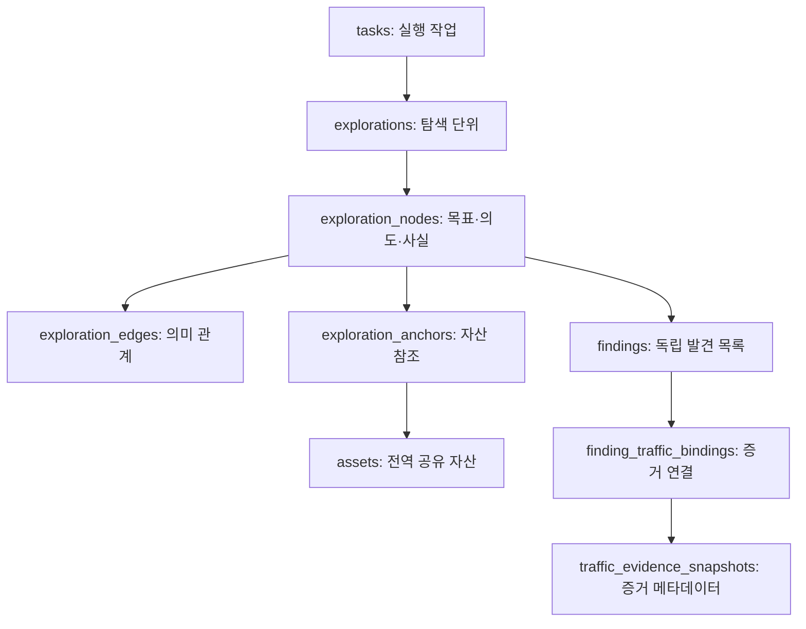

# 데이터베이스 모듈: 자산, 탐색, 실행 기록, 증거를 읽는 방법

`db/`는 ARTEX의 **PostgreSQL 저장 계약**을 정의한다. 모델이 계획을 세우고 도구가 외부 작업을 수행하더라도, 작업의 현재 상태와 기록을 여러 에이전트·서버·화면이 함께 읽으려면 일관된 저장 경계가 필요하다. 이 모듈은 그 경계를 트랜잭션, 행 잠금, 고유 제약, 버전 번호, 커서로 구현한다.

이 문서는 저장소에 포함된 코드의 동작을 설명한다. SQL 쿼리를 실행하거나 서비스의 실제 재현 성공을 주장하는 문서는 아니다. 한국어 주석을 추가하면서 기존 Go 실행 토큰, SQL 문장, 프롬프트·오류 메시지·테이블/필드 이름은 유지했다. 각 Go 파일의 첫 부분에는 해당 파일만 열어도 역할을 알 수 있는 한국어 안내를 추가했고, 핵심 함수 및 트랜잭션 분기에는 구체적인 이유를 덧붙였다.

## 1. 먼저 구분할 네 가지 데이터

| 구분 | 질문 | 대표 저장 위치 | 읽을 코드 |
|---|---|---|---|
| 전역 자산 | 무엇을 알고 있는가? 어느 회사/호스트/서비스인가? | `assets`, `companies`, `company_scope` | [assets.go](../../../db/assets.go), [companies.go](../../../db/companies.go) |
| 작업별 탐색 | 무엇을 목표로 했고, 왜 이 검사를 했으며, 어떤 결과로 이어졌는가? | `explorations`, `exploration_nodes`, `exploration_edges`, `exploration_anchors` | [exploration.go](../../../db/exploration.go), [constants.go](../../../db/constants.go) |
| 실행 기록 | 언제 어떤 도구/모델 호출이 있었는가? | `activity`, `conversation_activities`, `llm_usage`, `llm_records` | [conversation.go](../../../db/conversation.go), [commands.go](../../../db/commands.go), [llm_usage.go](../../../db/llm_usage.go) |
| 결과와 증거 | 발견의 처분 상태는 무엇이고, 어떤 저장 증거로 보고서를 만들었는가? | `findings`, `traffic_evidence_snapshots`, `finding_traffic_bindings`, `finding_retests` | [findings.go](../../../db/findings.go), [finding_traffic.go](../../../db/finding_traffic.go) |

자산과 탐색이 모두 화면에서 그래프로 보이더라도 저장 방식은 다르다. **탐색의 의미 간선은 테이블에 저장한다. 자산의 화면용 포함 관계는 도메인·URL·IP·포트·회사 열을 바탕으로 조회 시 조립한다.** 자산 그래프를 만드는 [BuildCoverageGraph](../../../db/task_scope.go)와 발견별 자산 트리를 만드는 [BuildFindingAssetTree](../../../db/finding_assets.go)를 보면 이 차이가 드러난다.



위 화살표는 데이터의 연결을 이해하기 위한 관계도다. 외래키 방향과 삭제 정책은 [schema.sql](../../../db/schema.sql)을 함께 확인해야 한다. 예를 들어 작업의 탐색 FK는 `ON DELETE RESTRICT`이고, 탐색 노드의 간선/앵커는 노드 삭제 시 함께 정리되는 구조다.

## 2. PostgreSQL을 여는 과정

[db.go](../../../db/db.go)의 읽기 순서는 `DSN → Open → withSchemaMigrationLock → applySchemaWithRetry → seedBuiltins`다.

1. `DSN`은 환경변수 `ARTEX_PG_DSN`, 파일 설정 순으로 연결 정보를 구한다. 둘 다 없으면 임의의 기본 DB를 선택하지 않고 오류를 반환한다.
2. `ensureDatabase`는 가능한 경우 관리 DB를 통해 대상 데이터베이스를 만든다.
3. `Open`은 `database/sql`과 pgx 드라이버로 연결 풀을 열고 실제 연결 가능성을 확인한다.
4. `schema.sql`의 멱등 DDL과 기존 설치 보정 구문을 적용한다.
5. 내장 에이전트, 프롬프트 변수 목록, 일부 MCP/Skill 가시성, 기본 규칙을 등록한다.

초기화의 핵심은 **세션 단위 잠금이 연결에 귀속된다는 점**이다. 풀인 `*sql.DB`에서 `pg_advisory_lock`을 실행한 뒤 다른 풀 연결에서 스키마를 실행하거나 잠금을 해제하면 처음 얻은 잠금과 다른 세션을 쓰게 될 수 있다. `withSchemaMigrationLock`은 `sql.Conn` 하나를 빌려 잠금 획득부터 해제까지 고정한다. 긴 아카이브 트랜잭션은 같은 키의 트랜잭션 잠금을 사용해 초기 DDL과 조율한다.

`applySchemaWithRetry`는 PostgreSQL deadlock 코드 `40P01`일 때만 정해진 지연 후 재시도한다. 권한 오류나 잘못된 문장까지 같은 방식으로 재시도하지 않는다. 이 경계는 [TestApplySchemaRetriesOnlyDeadlocks](../../../db/db_test.go)에서 실제 대기 함수 대신 주입한 함수를 사용해 검사한다.

### 초기값을 등록하는 세 가지 방식

| 방식 | 의미 | 코드에서 확인할 예 |
|---|---|---|
| 없을 때만 삽입 | 재시작해도 사용자 편집 유지 | `SeedTool`, `SeedPromptIfEmpty`, 일부 MCP seed |
| 특정 열만 갱신 | 코드가 관리하는 설명/스키마 등만 보정 | `RefreshToolDefaults`, 내장 에이전트 메타데이터 |
| 완료 플래그를 둔 일회성 보정 | 이미 설치된 DB에도 새 기본 정책을 한 번 적용 | `seedDefaultInterceptRulesV2/V3`, `settings`의 seed 플래그 |

모든 `ON CONFLICT`가 같은 정책은 아니다. 새 업스트림을 반영할 때는 기존 행이 왜 유지되거나 갱신되는지 확인해야 한다. 또한 `schema.sql`만으로 모든 테이블이 생성되는 것은 아니다. `llm_usage`는 [llm_usage.go](../../../db/llm_usage.go)의 `EnsureLLMUsageTable`, `llm_records`는 [commands.go](../../../db/commands.go)의 전용 초기화 코드도 읽는다.

## 3. 여섯 자산 종류와 중복 제거

자산은 [assets.go](../../../db/assets.go)의 `Upsert*` 진입점에서 종류별로 처리된다. `UPSERT`는 새 행 삽입과 기존 자연키 충돌 시 병합을 하나의 저장 연산으로 표현하는 방식이다. 여기서 자연키는 모델이 임의 생성한 ID가 아니라 도메인, IP, URL 같은 실제 식별 정보다.

| 종류 | 현재 고유성 기준 | 대표 진입점 | 주의할 해석 |
|---|---|---|---|
| `root_domain` | `domain` | `UpsertRootDomain` | 루트 도메인과 서브도메인은 종류가 다름 |
| `ip` | `ip` | `UpsertIP` | hostname을 IP 필드로 저장하지 않음 |
| `subdomain` | `domain` + `COALESCE(record_type,'')` | `UpsertSubdomain` | 같은 도메인도 DNS record type이 다르면 별도 행 가능 |
| `app` | bundle ID가 있으면 `bundle_id`, 없으면 `app_name` | `UpsertApp` | 두 경우에 서로 다른 부분 고유 인덱스 적용 |
| HTTP `service` | `url` | `UpsertHTTPService` | URL에서 host/port/root domain을 보완 |
| non-HTTP `service` | domain + IP + port + service name | `UpsertOtherService` | HTTP URL 기준과 다른 식별 방식 |
| `endpoint` | `url` + `method` | `UpsertEndpoint` | 같은 URL의 GET/POST를 별도 대상으로 구분 |

표에 service를 두 줄로 나눴지만 `assets.type`은 여섯 종류다. 세부 서비스 구분은 `service_type`이다. 고유 조건은 [schema.sql의 `uq_av2_*` 인덱스](../../../db/schema.sql)에 정의되어 있다.

### 정규화가 실제로 하는 일

- `DomainKey`: 앞뒤 공백 제거, 소문자화, 끝 점 제거.
- `RootDomain`: public suffix 목록을 이용해 등록 가능한 도메인(eTLD+1)을 구한다. IP나 분류 불가능한 호스트는 그 자체를 루트로 취급하는 경로가 있다.
- `normalizeURL`: scheme/host를 소문자로 만들고 query가 없는 단순 루트 경로의 끝 `/`를 정리한다. 경로의 대소문자나 숫자 ID를 임의로 합치지 않는다.
- `ValidateAssetIP`: 비어 있지 않은 IP가 실제 IP 리터럴인지 검사한다.
- `calcCSegment`: IPv4 `/24`, IPv6 `/48` 분류용 네트워크를 만든다.
- `NormalizeParamName`: 공백과 대소문자를 정리한다. `userId`, `user_id`, `uid`를 의미상 같은 파라미터로 합치지는 않는다.

[nkey.go](../../../db/nkey.go)의 `TemplatePath`는 `/user/123`을 `/user/{id}`처럼 바꾸는 보조 함수다. 그러나 **현재 자산 입력의 `UpsertEndpoint`는 이 함수를 사용해 URL을 템플릿화하지 않는다.** 트래픽 계층의 경로 템플릿 사용과 자산 테이블의 고유성은 구분해서 읽어야 한다.

### 회사 귀속과 파생 자산

[companies.go](../../../db/companies.go)는 `company_source=explicit`인 수동 연결과 `scope`인 자동 귀속을 구별한다. 회사 범위 재계산은 자동 귀속을 갱신하며 수동 선택을 덮어쓰지 않는 계약을 유지한다. 우선순위는 도메인, IP/CIDR, 정규화한 정확한 ICP 일치 순서다. `keyword`는 이 자동 귀속 판정에 사용하지 않는다. 같은 조건의 회사가 여럿이면 안정적인 ID 동률 처리를 적용한다.

자산 입력과 회사 범위 수정은 같은 advisory lock을 사용하는 트랜잭션으로 조율한다. `withCompanyScopeMutation`은 중첩 자산 보완에 같은 `tx`를 전달한다. 이 덕분에 서비스 생성 중 루트 도메인을 보완할 때 서로 다른 회사 범위 시점을 읽는 문제를 줄인다.

자산 파생과 범위 확장은 다르다. `linkHostAssets`는 서비스의 호스트가 자산 목록에 보이도록 도메인 행을 보완하지만, 이것만으로 작업 scope를 계속 넓히면 안 된다. `AddAutoScope`는 상위 입력 루프가 명시적으로 입력한 자산 종류만큼 보수적으로 추가하도록 설계되어 있다.

## 4. 작업 생성부터 worker 선점까지

[tasks.go](../../../db/tasks.go)의 `CreateTaskWithOptions`는 다음을 한 트랜잭션에서 생성한다.

1. exploration 행과 작업의 원점인 `fact/state=origin` 노드.
2. task 레지스트리 행.
3. 직접 source 관계.
4. 회사 scope와 생성 시점의 회사 자산 연결 및 출처.
5. 순서 있는 LLM 프로필 체인.
6. 작업별 자산 규칙.

입력 제한은 가능하면 트랜잭션을 열기 전에 검사한다. 현재 직접 source 최대 개수는 8개, 회사 연결 최대 개수는 중복 제거 후 32개다. 실제 첫 실행 전에는 deadline을 시작하지 않으며 `StampFirstRun`이 최초 실행 시각을 한 번만 기록한다. 재시작해도 이미 시작한 시간 예산을 새로 지급하지 않는다.

현재 Go 생성 경로의 planner 최소/기본 heartbeat는 `MinPlanHeartbeatSeconds=600`이다. 원본의 일부 필드 설명 및 SQL 기본값에는 300이 남아 있으므로, 직접 SQL 삽입과 Go의 정규화 경로가 같은 기본값이라고 가정하면 안 된다.

### 큐와 상태는 서로 다른 축이다

`status`는 `created/running/paused/done/failed/timeout`을 저장한다. 별도의 `paused`는 수동 중지, `queued`는 실행 허가 대기를 표현한다. `Enqueue`는 이미 대기 중인 작업의 `queued_at`을 보존해 반복 요청으로 FIFO 순서가 바뀌지 않게 한다. `queue_mode=bootstrap`이 필요한 작업을 단순 resume 요청이 덮어쓰지 않는 조건도 있다.

### worker 경쟁의 실제 구현

`Frontier`가 반환한 후보는 아직 예약된 것이 아니다. 여러 worker가 같은 open intent를 동시에 읽을 수 있다. `ClaimIntent`의 조건부 UPDATE가 마지막 경계다.

```sql
UPDATE exploration_nodes
SET state = 'running', owner = $1
WHERE id = $2
  AND exploration_id = $3
  AND kind = 'intent'
  AND state = 'open';
```

영향받은 행 수가 1인 worker만 선점에 성공한다. 다른 worker가 먼저 running으로 바꿨다면 결과는 0행이다. 여기에는 `FOR UPDATE SKIP LOCKED`가 없다. 그 방식은 알림 전달 큐와 아카이브 큐에서 별도로 사용된다.

이 보장은 **같은 intent 행의 중복 선점**을 막는 것이다. 서로 다른 두 intent가 의미상 같은 외부 검사를 수행하는지까지 자동 중복 제거하지 않는다. 또한 재시작 때 `ResetRunningIntents`가 running을 open으로 돌려도, 이전 외부 명령의 부작용이 정확히 한 번만 발생했다는 보장은 별도다.

## 5. 탐색 노드의 상태와 계보

| kind | 허용 상태 | 역할 |
|---|---|---|
| `begin` | `open` | 과거 형식의 시작 노드. 새 작업은 origin fact를 생성 |
| `goal` | `open`, `met`, `abandoned` | 목표, 달성, 포기 |
| `intent` | `open`, `running`, `paused`, `done`, `blocked`, `exhausted`, `stopped`, `deleted` | 실행 후보와 진행/종료 상태 |
| `fact` | `confirmed`, `dismissed`, `origin` | 관찰/추론 기록 및 시작점 |
| `finding` | `confirmed`, `dismissed` | 탐색 그래프의 발견 |
| `hint` | `active`, `consumed` | 사람/시스템의 추가 지침 |
| `digest` | `active`, `superseded` | 현재 요약과 대체된 과거 요약 |

상태 허용 집합은 [schema.sql](../../../db/schema.sql)의 CHECK 제약이다. 허용 상태 집합과 실제 상태 전이 정책은 같지 않다. 예를 들어 `CompareAndSetIntentState`는 이전 상태를 조건에 넣어, 사람이 pause한 직후 worker의 오래된 완료 처리로 상태가 덮어써지는 일을 제어한다. 일반 `SetIntentState`와 조건부 전이를 구분해서 사용해야 한다.

관계도 분리되어 있다. `spawns`는 생성 관계, `derived_from`은 근거에서 새 탐색 방향이 파생된 관계, `yields`는 intent의 산출, `proves`는 목표 근거, `covers`는 요약이 원본을 접는 관계다. DB는 이런 관계를 저장하고 종류를 제한하지만 텍스트 주장의 참/거짓을 독립적으로 입증하지는 않는다.

`FindingLineage`는 대상 노드에서 간선을 역방향으로 따라가 조상 집합을 재귀 SQL로 찾는다. 노드와 그 집합 내부 간선을 반환하므로 화면에서 시작점부터 발견까지 설명할 수 있다. `FindingIntents`는 `intent --yields--> finding`을 직접 JOIN해 생성 intent를 찾는다.

### 삭제를 두 종류로 나눈 이유

- `SoftDeleteIntent`는 open/running/paused intent를 deleted로 표시하고 사용자 사유를 남긴다. 원래 노드·산출물·계보는 보존한다.
- `CancelIntent`는 물리 삭제다. yields/derived_from 후손 중 모든 부모가 삭제 집합 안에 들어가는 독점 노드만 함께 지운다. goal, origin fact, 다른 intent/digest가 참조하는 공유 노드는 남긴다.

물리 삭제 전에 활동의 토큰을 원래 UTC 날짜별로 합쳐 별도 장부 행으로 남기는 부분이 있다. 실행 상세를 지운다고 실제 소비한 사용량까지 사라지지 않도록 하는 설계다. 두 경로 모두 실행 중 worker 중단은 상위 계층이 먼저 수행해야 한다.

## 6. 문맥 상속과 요약: 저장한 모든 것을 모델에 보내지 않는다

[exploration_sources.go](../../../db/exploration_sources.go)와 [task_assets_context.go](../../../db/task_assets_context.go)는 현재 작업 및 **직접 연결한 source 작업만** 합친다. 연결된 작업의 연결까지 재귀적으로 펼치지 않는다. `SourceTaskID`, `Inherited`를 붙여 읽기 전용 출처를 표시하며 원본 행을 복사하지 않는다.

source의 worker 이력은 종료 상태 intent에 속한 범위로 제한된다. source의 planner/main 대화는 임의 activity ID를 알고 있어도 상속 조회로 그대로 읽어 오는 대상이 아니다. `ActivityDetailWithSources`, `ActivityByIDsWithSources`에서 이 경계를 확인할 수 있다.

페이지 제한의 의미도 중요하다. `ListByKindWithSources(kind, limit)`는 **소스별 limit**로 합치므로 최종 길이가 limit를 넘을 수 있다. 일반 `ListByKind`는 제한된 최신 목록이며 `len(result)`를 전체 개수로 해석하면 큰 작업에서 실제 수가 축소된다. 전체 열린/종료 intent 수가 필요하면 전용 COUNT 조회를 사용한다.

### cold digest의 저장 책임

[digest.go](../../../db/digest.go)는 요약을 생성하지 않고 요약 알고리즘에 필요한 영속 상태를 제공한다.

| 필드/관계 | 의미 | 왜 필요한가 |
|---|---|---|
| `round_no` | 해당 탐색의 planner 처리 회차 | 전역 시간/다른 작업 활동량에 영향받지 않는 냉각 기준 |
| `cold_since_round` | intent/fact가 차가워진 회차, 없으면 nil | 최근 다시 중요해진 노드를 바로 접지 않기 위한 입력 |
| `content_version` | 요약에 영향을 주는 원본 변경 감지 값 | 같은 ID의 원본이 바뀌면 예전 요약 재사용을 피함 |
| active digest | 현재 개요에 사용할 요약 | 전체 기록과 모델용 압축 표현 분리 |
| `covers` | digest가 접는 원본 노드 집합 | 원본 조회, 요약 출처, 중복 포함 판정 |

`AddDigest`는 digest와 covers를 함께 저장하고 `SupersedeDigests`는 이전 covers 제거와 superseded 전환을 함께 커밋한다. 원본 노드와 이전 digest는 남는다. 따라서 여기서 말하는 복구 가능성은 **원본을 다시 조회할 수 있음**이다. 자연어 요약문만으로 원본의 모든 세부 내용을 재구성할 수 있다는 뜻은 아니다.

## 7. 발견 저장과 증거 버전

[finding_traffic.go](../../../db/finding_traffic.go)의 `RecordFindingTx`가 발견 저장의 중심이다. task와 exploration의 연결, 현재 intent 소유를 확인한 뒤 다음을 같은 트랜잭션에 쓴다.

1. 탐색 그래프의 finding 노드.
2. 자산 앵커.
3. 생성 intent의 yields 간선.
4. 독립 findings 목록 행.
5. 준비된 HTTP 증거 스냅샷과 연결.

`RecordedFinding`에 `FindingID`와 `NodeID`가 따로 있는 이유는 두 테이블의 PK가 서로 다르기 때문이다. 숫자가 우연히 같아도 서로 바꾸어 사용하면 안 된다. `PopulateFindingTrafficIDs`는 이미 읽기 허용된 노드에 실제 JOIN 결과를 보완한다.

### 증거의 두 버전

- `evidence_version`: 증거 구성/역할/순서 등이 바뀔 때 증가하는 현재 버전.
- `report_evidence_version`: 보고서가 작성될 때 사용한 증거 버전.

사용자가 예전 화면을 열어 둔 상태에서 다른 사용자가 증거를 바꾸면, `LockFindingEvidenceTx`가 버전을 비교해 충돌을 반환한다. 증거 재정렬은 전체 바인딩 집합이 정확히 한 번씩 등장하는 순열인지 확인한다. 일부만 재정렬 요청에 포함해 사라진 항목을 만드는 일을 방지한다.

`TrafficSnapshotID`는 정규화된 메타데이터에서 변동 가능한 ID/생성 시각을 제외하고 SHA-256을 계산한다. 바이트 보존과 중복 재사용을 돕지만 암호화나 취약점 판정이 아니다. 요청/응답 본문 파일 복사와 길이/해시 검사는 별도의 `evidence` 패키지가 함께 담당한다.

### 상태와 알림, 재검증

그래프의 `finding.state=confirmed`와 독립 목록의 사람 처분 `findings.status`는 다른 값이다. DB가 confirmed로 저장했다는 이유만으로 독립적인 재현 검증을 통과한 것으로 해석하면 안 된다.

`SetFindingStatus`는 상태만 바꾸는 낮은 수준의 함수다. 알림이 필요한 제품 경로는 [notification.go](../../../db/notification.go)의 `SetFindingStatusWithNotify` 또는 `SetFindingStatusTx`를 사용한다. `RecordNotificationEventTx`는 SAVEPOINT로 알림 INSERT 실패를 격리한다. 정상 등록이면 주요 기록과 함께 커밋되지만, 실패 시 주요 발견 기록은 남고 해당 알림은 누락될 수 있다. 저장점 복구 자체의 실패나 트랜잭션 취소는 최종 COMMIT 결과로 확인해야 한다.

[finding_retests.go](../../../db/finding_retests.go)는 원본 스냅샷과 별도 대화를 만들고 동시 재검증 클릭을 발견 행 잠금으로 합친다. 결과를 잠시 기록하는 단계와 실행 완료를 구분한다. `FinishFindingRetest`에서 **실제로 completed가 된 fixed 판정**만 원래 발견을 수정 완료 상태로 바꾼다. 취소/실패한 실행의 잠정 fixed를 성공으로 취급하지 않는다.

## 8. 실행 이력, 사용량, 승인의 읽기 모델

### 같은 숫자로 보이는 통계도 출처가 다르다

| 데이터 | 측정 단위 | 중요한 경계 |
|---|---|---|
| `activity`의 result 토큰 | 실행 완료 요약 | 중간 tool 사건을 중복 합산하지 않음 |
| `llm_usage` | 모델 호출 1회 | 중단/실패 호출도 호출자가 보고한 사용량을 남길 수 있음 |
| `llm_records` | 선택적으로 기록한 모델 원문 | 디버깅용 큰 요청/응답, 별도 사용량 장부와 분리 |
| `skill_usage` / `tool_usage` | Skill/도구 시도 1회 | 본문 기록이 아닌 차원별 사용 통계 |
| 아카이브 집계 | 활성 저장소에서 이동한 과거 합계 | 전체 통계를 유지하되 활성 자료와 중복 계산하지 않아야 함 |

공급자가 사용량을 보고하지 않은 부분을 DB가 추정해 복원하지는 않는다. `JudgeUsageStats`는 전체 누적 합계와 지정 days의 일별 시계열을 동시에 반환하므로 총계와 그래프의 기간이 다를 수 있다.

활동 목록은 `sinceID` 이후로 진행하는 조회와 `before` 이전으로 거슬러 가는 페이지가 나뉜다. 긴 detail은 별도 요청에서 읽는다. 전역 BIGSERIAL ID 사이의 숫자 공백은 다른 작업 사건이나 롤백 등으로 생길 수 있으므로 단순히 `이전 ID+1`을 기대하는 방식으로 누락을 판단해서는 안 된다.

### 승인 이력은 실행 결과와 분리한다

[intercept_detail.go](../../../db/intercept_detail.go)의 `ResolveIntercept`는 pending일 때만 갱신해 사람이 결정한 내용을 타임아웃이 덮어쓰지 않게 한다. allow는 실행 성공과 다르다. 정확한 run/tool ID 연결이 있는 경우에만 `CompleteIntercept`가 결과를 붙인다.

[intercept_execution.go](../../../db/intercept_execution.go)는 실제 tool_use/tool_result의 ID·worker·intent·main 세그먼트를 확인해 원본 실행 위치로 이동한다. 후보가 모호하면 오류를 반환하며 명령 문자열이 비슷하다는 이유로 과거 실행을 추측해서 연결하지 않는다.

## 9. 긴 작업을 위한 아카이브와 복구

[task_archives.go](../../../db/task_archives.go)는 아카이브 큐, 상태, 형식, 스냅샷 추출을 담당한다. [task_archives_restore.go](../../../db/task_archives_restore.go)는 외부 파일이 준비된 후 활성 DB를 줄이고 다시 복원한다.

아카이브는 먼저 작업이 일시정지 또는 종료 상태인지, 실행 대기 중이지 않은지, 다른 살아 있는 작업이 직접 source로 의존하는지 검사한다. 스냅샷은 Repeatable Read 트랜잭션에서 여러 테이블을 같은 시점으로 읽는다. 실제 에이전트 쓰기를 멈추는 barrier는 상위 서비스가 마련한다.

작은 테이블은 manifest에 JSON 배열로 넣지만 큰 `llm_records`는 `database/llm_records.ndjson` 스트림으로 옮길 수 있다. 현재 쓰기 형식은 v3이고 읽기는 v1~v3를 지원한다. 키와 모델 전역 설정을 아카이브 복원으로 임의 재생성하지 않는다.

`CompleteTaskArchive`는 외부 패키지의 기록과 체크섬이 완료된 뒤 호출해야 한다. 작업/탐색의 최소 ID 행은 남고 무거운 작업 소유 자료는 활성 테이블에서 정리된다. 공유 자산 여부는 최종 잠금 아래 다시 확인한다.

복원은 같은 자연키 자산이 이미 존재할 수 있으므로 **옛 자산 ID → 현재 자산 ID** 매핑을 만든다. 그 뒤 앵커, 발견의 자산 배열 등 참조도 바꾼다. 자산 행만 복원하고 참조를 옛 ID로 남기면 다른 객체를 가리킬 수 있다. 현재 없어져 버린 분류/회사/모델 참조는 경고를 남기고 생략하는 정책이다.

중단 복구는 종류별로 다르다. `archiving`은 `archive_failed`로 바뀌어 수동 재시도를 요구하고, `restoring`/`deleting`은 각각 queued로 돌아가 재개한다. 무거운 아카이브가 자원 문제로 중단되었을 때 시작마다 같은 작업을 반복하는 crash loop를 피하려는 구분이다.

## 10. /btw와 늦게 도착한 쓰기

[side_questions.go](../../../db/side_questions.go)는 부모 스냅샷, 질문 요청, 답변, 요약 메모리를 저장한다. 핵심 식별자는 session key, client ID, generation, run/version, sequence다.

| 식별자 | 막으려는 문제 |
|---|---|
| client ID | 같은 HTTP 요청을 재전달해 질문을 중복 실행 |
| generation | 사용자가 지운 과거 기록의 늦은 결과가 새 이력을 채움 |
| run ID + version | 오래된 체크포인트가 최신 부모 문맥을 덮어씀 |
| sequence | 같은 실행의 늦은 스트림 갱신이 더 최신 상태를 되돌림 |

`lockSideParent`는 부모 대화 또는 살아 있는 작업을 잠근다. intent에는 현재 코드상 `state <> 'stopped'` 조건이 적용된다. `SoftDeleteIntent`의 `deleted`를 포함한 모든 끝난 상태를 제외하는 조건은 아니므로, 이 점은 향후 상태 정책을 점검할 구체적인 지점이다. 이번 한국어 설명 작업에서 이 실행 조건을 변경하지 않았다.

화면용 `SideReplay`의 최근 20개 제한과 요약용 `SideReplayPage`는 다른 목적이다. 요약 경로는 현재 요청 이전의 성공 교환을 페이지 단위로 모두 방문할 수 있게 한다.

## 11. 테스트를 읽을 때 확인할 것

테스트는 파일별 설명과 기대값 자체가 저장 계약의 예제다. [testmain_test.go](../../../db/testmain_test.go)는 agent/server 테스트와 공유하는 advisory lock을 사용해 DB 정리 경쟁을 줄인다. 이는 **독립 테스트 DB를 대신 만들어 주는 기능은 아니다.** DB를 사용하는 fixture가 실제 INSERT/UPDATE/DELETE와 스키마 적용을 수행하므로 운영 DB를 지정해서 실행하면 안 된다.

설정이 없는 경우 `testDSN` 등은 DB 의존 테스트를 skip한다. `go test`의 성공만으로 모든 PostgreSQL SQL/잠금 경로를 실행했다고 판단하지 말고 skip 여부와 실행 대상을 확인한다.

추천 순서는 다음과 같다.

1. [db_test.go](../../../db/db_test.go): 초기화와 멱등성, deadlock 재시도.
2. [assets_test.go](../../../db/assets_test.go), [companies_test.go](../../../db/companies_test.go): 정규화와 upsert, 귀속/롤백.
3. [tasks_test.go](../../../db/tasks_test.go), [intent_control_test.go](../../../db/intent_control_test.go): 생성 단위와 상태 경쟁.
4. [exploration_sources_test.go](../../../db/exploration_sources_test.go): 직접 상속과 노출 범위.
5. [task_context_lock_test.go](../../../db/task_context_lock_test.go): 실제 병렬 연결의 잠금 순서.
6. [task_delete_concurrency_test.go](../../../db/task_delete_concurrency_test.go): 공유 자산/호스트 보호.
7. [finding_retests_test.go](../../../db/finding_retests_test.go), [notification_test.go](../../../db/notification_test.go): 결과 확정과 부가 알림 실패 분리.
8. [task_archives_test.go](../../../db/task_archives_test.go), [side_questions_test.go](../../../db/side_questions_test.go): 복원 및 늦은 쓰기 경쟁.

## 12. 이 모듈에서 배울 설계와 확장 지점

### 재사용 가치가 큰 설계

- **전역 객체와 작업별 근거의 분리**: 같은 자산을 재사용하면서 각 작업의 판단 계보를 남길 수 있다. 제조 검사에서는 설비/부품을 전역 자산으로, 검사 계획/측정값/결함을 탐색 노드로 대응시킬 수 있다.
- **조건부 UPDATE와 버전 비교**: 분산 작업자가 같은 단위를 동시에 처리할 때 선점과 상태 변경 경쟁을 다루는 기본 도구다.
- **출처를 가진 읽기 전용 상속**: 과거 작업을 통째로 복제하지 않고 직접 연결한 안정된 결과를 가져온다. 문서 검토, 실험 계획, 고객 지원 이력에도 적용할 수 있다.
- **원본을 보존하는 요약**: 모델 문맥 비용을 줄이면서 원래 기록으로 돌아갈 수 있는 링크를 유지한다. 요약을 정답 원본으로 취급하는 오류를 줄인다.
- **핵심 기록과 부가 기능의 실패 분리**: 알림의 SAVEPOINT는 부가 전달 실패가 주요 발견 저장을 막지 않도록 하는 의도적인 트레이드오프다.
- **자산 ID 재매핑을 포함한 복원**: 이미 변한 전역 객체 집합에 과거 작업을 복구할 때 필요한 실제 데이터 병합 문제를 다룬다.

### 동작 변경이 필요할 때 구체적으로 검토할 곳

| 확장 지점 | 현재 경계 | 개선 방향 |
|---|---|---|
| 사실/발견의 신뢰도 | DB 상태와 payload가 주장의 실제 진위를 보장하지 않음 | 독립 검증 결과·근거 버전·판정 주체를 별도 구조로 저장 |
| 외부 실행 중복 | intent 선점과 재시작 복구만으로 외부 부작용의 정확히 한 번 실행을 보장하지 않음 | 실행별 idempotency key, 효과 확인, 재시도 가능성 분류 |
| 자산 정규화 | 정확한 URL+method 식별은 의미상 같은 endpoint를 여러 행으로 남길 수 있음 | 원본 URL과 별개 canonical/template 키를 두고 오합병을 측정 |
| 조회 총수 | 제한된 목록 길이가 전체 수로 잘못 쓰일 수 있음 | COUNT와 page 반환 계약 분리, UI에서 잘림 표시 |
| 전역 동시성 | 회사 범위/증거 등의 공유 잠금은 단순하지만 큰 규모에서 대기 증가 가능 | 먼저 잠금 대기 측정 후 회사/작업 단위 분할 가능성 검토 |
| 상태 정책 | intent의 stopped/deleted 등 경계가 기능별 쿼리에 흩어짐 | 공통 상태 판정 계약 및 삭제 이후 지연 쓰기 회귀 테스트 |
| 아카이브 호환 | v1~v3 필드 및 ID 재매핑을 여러 함수가 담당 | 형식별 명시적 마이그레이션과 복원 전 검증 보고서 |
| 알림 전달 | DB 임대와 외부 채널 전송은 단일 트랜잭션이 아님 | 채널이 지원하면 전달 idempotency key 및 중복 확인 |

이 표의 개선안은 현재 구현된 기능 목록이 아니라 후속 개발 제안이다. 한국어 주석 추가 작업에서는 실행 동작을 바꾸지 않았다.

## 13. 전체 Go 파일 안내

`db/`의 Go 95개 파일(구현 49개, 테스트 46개)을 모두 포함한다. 표의 설명은 각 파일에 추가한 한국어 안내와 대응한다.

### 구현 파일

| 파일 | 읽을 내용 |
|---|---|
| [asset_dsl.go](../../../db/asset_dsl.go) | 자산 검색 문장을 토큰 → AND/OR 식 트리 → 매개변수화한 SQL WHERE로 바꾸는 작은 검색 언어 구현이다. |
| [asset_intercept.go](../../../db/asset_intercept.go) | 전역 자산 차단 규칙의 영속화 계층이다. kind·pattern·note·enabled를 저장하고 화면에서 편집할 수 있게 CRUD를 제공한다. |
| [asset_intercept_match.go](../../../db/asset_intercept_match.go) | 자산의 domain/IP/URL 후보와 전역·작업 규칙을 비교하는 순수 판정 로직 및 DB 연결 부분이다. |
| [assets.go](../../../db/assets.go) | 여섯 자산 종류(root_domain, ip, subdomain, app, service, endpoint)의 전역 공유 저장소다. 서로 다른 종류의 열을 하나의 assets 테이블에 담는다. |
| [chat_mentions.go](../../../db/chat_mentions.go) | 대화 입력의 @ 참조 선택기에 필요한 작업·자산·발견 등 후보를 검색한다. 종류는 ValidChatMentionKind의 허용 목록을 따른다. |
| [commands.go](../../../db/commands.go) | activity에 저장된 도구 호출을 명령 이력으로 조회하고, 별도의 llm_records에 모델 요청/응답 원문 기록을 보관한다. |
| [companies.go](../../../db/companies.go) | 회사 레지스트리와 회사별 범위 규칙을 관리하고, 그 규칙으로 전역 자산의 company_id를 재계산한다. |
| [company_scope.go](../../../db/company_scope.go) | 사용자가 입력한 회사 범위를 domain/IP/CIDR/ICP/keyword로 분류하고 정규화하는 파서다. |
| [config.go](../../../db/config.go) | LLM 프로필, 에이전트 설정, 프롬프트 버전, MCP 서버와 도구 캐시, Skill/MCP 가시성을 PostgreSQL에 저장한다. |
| [constants.go](../../../db/constants.go) | 탐색 그래프의 노드 종류·관계 이름·상태 이름을 공유하는 상수 모음이다. 문자열 자체는 DB CHECK 제약 및 API 계약과 맞물린다. |
| [constraints.go](../../../db/constraints.go) | 한 exploration에 속한 사람이 읽을 수 있는 작업 제약을 task_constraints에 저장한다. 목록·추가·수정·삭제가 exploration_id로 제한된다. |
| [conversation.go](../../../db/conversation.go) | 독립 대화의 제목·에이전트·모델 설정·고정 상태와 conversation_activities를 관리한다. 작업 탐색의 activity와 저장 공간이 구분된다. |
| [db.go](../../../db/db.go) | PostgreSQL 연결과 초기화의 진입점이다. DSN → 연결 확인 → 스키마 적용 → 내장 설정 초기값 등록 순서로 시작한다. |
| [digest.go](../../../db/digest.go) | 탐색 그래프의 오래된 부분을 요약하는 compactor가 사용하는 영속 상태를 담당한다. 요약문 생성 자체는 agent 쪽에서 수행한다. |
| [exploration.go](../../../db/exploration.go) | 한 작업의 탐색 그래프와 실행 활동 장부를 읽고 쓰는 중심 파일이다. Node는 추론/계획 상태, Edge는 노드 간 관계, Anchor는 전역 자산 참조다. |
| [exploration_sources.go](../../../db/exploration_sources.go) | 현재 작업이 직접 연결한 source 작업의 기록을 읽기 전용 문맥으로 합치는 조회 계층이다. source의 source까지 재귀로 확대하지 않는다. |
| [finding_assets.go](../../../db/finding_assets.go) | 발견 목록의 자산별 탐색 트리를 만드는 조회/조립 코드다. finding.asset_ids로 출발해 실제 자산과 필요한 상위 호스트·회사를 보완한다. |
| [finding_retests.go](../../../db/finding_retests.go) | 사용자가 발견 재검증을 요청했을 때 재검증 대화와 원본 스냅샷을 만들고 결과를 봉인하는 저장 계층이다. |
| [finding_traffic.go](../../../db/finding_traffic.go) | 발견과 HTTP 증거 스냅샷의 연결, 증거 편집 버전, 보고서가 참조한 버전을 관리한다. 실제 본문 파일 복사/해시 검사는 evidence 패키지와 협력한다. |
| [finding_traffic_archive.go](../../../db/finding_traffic_archive.go) | 작업 아카이브에 포함된 발견 증거 스냅샷을 읽고, 복원 때 스냅샷과 발견 연결을 다시 구성한다. |
| [findings.go](../../../db/findings.go) | 독립 findings 테이블의 목록·필터·통계·편집·삭제·내보내기를 담당한다. 작업 그래프의 finding 노드와 node_id로 연결된다. |
| [intent_admission.go](../../../db/intent_admission.go) | 추가 intent를 만들었으나 작업 실행 허가 단계가 실패한 경우 저장 결과를 보상하는 작은 트랜잭션이다. |
| [intercept.go](../../../db/intercept.go) | 도구 호출 승인 규칙과 승인 대기/결정 이력을 보관한다. 자산 주소 규칙을 다루는 asset_intercept와 다른 기능이다. |
| [intercept_detail.go](../../../db/intercept_detail.go) | 승인 순간에 수집한 제한된 세션 사건과 도구 ID를 audit JSON으로 저장/조회한다. 기록된 맥락이며 모델 내부 추론을 복원하지 않는다. |
| [intercept_execution.go](../../../db/intercept_execution.go) | 승인 이력에서 원래 도구 실행 위치로 이동할 수 있도록 activity/conversation_activities의 정확한 호출을 찾는다. |
| [llm_usage.go](../../../db/llm_usage.go) | 모델 호출별 토큰 사용량을 llm_usage에 누적하는 계량 장부와 집계 쿼리다. 원문 요청/응답을 저장하는 llm_records와 분리된다. |
| [llmhealth.go](../../../db/llmhealth.go) | LLM 프로필의 일시적 장애와 냉각 종료 시각을 저장해 프로세스 재시작 뒤에도 회로 차단 상태를 이어간다. |
| [llmretry.go](../../../db/llmretry.go) | 전역 재시도 정책과 프로필별 부분 재정의를 표현한다. 횟수 0은 미설정, -1은 해당 재시도 비활성, 양수는 명시한 횟수다. |
| [logs.go](../../../db/logs.go) | 운영 로그의 추가·최근 조회·이전 페이지 조회를 담당한다. 작업별 도구 활동과 달리 서버 전체 운용 사건을 담는 로그다. |
| [nkey.go](../../../db/nkey.go) | 도메인·IP·URL·파라미터의 정규화와 과거 그래프 자연키를 만드는 보조 함수 모음이다. |
| [notification.go](../../../db/notification.go) | 알림 채널 설정, 발견/상태 변경 사건, 채널별 발송 작업으로의 분배와 상태 통계를 저장한다. |
| [notification_delivery.go](../../../db/notification_delivery.go) | 알림 전달 작업의 선점·임대·재시도·완료·이력 조회를 관리한다. 네트워크 전송 자체는 notify 패키지의 dispatcher가 담당한다. |
| [settings.go](../../../db/settings.go) | settings 테이블의 문자열 key/value를 읽고 쓰는 공통 저장 API다. 기능별 세부 설정은 각 호출자가 직렬화해 저장한다. |
| [side_questions.go](../../../db/side_questions.go) | 본 작업과 별도로 묻는 /btw 질문의 부모 스냅샷·요청·답변·요약 메모리를 저장한다. |
| [skill_usage.go](../../../db/skill_usage.go) | Skill 호출의 성공/누락 여부와 에이전트·작업·탐색 식별자를 기록하는 사용 장부다. |
| [task_archive_aggregate_stats.go](../../../db/task_archive_aggregate_stats.go) | 활성 테이블에서 제거된 아카이브 작업의 미리 계산된 통계를 읽어 전체 통계에 합친다. |
| [task_archives.go](../../../db/task_archives.go) | 작업 아카이브의 상태 머신·작업 큐·형식 버전·DB 스냅샷 추출을 담당한다. 압축 파일 입출력은 상위 아카이브 서비스가 수행한다. |
| [task_archives_restore.go](../../../db/task_archives_restore.go) | 검증된 아카이브 파일이 준비된 뒤 활성 DB를 축소하고, 복원 시 참조 순서에 맞춰 데이터를 되돌리는 트랜잭션 코드다. |
| [task_assets.go](../../../db/task_assets.go) | 전역 자산을 특정 작업에 등록·연결·연결 해제하고 연결의 출처 설명을 기록한다. |
| [task_assets_context.go](../../../db/task_assets_context.go) | 현재 작업과 직접 연결한 source 작업을 합쳐 범위·커버리지·미검사 자산·트래픽 검색용 호스트를 조회한다. |
| [task_categories.go](../../../db/task_categories.go) | 작업 분류의 생성·이름 변경·삭제·단일/일괄 배정을 처리한다. 정규화된 이름의 고유 제약 위반을 도메인 오류로 바꾼다. |
| [task_context.go](../../../db/task_context.go) | 작업의 직접 source 관계·회사 범위·순서 있는 LLM 체인과 현재 프로필 커서를 읽고 갱신한다. |
| [task_intercept.go](../../../db/task_intercept.go) | 한 작업에 한정된 자산 allow/block 규칙의 CRUD와 생성 시 일괄 등록을 담당한다. |
| [task_scope.go](../../../db/task_scope.go) | task_scope의 등록/삭제와 자산 포함 관계, 검사 커버리지 및 화면용 자산 그래프를 계산한다. |
| [task_templates.go](../../../db/task_templates.go) | 재사용할 작업 템플릿의 이름·본문·옵션·자산 규칙을 저장하고 부분 갱신을 처리한다. |
| [tasks.go](../../../db/tasks.go) | 작업 레지스트리와 exploration의 1:1 생명주기를 관리한다. 생성은 origin fact·source 관계·회사 범위·모델 체인·규칙을 한 트랜잭션에 묶는다. |
| [tool_usage.go](../../../db/tool_usage.go) | 도구 실행 시도마다 도구명·에이전트·작업·결과를 기록하는 가벼운 사용 장부다. |
| [tools.go](../../../db/tools.go) | 도구 설명·JSON Schema·허용 에이전트 목록·사용자 정의 도구의 실행 설정을 보관한다. |
| [triggers.go](../../../db/triggers.go) | 사용자 정의 에이전트의 이벤트/주기 트리거와 스케줄러 커서를 영속화한다. |

### 테스트 파일

| 파일 | 읽을 내용 |
|---|---|
| [activity_page_test.go](../../../db/activity_page_test.go) | 대화 세그먼트별 activity 페이지와 노드 종류별 페이지 조회를 검증한다. `Test*` 함수 2개. |
| [asset_intercept_match_test.go](../../../db/asset_intercept_match_test.go) | 도메인/CIDR/IP/URL 패턴의 일치, 비활성 규칙 제외, 차단/허용 우선순위를 표 기반으로 검사한다. `Test*` 함수 3개. |
| [assets_test.go](../../../db/assets_test.go) | 여섯 자산 종류의 upsert, 자연키 중복 제거, 부가 필드 병합, 회사 귀속, 작업/회사별 페이지 조회와 삭제를 검증한다. `Test*` 함수 29개. |
| [companies_test.go](../../../db/companies_test.go) | 정규화 회사명 중복, 회사와 범위의 원자적 생성, 규칙 갱신 실패 롤백, 회사 귀속 재계산과 삭제를 검증한다. `Test*` 함수 12개. |
| [company_lock_test.go](../../../db/company_lock_test.go) | 회사 범위 변경용 advisory lock 키가 스키마/테스트/증거 등 다른 기반 잠금과 충돌하지 않는지 검사한다. 대표 검사: `TestCompanyScopeMutationLockDoesNotReuseInfrastructureLocks`. |
| [company_scope_consistency_test.go](../../../db/company_scope_consistency_test.go) | 범위 수정과 자산 upsert가 같은 잠금으로 조율되는지, 동일 우선순위에서 회사 ID로 결과가 안정되는지 검증한다. `Test*` 함수 4개. |
| [company_scope_test.go](../../../db/company_scope_test.go) | 자동/명시적 범위 입력 파서와 domain/IP/CIDR/ICP/keyword 분류, ICP 귀속을 검증한다. `Test*` 함수 6개. |
| [config_max_tokens_test.go](../../../db/config_max_tokens_test.go) | LLM 프로필의 max_tokens가 저장·조회·수정 후 같은 값으로 돌아오는지와 기본값 적용을 검증한다. `Test*` 함수 2개. |
| [config_test.go](../../../db/config_test.go) | 프로필 failover 정렬, 취소된 삭제 요청, 에이전트/프롬프트/MCP/가시성 저장소의 기본 계약을 검증한다. `Test*` 함수 3개. |
| [conversation_pin_test.go](../../../db/conversation_pin_test.go) | 대화 고정/해제와 PATCH 후 목록 순서를 검증한다. 대표 검사: `TestConversationPinOrderingAndPatch`. |
| [customtool_test.go](../../../db/customtool_test.go) | Python/HTTP 등의 사용자 정의 도구 레코드 생성·읽기·수정·삭제를 검증한다. 대표 검사: `TestCustomToolCRUD`. |
| [db_test.go](../../../db/db_test.go) | 스키마 실행이 PostgreSQL deadlock(40P01)만 재시도하는지와 Open의 내장 데이터 등록/재호출 멱등성을 검증한다. `Test*` 함수 2개. |
| [exploration_sources_test.go](../../../db/exploration_sources_test.go) | 직접 source의 읽기 전용 노드·fact·종료된 worker 이력·앵커를 합치는 조회 계약을 검증한다. `Test*` 함수 3개. |
| [exploration_test.go](../../../db/exploration_test.go) | 탐색 노드/간선/앵커의 생성·조회·상태 변경, 선점 경쟁, activity 저장과 계보 조회를 검증한다. `Test*` 함수 3개. |
| [exploration_tokens_test.go](../../../db/exploration_tokens_test.go) | 작업 전체·worker·UI 세션의 토큰 합계가 종료 result 활동에서 일관되게 집계되는지 검증한다. 대표 검사: `TestTokenStatsBySessionUsesCompleteIntentHistory`. |
| [finding_assets_test.go](../../../db/finding_assets_test.go) | 발견 필터에 따른 자산 트리와 상위 호스트/회사 연결, 심각도 집계 및 하위 범위 필터를 검증한다. `Test*` 함수 2개. |
| [finding_retests_test.go](../../../db/finding_retests_test.go) | 동시 재검증 요청 중복 억제, 원본 스냅샷/대화 생성, 결과 판정과 완료 상태의 조합을 검증한다. `Test*` 함수 4개. |
| [finding_traffic_archive_test.go](../../../db/finding_traffic_archive_test.go) | 증거용 advisory lock 키 충돌 방지와 구형 아카이브에서 없는 발견 버전/증거 연결의 기본값 복원을 검증한다. `Test*` 함수 2개. |
| [findings_test.go](../../../db/findings_test.go) | 발견의 별도 목록 테이블과 그래프 노드 연결, 상태·심각도·필터·그룹·내보내기·후속 intent 생성을 검증한다. `Test*` 함수 5개. |
| [intent_control_test.go](../../../db/intent_control_test.go) | 사람의 pause/resume/stop과 worker의 완료가 경쟁할 때 허용된 상태 전이만 성공하는지 검증한다. `Test*` 함수 3개. |
| [intent_delete_test.go](../../../db/intent_delete_test.go) | intent의 soft delete, 삭제 사유, 관련 후손/이력 처리와 재조회 시 노출 범위를 검증한다. `Test*` 함수 3개. |
| [intercept_detail_test.go](../../../db/intercept_detail_test.go) | 승인 당시 audit의 저장/상세 조회와 사람이 결정한 뒤 타임아웃/중복 결정이 덮어쓰지 않는 조건을 검증한다. 대표 검사: `TestInterceptDetails`. |
| [intercept_execution_test.go](../../../db/intercept_execution_test.go) | 승인에서 원본 tool_use/tool_result 쌍으로 이동할 때 ID·worker·intent·main 세그먼트의 정확한 연결을 검증한다. 대표 검사: `TestInterceptExecutionNavigation`. |
| [intercept_filter_test.go](../../../db/intercept_filter_test.go) | 승인 목록의 상태/종류/대화/작업/검색 필터와 페이지 건수를 검증한다. 대표 검사: `TestInterceptApprovalFilters`. |
| [intercept_seed_test.go](../../../db/intercept_seed_test.go) | 내장 삭제 경로 정규식이 tool_input JSON 형태에서 삭제 API를 탐지하고 비슷한 일반 단어는 통과시키는지 검증한다. 대표 검사: `TestDeleteEndpointPathPattern`. |
| [jsonb_clean_test.go](../../../db/jsonb_clean_test.go) | PostgreSQL JSONB가 거부하는 실제 NUL escape만 제거하고 이스케이프된 역슬래시의 문자 표현은 유지하는지 검증한다. 대표 검사: `TestJsonbClean`. |
| [llm_records_migrate_test.go](../../../db/llm_records_migrate_test.go) | 예전 llm_records 테이블을 현재 기록 형태로 보완하는 마이그레이션의 멱등성을 검증한다. 대표 검사: `TestLLMRecordsMigrateAddsRawColumnsToOldTable`. |
| [llmretry_test.go](../../../db/llmretry_test.go) | 프로필별 재시도 설정 및 전역 정책의 저장/조회, 값의 범위 제한, 미설정 기본값을 검증한다. `Test*` 함수 3개. |
| [notification_test.go](../../../db/notification_test.go) | 알림 채널 CRUD, 사건 분배, 실시간/요약 발송 선점, 임대·재시도·비활성 처리·통계를 검증한다. `Test*` 함수 17개. |
| [side_questions_test.go](../../../db/side_questions_test.go) | /btw 질문의 client ID 중복 억제, 기록 페이지, 재시작 복구, 메모리 체크포인트와 기록 초기화를 검증한다. `Test*` 함수 6개. |
| [skill_usage_test.go](../../../db/skill_usage_test.go) | Skill 호출 성공/누락/에이전트/작업별 집계 및 최근 호출 목록을 검증한다. 대표 검사: `TestSkillUsageLedger`. |
| [task_archives_test.go](../../../db/task_archives_test.go) | JSON 행 스트리밍, 지원 형식, 작업 아카이브→활성 정리→복원 왕복과 집계 유지·의존 관계·중단 복구를 검증한다. `Test*` 함수 6개. |
| [task_assets_test.go](../../../db/task_assets_test.go) | 범위 등록의 원자성, 기존 전역 자산 attach/detach, 출처 설명과 직접 source의 intent 대상 조회를 검증한다. `Test*` 함수 3개. |
| [task_categories_test.go](../../../db/task_categories_test.go) | 분류 CRUD, 작업 생성 시 분류 검증, 단일/일괄 분류 배정과 잘못된 입력의 전체 롤백을 검증한다. `Test*` 함수 4개. |
| [task_context_lock_test.go](../../../db/task_context_lock_test.go) | 작업/에이전트/대화의 모델 프로필 참조 갱신과 프로필 삭제 사이의 잠금 순서를 실제 병렬 연결로 검증한다. `Test*` 함수 5개. |
| [task_context_unit_test.go](../../../db/task_context_unit_test.go) | UTF-8 문자열을 바이트 제한에 맞춰 자를 때 한글 같은 다중 바이트 문자가 중간에서 깨지지 않는지 검증한다. `Test*` 함수 2개. |
| [task_delete_concurrency_test.go](../../../db/task_delete_concurrency_test.go) | 작업 삭제용 트래픽 호스트 선정부터 DB 삭제 확정까지 자산/앵커 쓰기를 같은 트랜잭션으로 조율하는지 검증한다. 대표 검사: `TestDeleteTaskTrafficHostsUseOneLockedTransaction`. |
| [task_list_performance_test.go](../../../db/task_list_performance_test.go) | 작업 목록이 LLM 체인/source/회사 정보를 작업별 N+1 쿼리 없이 일괄 보완하는지 검증한다. `Test*` 함수 2개. |
| [task_metadata_test.go](../../../db/task_metadata_test.go) | 작업 고정/해제·이름 수정·목록 순서와 대화 일괄 삭제의 실제 삭제 ID 반환을 검증한다. `Test*` 함수 2개. |
| [task_queue_test.go](../../../db/task_queue_test.go) | 동시 실행 제한으로 큐에 들어간 작업의 bootstrap/resume 모드와 FIFO 시각이 반복 등록 후에도 보존되는지 검증한다. 대표 검사: `TestTaskQueuePreservesBootstrapAndFIFOPosition`. |
| [task_scope_test.go](../../../db/task_scope_test.go) | host:port, IP:port, IPv6 표기의 포트를 제거하는 stripHostPort 경계 조건을 검증한다. 대표 검사: `TestStripHostPort`. |
| [task_source_limit_test.go](../../../db/task_source_limit_test.go) | 최대 직접 source 수 및 회사 수, 회사 ID 양수 검증·순서 보존 중복 제거를 검사한다. `Test*` 함수 3개. |
| [task_templates_test.go](../../../db/task_templates_test.go) | 템플릿 CRUD와 정규화 이름 중복 처리, 서로 다른 필드의 동시 PATCH 결합을 검증한다. `Test*` 함수 2개. |
| [tasks_test.go](../../../db/tasks_test.go) | 작업/탐색의 생성과 생명주기, cascade 삭제, 직접 source 관계, LLM failover 체인, 회사 범위·목록 정렬을 검증한다. `Test*` 함수 6개. |
| [testmain_test.go](../../../db/testmain_test.go) | db 테스트 묶음의 진입점이다. agent/server 테스트와 같은 advisory lock을 사용해 공유 테스트 DB의 청소 경쟁을 줄인다. 대표 검사: `TestMain`. |
| [tool_usage_test.go](../../../db/tool_usage_test.go) | 도구 사용 장부의 기록과 도구별 호출 횟수를 검증한다. 대표 검사: `TestToolUsageLedger`. |


## 14. 전체 스키마 테이블 안내

[schema.sql](../../../db/schema.sql)에 선언한 49개 테이블의 역할이다. `llm_usage`와 `llm_records`의 추가 초기화 위치는 아래에 따로 표시한다.

| 테이블 | 역할 |
|---|---|
| `companies` | 회사 레지스트리다. 표시 이름과 별도로 정규화 nkey가 유일하며, 범위 규칙과 자산 귀속의 부모가 된다. |
| `assets` | 전역 공유 자산 저장소다. type별로 필요한 열을 사용하고 아래 partial unique index가 여섯 종류의 자연키 중복을 막는다. task_ids는 여러 작업의 연결을 담는다. |
| `company_scope` | 회사에 속하는 도메인/네트워크/ICP/키워드 범위다. kind별 domain/net/value payload 제약을 두며 키워드는 자산 자동 귀속과 별도의 참고 입력이다. |
| `explorations` | 작업별 탐색 그래프의 최상위 행이다. tasks와 1:1로 이어지며 round_no는 이 탐색의 planner 회차를 센다. |
| `exploration_nodes` | goal/intent/fact/finding/hint/digest 등 추론 상태를 저장한다. JSONB payload 내용과 별도로 kind별 허용 state를 CHECK로 제한한다. |
| `exploration_edges` | 탐색 노드 사이의 방향 있는 의미 관계를 저장한다. spawns/derived_from/yields/proves/covers는 자산 네트워크의 물리 연결과 다른 관계다. |
| `exploration_anchors` | 탐색 노드와 전역 자산의 다대다 연결이다. 누가 어떤 자산을 검사/참조했는지 추적하며 자산 소유권이나 외부 명령 권한 자체를 표현하지 않는다. |
| `task_constraints` | 작업 설명에서 추출하거나 사람이 편집한 제약 텍스트다. 행 저장만으로 실행 도구의 접근이 강제로 차단되지는 않는다. |
| `activity` | 작업 실행 사건을 누적하는 장부다. 전역 증가 ID는 폴링/SSE 재생 커서로 쓰고 긴 detail은 목록에서 분리해서 읽는다. result의 토큰은 실행 완료 집계에 사용한다. |
| `main_sessions` | 같은 작업의 main 대화를 새로 시작할 때 세그먼트 번호를 보관한다. 원래 세그먼트 0은 암묵적이고 추가 세그먼트만 행을 가진다. |
| `settings` | 기능별 런타임 설정과 일회성 seed 완료 플래그를 key/value로 저장한다. 값의 JSON/불리언 해석은 각 설정 API가 담당한다. |
| `llm_profiles` | 외부 모델 접속 정보와 모델/예산/우선순위를 보관한다. API 키는 실행용 조회와 목록 힌트 조회를 구분해서 다룬다. |
| `llm_profile_health` | 프로필의 연속 실패·마지막 오류·냉각 기한이다. 만료된 냉각을 재시작 후 다시 장애로 취급하지 않도록 조회 조건을 확인한다. |
| `task_categories` | 작업을 묶는 전역 분류다. 이름 변경/삭제가 실제 작업 실행이나 템플릿 삭제를 뜻하지 않으며 분류 삭제 시 작업은 미분류로 돌아간다. |
| `tasks` | 실행 작업의 레지스트리다. status, paused, queued는 각각 생명주기·수동 중지·실행 허가 대기를 나타낸다. timeout은 first_run_at부터 계산한다. |
| `task_archives` | 아카이브 상태/파일 해시/경로/이름 스냅샷/잔여 예산/집계 등 작은 메타데이터를 유지한다. 실제 무거운 작업 자료는 외부 패키지로 이동한다. |
| `task_templates` | 재사용할 작업 설명과 목표·옵션·규칙을 저장한다. 정규화 nkey로 이름 중복을 막고 템플릿 저장 자체는 실행을 시작하지 않는다. |
| `task_relations` | 현재 작업이 직접 읽는 source 작업 관계다. 조회 코드는 한 단계만 합치고 source의 source를 재귀로 확장하지 않는다. |
| `task_asset_links` | 기존 assets.task_ids 연결에 사람이 읽을 출처/사유/발견 노드를 덧붙이는 보조 테이블이다. 아래 동기화 trigger가 기존 upsert 경로와 정합성을 유지한다. |
| `task_llm_profiles` | 작업 전용 LLM failover 체인의 순서와 소진 상태다. 같은 작업의 여러 호출은 tasks의 활성 커서와 revision을 함께 사용한다. |
| `task_scope` | 작업이 다루는 회사/루트 도메인/호스트/IP/CIDR 등의 선언 범위와 출처를 저장한다. 자산 연결 배열 및 탐색 앵커와 의미가 다르다. |
| `agents` | 내장/사용자 에이전트의 역할과 모델/도구/시간/마무리 설정을 저장한다. 현재 프롬프트 본문은 agent_prompts의 버전 행을 참조한다. |
| `agent_prompts` | 프롬프트를 덮어쓰기보다 버전을 추가해 이력을 남긴다. agents.current_prompt_id가 실행에 선택된 버전을 가리킨다. |
| `agent_prompt_vars` | 프롬프트 편집기에 노출할 변수 이름·설명·예제·출처 목록이다. 실제 변수 값은 작업/런타임 조립 시 제공한다. |
| `mcp_servers` | MCP transport/주소/명령/환경 설정이다. 저장된 설정과 서버 연결 상태는 다르며 MCP 발견은 런타임에서 수행한다. |
| `mcp_tools_cache` | MCP 서버에서 발견한 도구 이름/설명/스키마 캐시다. 실제 실행 결과나 도구 호출 이력은 여기에 쌓지 않는다. |
| `agent_visibility` | 에이전트와 MCP 같은 자원 ID의 가시성 연결이다. 양쪽 설정 화면은 같은 행을 읽고 쓰며 실제 도구 정책 검사는 별도다. |
| `agent_skill_visibility` | Skill 디렉터리 이름별로 어느 에이전트에 노출할지 저장한다. Skill Markdown 파일 본문은 DB 안에 복제하지 않는다. |
| `skill_usage` | Skill 호출 한 번의 차원 정보와 성공/누락 여부를 누적한다. Skill 본문 자체를 저장하지 않는 사용량 장부다. |
| `tool_usage` | 도구 호출 한 번의 도구명/에이전트/작업/결과 정보를 기록한다. 상세 입력·출력은 activity 또는 대화 활동에 있다. |
| `tools` | 내장/사용자 도구의 설명·스키마·에이전트 바인딩과 실행 설정이다. DB에 등록된 도구가 즉시 모든 에이전트에서 실행되는 것은 아니다. |
| `conversations` | 작업 엔진 밖의 독립 대화 레지스트리다. 선택 에이전트·모델·제목·고정 상태를 보관하고 대화 사건은 별도 활동 테이블에 저장한다. |
| `conversation_activities` | 독립 대화의 메시지/도구/결과 사건 장부다. task의 activity와 구조가 비슷해도 다른 부모와 커서 범위를 가진다. |
| `agent_triggers` | 사용자 정의 에이전트의 주기/사건 트리거 설정이다. 실제 실행 병합과 동시성 정책은 상위 스케줄러에서 적용한다. |
| `scheduler_state` | 스케줄러가 마지막으로 처리한 사건 커서와 주기 상태를 저장한다. 재시작 때 과거 사건을 모두 새것처럼 다시 처리하지 않기 위한 기록이다. |
| `intercept_rules` | 도구 호출 승인/차단 규칙이다. 매칭 대상·패턴·priority·action·타임아웃 정책을 보관하며 주소 기반 자산 규칙과 별개다. |
| `intercept_pending` | 승인 요청과 결정 이력이다. audit은 상세 화면에서만 읽고, 옛 행의 NULL은 당시 기록이 없다는 뜻으로 유지한다. |
| `findings` | 독립 발견 목록과 사람의 처분 상태를 저장한다. 탐색 finding 노드는 node_id로 연결되며 두 ID는 교환해서 쓸 수 없다. evidence_version은 증거 구성 버전이다. |
| `finding_retests` | 발견 재검증의 원본 스냅샷·대화·진행 상태·판정을 저장한다. 잠정 fixed와 실제 completed 상태를 분리해 중단된 검증을 성공으로 표시하지 않는다. |
| `traffic_evidence_snapshots` | HTTP 증거 메타데이터와 요청/응답 blob 해시·길이를 저장한다. ID는 정규화한 메타데이터 해시이며 원래 가변 트래픽 저장소와 별도 수명을 가진다. |
| `finding_traffic_bindings` | 발견과 증거 스냅샷의 다대다 연결에 역할·설명·표시 순서를 더한다. 연결 변경 때 evidence_version을 올려 보고서가 참조한 버전과 비교한다. |
| `server_logs` | 서버 전체 운영 로그를 누적한다. 작업별 추론 활동과 구분하며 ID 커서로 최근 또는 더 오래된 페이지를 읽는다. |
| `side_question_sessions` | /btw가 읽을 최신 부모 스냅샷과 generation/요약 메모리다. 기록 초기화 전후 세대를 나눠 늦은 응답의 재삽입을 제어한다. |
| `side_question_requests` | /btw 질문 한 번의 client ID·순서·generation·응답·사용량·상태다. 같은 요청 재전달과 동시에 실행 중인 새 요청을 구분한다. |
| `asset_intercept_rules` | 전역 자산 주소 차단 규칙이다. 저장만으로 임의 shell 네트워크 요청을 자동 필터링하지 않으며 해당 판정 함수를 호출한 경로에 적용된다. |
| `task_intercept_rules` | 작업별 자산 block/allow 규칙이다. 활성 허용 목록이 있으면 포함 여부를 요구하고 차단 규칙이 우선하는 평가는 Go 코드에 있다. |
| `notification_channels` | 사용자가 설정한 발송 채널별 접속 정보·방식·필터·속도 한도다. 채널 비활성화는 대기 전달 skipped 전환과 함께 처리한다. |
| `notification_events` | 발견 생성/처분 상태 변경의 사건 스냅샷이다. 주요 기록과 같은 트랜잭션에서 SAVEPOINT로 실패를 격리해 추가하는 outbox 단계다. |
| `notification_deliveries` | 사건을 채널별로 펼친 실제 전달 장부다. pending/sending/완료 상태, 시도 수, 다음 발송 시각, 임대, 요약 batch를 따로 보관한다. |
| `llm_usage` | [llm_usage.go](../../../db/llm_usage.go)의 별도 스키마로 생성하는 호출별 토큰 장부. |
| `llm_records` | [commands.go](../../../db/commands.go)의 별도 초기화로 관리하는 모델 원문 요청/응답 기록. |

schema.sql의 `set_updated_at`, `try_inet`, `sync_task_asset_links`, `stop_deleted_conversation_retest` 앞에도 한국어 설명을 추가했다. 이들은 시간 갱신, 안전한 IP 변환, 작업별 자산 출처 동기화, 재검증 대화 삭제 정리를 담당한다.
