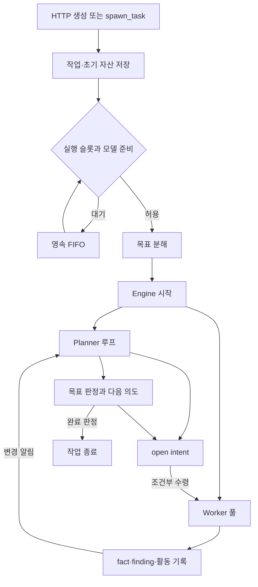

# 서버·실행 엔진·설정 코드 읽기

이 문서는 `cmd/artex`, `config`, `server`의 코드를 한국어로 따라 읽기 위한 안내서다. 범위는 **Go 파일 106개: 실행 코드 57개와 테스트 파일 49개**다. 파일마다 한국어 길잡이를 붙였고, 주요 함수와 동시성·상태 전환 경계에는 설명을 추가했다. 원본 실행 식별자, API 경로, JSON 키, 프롬프트 문자열, SQL, 빌드 조건은 유지한다.

한국어 해설은 이 스냅샷의 **실제 구현**을 설명한다. 원문 주석에 과거 설계의 표현이 남은 경우에는 한국어 주석과 아래의 한계 설명에서 현재 코드와의 차이를 명시한다. 예를 들어 시작점의 과거 `dual SQLite graph stores` 표현과 달리 현재 자산·탐색·설정의 주 저장소는 PostgreSQL이다. 트래픽은 별도의 로컬 저장 경로를 사용한다.

## 1. 처음 읽을 때의 순서

한 번에 `server.go` 전체를 외우기보다, 아래 연결을 따라 요청 하나가 어떤 상태를 만들고 누가 실행하는지 추적하는 편이 쉽다.

| 순서 | 읽을 파일과 함수 | 여기서 답할 질문 |
|---|---|---|
| 1 | [`cmd/artex/main.go`](../../../cmd/artex/main.go)의 `run` | 프로세스는 어떤 순서로 시작하고 왜 종료 코드를 반환하는가? |
| 2 | [`config/config.go`](../../../config/config.go)의 `Path`, `PostgresDSN` | 설정은 어디서 읽고 환경 변수는 무엇을 덮어쓰는가? |
| 3 | [`manager.go`](../../../server/manager.go)의 `Task`, `Manager`, `NewManager` | DB 연결과 실행 중 작업의 메모리 객체는 누가 소유하는가? |
| 4 | [`server.go`](../../../server/server.go)의 `New`, `Handler`, `createTask` | UI의 작업 생성 요청은 어디로 연결되는가? |
| 5 | [`goals.go`](../../../server/goals.go)의 `launchTask`, `admitTaskWhen`, `startTaskEngine` | 작업 대기열과 목표 분해 중 어느 것이 먼저인가? |
| 6 | [`engine.go`](../../../server/engine.go)의 `Run`, `plannerLoop`, `workerLoop` | Planner와 여러 Worker가 어떻게 나눠 일하는가? |
| 7 | 같은 파일의 `claimNext`, `runIntent`와 [`db/exploration.go`](../../../db/exploration.go) | 같은 의도를 동시에 두 Worker가 실행하지 않게 하는 장치는 무엇인가? |
| 8 | [`assembly.go`](../../../server/assembly.go), [`task_llm.go`](../../../server/task_llm.go) | 역할의 도구와 실제 모델은 실행 시 어떻게 결정되는가? |
| 9 | [`server.go`](../../../server/server.go)의 `streamActivity`와 [`broadcast.go`](../../../server/broadcast.go) | Agent의 진행 내용은 DB와 브라우저에 어떻게 전달되는가? |
| 10 | [`engine_timeout.go`](../../../server/engine_timeout.go), [`task_control.go`](../../../server/task_control.go), [`task_archives.go`](../../../server/task_archives.go) | 멈추기·끝내기·삭제하기·보관하기가 왜 다른 절차인가? |

## 2. 코드에 반복해서 나오는 Go 개념

### 구조체와 메서드

`func (s *Server) createTask(...)`는 `Server`에 연결된 메서드다. `s` 안에는 Manager, Engine, 모델 캐시, 대화 실행 상태 등 요청 처리에 필요한 참조가 들어 있다. `*Server`나 `*Task`는 같은 객체를 공유할 수 있는 포인터이므로 여러 HTTP 요청과 goroutine이 동시에 상태를 읽을 수 있다.

`Task` 구조체를 찾았다고 필드를 아무 곳에서나 직접 바꿔도 되는 것은 아니다. 공개 후 변하는 생명주기 필드는 `lifecycleSnapshot`과 `updateLifecycle`을 사용한다. 스냅샷 함수는 잠금을 잡고 여러 필드를 함께 읽으며, 슬라이스도 복사한다. 잠금을 풀고 나서 호출자가 내부 배열을 바꾸지 못하게 하기 위해서다.

### goroutine과 channel

`go f()`는 현재 프로세스 안에서 `f`를 동시 실행한다. ARTEX의 Worker 수가 3이면 보통 작업 하나에 Worker 루프 세 개가 돈다. 컨테이너 셋이나 권한이 다른 OS 사용자 셋을 자동으로 만드는 구조는 아니다.

`chan struct{}`는 내용을 담기보다 “변경이 생겼으니 확인하라”는 신호로 쓰인다. `Task.Notify`의 비차단 채널은 여러 변경을 합칠 수 있다. 구체적으로 어떤 의도가 끝났는지 같은 이유는 별도 `pendingTriggers` 목록에 저장한다.

### context와 취소 사유

컨텍스트는 요청·작업·의도 실행의 수명을 연결한다. ARTEX는 `context.WithCancelCause`로 중단 원인까지 보존한다. 사용자가 작업을 잠깐 멈춘 경우, Planner가 한 의도를 종료한 경우, 프로그램을 닫는 경우를 같은 오류로 뭉개면 재개할 데이터와 최종 상태를 잘못 정할 수 있기 때문이다.

HTTP 요청 컨텍스트와 서버 루트 컨텍스트도 다르다. 파일 다운로드는 브라우저 연결이 끝나면 중단해도 되지만, 이미 수락한 장기 Agent 작업이 브라우저 탭 종료만으로 사라져서는 안 되는 경로가 있다. `conversationRunContext`, `runDetachedIntent`, `chat`에서 어떤 부모 컨텍스트를 사용하는지 확인한다.

### defer, mutex, CAS

`defer`는 함수가 돌아갈 때 정리를 수행한다. 실행 중 카운터 감소, busy 해제, 파일 닫기, MCP 연결 정리처럼 성공과 오류 양쪽에서 필요한 작업에 많이 쓰인다.

`sync.Mutex`/`RWMutex`는 같은 프로세스 안의 공유 상태를 보호한다. 반면 DB의 조건부 `UPDATE`는 상태가 기대값일 때만 바꾸는 CAS(compare-and-set) 역할을 한다. 다른 goroutine이나 DB 사용자가 먼저 상태를 바꿨다면 성공 행 수가 달라진다. ARTEX의 의도 수령과 실행 슬롯 배정에는 이 차이가 중요하다.

## 3. 세 가지 중심 객체

| 객체 | 책임 | 이 객체만으로 보장하지 않는 것 |
|---|---|---|
| `Manager` | PostgreSQL, 공유 자산, 작업 핸들, 기록/프록시/승인 설정, 영속 상태와 메모리 반영 | LLM의 계획 내용이나 도구 결과의 의미적 정확성 |
| `Server` | HTTP API, 역할/도구/모델 연결, 대화, 관리, 스케줄러·알림·아카이브 시작 | 모든 외부 명령의 OS 수준 격리 |
| `Engine` | 작업마다 Planner/Worker 루프, 의도 수령, 취소·시간 예산·활동 기록 | 분산 실행의 완전한 exactly-once나 독립적인 사실 검증 |

`Task.ID`는 작업 식별자이고 `Task.ExpID`는 그 작업의 탐색 그래프 식별자다. 자산 저장소는 여러 작업이 공유하지만 탐색 저장소는 작업에 연결된다. 이 때문에 같은 URL 자산을 여러 작업이 볼 수 있어도, 각 작업이 무엇을 시도했고 어떤 근거로 다음 의도를 만들었는지는 따로 추적한다.

`ParentRef`와 `SourceTaskIDs`도 같은 의미가 아니다. 전자는 생성·조정 관계의 출처를 표현하고, 후자는 다른 작업의 결과를 읽을 문맥 연결이다. 상속 결과의 DTO에는 원래 작업 ID를 남긴다. 원본 작업의 아직 실행 중인 의도를 현재 작업의 실행 큐에 그대로 복제하지 않는다.

## 4. 작업 하나가 실행되는 전체 흐름

### 4.1 생성과 실행은 다른 시점이다

`createTask` 또는 `toolSpawnTask`가 DB 작업을 만든다. 이후 두 경로 모두 `launchTask`를 사용한다. 이 함수는 초기 자산과 선택적 첫 intent를 기록한 뒤 `admitTask(..., "bootstrap")`으로 실제 실행 권한을 요청한다.

동시 실행 한도가 켜져 있고 자리가 부족하거나 모델을 사용할 수 없으면 작업은 DB FIFO에 대기한다. `queued_at`을 사용하므로 재시작해도 대기 순서를 복구할 수 있다. 사용자가 대기 중인 작업을 일시 정지하고 다시 재개하면 새 대기 위치를 받는 경로가 있다.

단순히 활성 UI 작업을 고르는 `SetActive`는 실행 슬롯 배정과 다르다. 브라우저에서 선택하지 않은 작업도 이미 실행 허가를 받았다면 계속 수행할 수 있다.

### 4.2 먼저 목표를 만든다

`startTaskEngine`은 0번째 목표 분해 라운드를 활동으로 남기고 `createGoals`를 호출한다. 목표 분해에는 작업에서 사용할 LLM 라우터를 사용한다. 분해 도구가 이미 저장한 goal을 이 함수가 다시 중복 저장하지 않는다.

분해 결과가 없으면 원래 목표 문장 전체를 단일 goal로 저장한다. URL이나 문장을 구두점 기준으로 임의 분할하는 fallback은 없다. 그 후에 `Engine.Run`을 부르므로 Planner가 목표가 아직 없는 찰나에 성급하게 판단하는 경쟁을 줄인다.

### 4.3 Planner는 계속 같은 대화를 늘리는 주체가 아니다

Engine의 `plannerLoop`는 변경 신호 또는 심박 타이머를 기다린다. 변경이 몰리면 기본 debounce로 합친다. 작업 상태·모델 준비·삭제·수렴 여부를 통과하면 `planner.Plan` 한 번을 실행한다. Agent 내부에서 새 라운드에 필요한 그래프 요약과 선택적 상세를 구성하는 부분은 [`agent/planner.go`](../../../agent/planner.go)를 함께 읽는다.

기본/최소 심박은 600초다. 이는 모든 계획이 10분마다만 일어난다는 뜻이 아니다. Worker 완료, 발견, 사용자 힌트 같은 변경은 즉시 알림 경로를 탄다. 심박은 변화가 없는 동안에도 재검토할 기회를 주는 보완 장치다.

열린 목표가 하나도 없으면 `plannerLoop`의 별도 분기는 LLM을 호출하지 않는다. 사람이 직접 넣은 의도가 남아 있으면 실행을 기다리고, 활성 의도도 없으면 `done`을 기록한다. “목표가 없으니 남은 의도를 즉시 죽인다”는 구현이 아니다.

### 4.4 Worker는 DB에서 의도를 수령한다

`claimNext`는 `Frontier(20)`으로 열린 의도 후보를 읽는다. 그 목록 자체가 소유권을 주지는 않는다. 각 후보에 대해 `ClaimIntent`가 `open` 상태일 때 `running`과 owner를 기록하는 조건부 갱신에 성공해야 그 Worker가 실행한다.

동시에 두 Worker가 같은 frontier를 읽어도 한쪽만 해당 `UPDATE`에 성공할 수 있다. 이것은 `SELECT ... FOR UPDATE SKIP LOCKED`로 큐 행을 잠그는 구현과 다르다. 또한 **같은 ID의 중복 수령 방지**와 **의미가 비슷한 서로 다른 intent의 중복 작업 방지**는 다른 문제다.

`runIntent`는 개별 컨텍스트를 만들고, guard/steer hook을 연결하고, `worker.Execute` 또는 `ExecuteWithMessage`를 호출한다. 실제 모델-도구 반복은 Agent/Norma 계층이 담당한다. Engine은 그 결과와 취소 사유를 받아 상태를 정리한다.

## 5. 상태와 중단을 구분해서 읽기

| 상황 | 의도 또는 작업에서 보이는 결과 | 중요한 이유 |
|---|---|---|
| 의도 대기 | intent `open` | 일반 Worker 풀의 수령 대상 |
| 의도 실행 중 | intent `running` | owner와 개별 실행 컨텍스트가 있음 |
| 정상 Agent 완료 | intent `done` | Agent 호출이 정상 종료한 상태이며 목표 전체 달성과는 별개 |
| 턴/시간 예산 소진 | intent `exhausted` | 이 방향에 예산을 썼지만 정상 완료로 간주하지 않음 |
| 실행 오류 | intent `blocked` | 오류와 모델 체인 소진 같은 원인을 따라 재실행 판단 |
| 사용자 개별 의도 일시 정지 | intent `paused` | 풀에 자동 재수령되지 않고 명시 재개 또는 후속 메시지를 기다림 |
| 작업 전체 일시 정지 | 실행 중 intent를 보통 `open`으로 복귀 | 작업 재개 시 대화 이력을 이어 일반 풀에서 재수령 가능 |
| Planner가 개별 의도 종료 | intent `stopped` | 그 의도를 자동으로 다시 가져오지 않음 |
| 목표 달성으로 작업 종료 | task `done`, 남은 실행 중 intent `stopped` 경로 | 완료된 과제의 후속 실행을 계속하지 않음 |
| 사용자 의도 취소 | 기본 soft delete는 `deleted`, hard는 노드 정리 | 실행 중이면 먼저 멈춰 쓰기가 끝난 뒤 정리 |
| 작업 시간 예산 종료 | 최종 판정에 따라 task `done` 또는 `timeout` | 마지막 수집 결과를 반영할 수 있는 종료 단계가 있음 |

표의 상태는 서로 다른 테이블/객체의 상태를 함께 비교한 것이다. 예를 들어 탐색 노드의 `confirmed`, 발견 목록의 triage 상태, 작업의 `done`을 모두 “검증 완료” 하나로 번역하면 설계를 오해하게 된다.

### 사용자 Worker 메시지가 풀을 거치지 않는 이유

`sendWorkerMessage`는 해당 의도의 기존 실행을 필요한 경우 중단하고, `runDetachedIntent`에서 `paused → running` CAS로 새 실행을 시작한다. 중간에 `open`을 만들지 않기 때문에 다른 일반 Worker가 그 의도를 가로채지 않는다. 별도 goroutine이므로 풀의 다른 슬롯이 모두 바빠도 해당 후속 메시지를 진행할 수 있는 구조다.

### 작업 시간 초과가 즉시 프로세스 종료가 아닌 이유

`engine_timeout.go`는 첫 실제 실행 때 절대 deadline을 기록한다. deadline에 도달하면 `settling`을 세워 새 의도 수령과 일반 Planner 호출을 억제하고 진행 중 기록을 최대 90초 기다린다. 이후 필요하면 실행 컨텍스트를 취소하고 마지막 Planner 라운드로 목표를 판단한다.

`SetTaskStatusGuarded`는 먼저 기록된 종료 상태를 보존한다. 정상 완료와 timeout이 거의 동시에 발생했을 때 더 늦은 기록이 앞선 `done`을 덮어쓰지 않게 하는 장치다. 마지막 Planner가 사용할 모델이 없을 때는 준비를 기다리는 경로가 있으므로 90초가 “서버가 반드시 완전히 종료하는 상한”인 것은 아니다.

## 6. 실제 사용할 모델을 고르는 방법

[`task_llm.go`](../../../server/task_llm.go)의 `taskLLMRuntime.current`를 기준으로 읽는다.

| 우선순위 | 설정 | 의미 |
|---|---|---|
| 1 | Agent 역할의 명시적 모델 바인딩 | 해당 역할에 지정한 provider를 우선 사용 |
| 2 | 작업에 지정한 순서 있는 모델 체인 | 작업의 현재 활성 프로필과 영속 failover 상태 사용 |
| 3 | 전역 활성 또는 환경 모델 설정 | 작업에 별도 체인이 없을 때의 공용 경로 |

명시적 작업 체인이 존재하지만 모두 소진되었으면 전역 모델로 조용히 넘어가지 않는다. 이를 위해 Engine은 권위 있는 작업 resolver를 사용한다. `Ready()`의 전역 모델 표시와 `ReadyFor(task)`의 작업별 실행 가능성은 서로 다른 질문이다.

`server/llmpool.go`는 공용 모델 풀·건강 상태·cooldown을 연결하고, `task_llm.go`는 작업의 영속 체인과 잔액 소진 이동을 관리한다. 동일한 “모델 전환”이라도 두 층의 상태와 용도가 다르다.

### 스트림 재시도에서 가장 중요한 경계

`streamTaskLLM`의 `committed`는 **DB 트랜잭션 커밋이 아니라 모델 출력의 외부 전달 여부**다.

1. 모델이 연결·메타 이벤트만 보내는 동안은 `pending`에 보관한다.
2. 비어 있지 않은 텍스트/thinking/도구 입력, 도구 시작, 메시지 종료 등 의미 있는 이벤트를 내보내면 `committed=true`가 된다.
3. 그 전의 일시 오류는 버퍼를 버리고 같은 요청을 재시도할 수 있다.
4. 그 후의 오류는 이미 소비자가 도구 실행을 시작했을 수 있으므로 요청 전체를 처음부터 반복하지 않는다.
5. 잔액 소진이라면 다음 호출에 사용할 프로필은 이동시키되 현재 실행은 구조화된 오류로 정리할 수 있다.

`isRetryableStreamError`는 오류 문자열의 제외 목록으로 잔액·문맥 초과·일부 확정적 HTTP 오류를 걸러 내고 나머지를 일시적 오류로 취급한다. 모든 공급자의 오류를 엄밀한 타입으로 분류하는 완성된 시스템은 아니다. API/SDK 수준 재시도와 Worker 전체 의도 재실행 정책은 별도이므로 총 요청 횟수를 이해하려면 [`llmretry.go`](../../../server/llmretry.go)도 확인한다.

## 7. 도구·Skill·MCP의 조립 순서

[`assembly.go`](../../../server/assembly.go)의 두 연결점을 구분한다.

- **`ToolAugment`**: 파일 시스템과 DB 가시성에서 Skill/MCP/호스트 도구를 추가한다.
- **`ToolResolve`**: `tools` 테이블의 활성 상태와 역할 바인딩으로 목록을 거르고 설명·스키마·계량 래퍼를 적용한다.

Skill의 `mcps`에 선언된 서버는 해당 Skill을 읽기 전까지 도구 이름/스키마 공개와 실행 해제가 지연될 수 있다. 하지만 MCP의 네트워크/프로세스 연결 및 `tools/list`는 세션 조립 시 이미 수행한다. “지연 도구”를 “아직 원격 연결도 하지 않은 도구”로 이해하면 시작 비용이나 장애 위치를 잘못 예상하게 된다.

원래 작업 도구 목록에 있는 인스턴스가 우선하는 것도 중요하다. 그 인스턴스는 현재 작업의 탐색 저장소와 연결되어 있을 수 있다. 공용 레지스트리에서 같은 이름 도구를 다시 주입해 덮어쓰면 잘못된 문맥에 기록할 위험이 있기 때문이다.

### Python·명령·HTTP 사용자 도구

[`customtool.go`](../../../server/customtool.go)의 사용자 도구는 DB의 정의를 `CoreTool`로 만든다.

| 종류 | 입력 전달 | 실제 실행 | 읽을 때의 주의점 |
|---|---|---|---|
| command | `{name}` 템플릿에 인용한 값 치환 | Bash `CoreTool.Call` 직접 호출 | 상위 Agent hook을 다시 거치는 호출인지와 하위 Bash 자체 동작을 구분 |
| script | JSON stdin + 스칼라 `TOOL_<NAME>` 환경 변수 | 임시 Python 파일 실행 | OS 격리 없음, 출력은 먼저 전체 메모리에 수집 |
| http | URL/헤더/본문 템플릿 | Go HTTP client | 타임아웃·선택 프록시·1 MiB 응답 읽기 한도 |

`execPython`은 실행 실패나 시간 초과를 출력 본문에 추가하고 `body, nil`로 반환하는 경로가 있다. 따라서 Go 오류만 보고 프로세스가 정상 성공했다고 판단하면 안 된다. `Capture`로 모델에게 보여 줄 출력을 줄여도 `CombinedOutput`으로 먼저 수집한 메모리 크기가 제한되는 것은 아니다.

사용자 정의 도구의 자체 `Permissions` 콜백은 허용을 반환한다. 실제 제한은 역할 노출, 연결된 guard, 하위 실행기, 환경 설정을 함께 읽어야 한다. 승인 UI가 있다는 사실과 모든 역할의 모든 도구 호출이 강제 승인 경계를 통과한다는 보장은 별개다.

## 8. DB 활동과 브라우저 실시간 화면

`Engine.emitActivity`는 먼저 `appendActivity`로 PostgreSQL에 기록한다. 기록에 실패하면 몇 차례 짧게 재시도하고 원인·누락 수를 로그에 남긴다. 성공한 ID를 활동에 붙인 뒤 `Broadcaster.Publish`로 보낸다.

`streamActivity`는 다음 순서를 따른다.

1. 자동 재연결의 `Last-Event-ID`를 URL의 `since`보다 우선한다.
2. 실시간 채널을 먼저 구독한다.
3. DB 이력을 500개씩 읽어 커서 이후의 backlog를 전송한다.
4. 실시간 채널에서 이미 DB 재생으로 보낸 ID를 건너뛴다.
5. 20초 간격 ping으로 연결을 유지한다.

실시간 채널은 구독당 256개 버퍼이며 가득 차면 전송하지 않는다. 이는 엔진이 느린 브라우저 때문에 멈추지 않게 한다. 그러나 연결이 계속 살아 있는 중간에 이벤트가 빠지고 이후 더 큰 ID가 전송되면 단순 재연결만으로 그 누락이 반드시 복구되는 것은 아니다. 현재 코드를 영속 메시지 브로커의 전달 보장처럼 이해하면 안 된다.

활동 ID의 숫자가 연속하지 않는 것도 곧바로 이 작업의 유실 증거가 아니다. 전역 DB 순번은 다른 작업의 행이나 실패한 트랜잭션 때문에 건너뛸 수 있다. 개선한다면 “ID가 1 증가하지 않았으니 손실” 대신 DB 커서 기반 지속 재조회나 구독 overflow 시 명시적 재동기화 같은 설계가 필요하다. 이 문서의 개선 설명은 구현 변경을 뜻하지 않는다.

`logsink.go`의 백엔드 로그와 Agent activity도 구분한다. 로그에는 메모리 순번 `Seq`와 DB 행 `DBID`가 따로 있고 비동기 저장을 사용한다. 사용자 대화와 도구 실행의 재현 가능한 문맥은 activity/transcript 경로를 함께 읽어야 한다.

## 9. 멈추기·삭제하기·아카이브하기

### 작업 삭제의 순서

삭제는 단순 `DELETE FROM tasks`보다 훨씬 넓은 작업이다. Main 대화, Worker, Planner, 보조 질문이 파일과 DB를 아직 쓰고 있을 수 있기 때문이다.

1. `beginTaskDelete`가 실행 슬롯 조정과 같은 잠금 순서로 삭제 장벽을 세운다.
2. 새 작업 소유 연산은 `beginTaskOperation`에서 거부된다.
3. Main 대화와 작업 실행을 취소하고 `waitTaskQuiescent`로 기존 쓰기를 기다린다.
4. 보조 질문 기록도 배출한다.
5. Manager가 작업 소유 파일과 선택한 트래픽을 staging 위치로 옮긴다.
6. DB 삭제 실패라면 staging을 복원한다.
7. DB 커밋 성공 뒤에는 런타임 goroutine과 메모리 참조를 정리하고 staging을 제거한다.

마지막 물리 파일 제거만 실패했다면 DB 작업은 이미 사라진 상태다. `taskDeleteCommittedError`는 이 경우를 구분하고 HTTP 성공 결과에 cleanup 경고를 붙인다. 오류 하나만 반환해 사용자가 작업 전체가 남아 있다고 오해하게 만들지 않는다.

### 아카이브는 DB 스냅샷과 파일 패키지를 함께 다룬다

[`task_archives.go`](../../../server/task_archives.go)는 요청을 영속 큐에 넣고 절차를 조정한다. [`task_archive_package.go`](../../../server/task_archive_package.go)는 파일 이동, journal, 압축, 체크섬, 해제를 담당한다. [`db/task_archives.go`](../../../db/task_archives.go)는 저장 상태와 DB 복원을 담당한다.

중간 파일 이동을 journal에 남기는 이유는 프로세스가 이동 절반에서 종료될 수 있기 때문이다. 다음 시작에서 DB 상태와 journal을 함께 봐야 어느 경로를 되돌리고 어느 임시 파일을 지워야 하는지 결정할 수 있다.

서로 결과를 상속하는 작업 묶음은 처리 순서를 가진다. 복원은 source부터 dependent 순서, 보관/삭제는 dependent부터 source 순서다. 이 구조는 일반적인 “의존 관계를 가진 업무 스냅샷” 기능에도 응용할 수 있다.

## 10. 인증·파일 경계·발견 증거를 읽는 기준

인증은 단일 고정 계정 `ARTEX`와 bcrypt 비밀번호 해시, 7일 JWT 구조다. 비밀번호 변경은 현재 토큰과 이전 비밀번호를 확인하지만 기존 JWT를 일괄 폐기하지 않는다. `signJWT`는 HS256으로 발급하며 `verifyJWT`의 타입 확인은 HMAC 계열 전체를 허용한다. 타입 검사와 원문 주석의 표현 차이는 코드에 한국어로 설명했다.

서명 키는 브라우저 파일 관리자에서 보이는 `dataDir` 밖 `keyDir/jwt.key`에 저장한다. 과거 경로에 있던 키를 이동하는 코드도 있다. 파일 매니저의 `wsResolve`는 경로 문자열 정규화와 루트 검사이며, 모든 심볼릭 링크의 실제 대상을 따라가 확인하는 OS 격리 계층은 아니다.

발견의 HTTP 증거는 `finding_traffic.go`에서 관리하지만 파일 복사와 무결성 검사는 [`evidence`](../../../evidence) 계층에 위임한다. 원시 캡처를 지운 뒤에도 발견에 묶인 증거 복사본이 남을 수 있다. 해시가 맞는다는 사실은 “저장된 바이트가 변하지 않았다”는 의미이며 “그 바이트가 주장하는 취약점이 실제로 성립한다”는 의미와 다르다.

`finding_retests.go`는 별도로 요청하는 재검증이다. 모든 발견이 자동으로 독립 검증기를 통과한다는 구조는 아니다. `fixed` 완료, 실패, 중단, 판정 없음의 경로를 테스트와 함께 보면 모델이 결과를 쓰지 않은 종료를 성공 판정으로 취급하지 않는 설계를 배울 수 있다.

## 11. 기능별 API 지도를 따라가기

정확한 경로와 메서드는 [`Server.Handler`](../../../server/server.go), 각 `register...` 함수가 기준이다. 아래는 코드를 찾기 위한 묶음이다.

| 화면/요청 주제 | HTTP/조정 코드 | 다음으로 읽을 계층 |
|---|---|---|
| 작업 생성·실행 제어 | `server.go`, `goals.go`, `task_control.go` | `Manager`, `Engine`, `db/tasks` 관련 파일 |
| 목표·제약 수동 편집 | `goals_api.go`, `constraints_api.go` | 탐색 그래프·작업 제약 저장소 |
| 공유 자산·기업 범위 | `assets.go`, `task_assets.go` | `db/assets.go`, 기업·작업 범위 저장소 |
| 발견 목록·그룹·심화 | `server.go`, `findings_groups.go` | 발견 필터·그래프 lineage |
| HTTP 증거·내보내기 | `finding_traffic.go`, `finding_traffic_export.go` | `evidence`, `db/finding_traffic.go` |
| 재검증 | `finding_retests.go`, `conversations.go` | retester Agent와 DB 재검증 상태 |
| Main/일반/보조 대화 | `server.go`, `conversations.go`, `side_questions.go` | `agent/mainagent.go`, `agent/chat.go`, `sidequestion` |
| 역할·프롬프트·Skill/MCP | `server_mgmt.go`, `assembly.go`, `mcpdiscover.go` | Agent 도구 조립과 Norma Skill/MCP |
| 사용자 도구 | `customtool.go`, `platform_tools.go` | Python/Bash/Go HTTP 실행기 |
| 모델 구성·전환·계량 | `task_llm.go`, `llmpool.go`, `llmretry.go`, `commands.go` | `llmpool`, `llmrec`, 프로필 저장소 |
| 승인 규칙·대기 | `intercept.go`, `task_intercept.go`, `asset_intercept.go` | `guard`, `intercept`와 실제 hook 연결 |
| 알림 | `notify_api.go`, `notifier.go` | `notify`, delivery 저장소 |
| 파일·보관·업데이트 | `workspace.go`, `task_archives.go`, `update.go` | 파일 패키지, `selfupdate` |

## 12. 전체 실행 코드 파일 지도

각 파일의 길잡이와 아래 표를 짝지어 읽는다. 코드에 없는 기능을 추측하는 대신 표의 실제 함수에서 호출하는 저장소/Agent로 이동한다.

| 파일 | 역할과 읽을 지점 |
|---|---|
| [`cmd/artex/main.go`](../../../cmd/artex/main.go) | run은 플래그 해석 → 업데이트 부트스트랩 → PostgreSQL Manager → Server → HTTP 수신 순서로 시작한다. 정상 종료와 업데이트 재시작을 반환 코드로 구분해야 defer 정리가 실행되므로 main은 run의 결과만 os.Exit에 전달한다. 주요 함수: `printBanner`, `main`, `run`, `shutdownContext`. |
| [`config/config.go`](../../../config/config.go) | 설정 파일 위치는 ARTEX_CONFIG → 현재 디렉터리의 config.json → 실행 파일 옆 config.json 순서로 찾는다. 연결 문자열은 ARTEX_PG_DSN이 최우선이며, 다음으로 database.dsn 또는 database의 개별 필드로 조립한다. 주요 함수: `BaseDir`, `isGoRunDir`, `Path`, `Load`. |
| [`server/assembly.go`](../../../server/assembly.go) | wireAgentAugment는 DB의 역할별 가시성과 파일 시스템 Skill 정의를 읽어 세션에 추가할 도구 및 정리 함수를 만든다. Skill의 mcps에 연결된 도구는 스키마와 호출 권한을 늦게 공개하지만, MCP 연결과 tools/list 조회 자체는 이 조립 단계에서 이미 수행한다. 주요 함수: `wireAgentAugment`, `wireTools`, `buildDomainReg`, `seedPrompts`. |
| [`server/asset_intercept.go`](../../../server/asset_intercept.go) | domain·ip·url 및 CIDR 규칙을 생성·수정·삭제·활성화하는 API 계층이다. validateAssetInterceptRuleReq에서 종류·동작·값을 검증하고, 실제 매칭과 차단은 db/agent 등 규칙 소비 경로가 담당한다. |
| [`server/assets.go`](../../../server/assets.go) | 기업 생성과 범위 추가는 입력 크기 및 검증 오류를 HTTP 상태로 변환하고 CompanyStore·AssetStore에 위임한다. companyScopeInputs는 과거 문자열 배열과 새 {kind,value} 배열을 모두 읽어 저장 형식으로 맞춘다. 주요 함수: `decodeCompanyMutationRequest`, `UnmarshalJSON`, `createCompany`, `deleteCompany`. |
| [`server/auth.go`](../../../server/auth.go) | 고정 사용자명 ARTEX, DB에 저장한 bcrypt 비밀번호 해시, 서명 키 파일을 이용하는 인증 구조다. 로그인 성공 시 7일 유효 JWT를 반환한다. 토큰은 Bearer 헤더 → artex_token 쿠키 → token 쿼리 순서로 읽는다. 주요 함수: `loadOrCreateJWTKey`, `signJWT`, `verifyJWT`, `extractToken`. |
| [`server/broadcast.go`](../../../server/broadcast.go) | 하나의 작업 ID에 여러 SSE 구독 채널을 연결하고 mutex로 등록·해제를 보호한다. 구독당 버퍼는 256개이며 Publish는 채널이 가득 차면 이벤트를 버린다. 느린 브라우저가 엔진을 막지 않게 하는 선택이다. 주요 함수: `Subscribe`, `Publish`. |
| [`server/chat_mentions.go`](../../../server/chat_mentions.go) | 메시지 속 @[종류#숫자ID 표시명] 표기를 파싱해 중복을 제거하고 최대 개수·유효 ID를 확인한다. 표시명은 신뢰하지 않으며 DB에서 해당 기업·자산·발견 내용을 다시 읽어 모델 메시지에 추가한다. 주요 함수: `parseChatMentions`, `composeChatMentionMessage`, `boundChatMentionValue`. |
| [`server/chatupload.go`](../../../server/chatupload.go) | 작업 또는 대화의 작업 디렉터리에 첨부 파일을 저장하고 상대 경로·표시명·크기를 UI로 반환한다. 요청은 128 MiB 한도로 제한하며 안전한 대화 ID와 파일명을 사용하고 동명 파일은 uniqueUploadPath로 구분한다. 주요 함수: `chatUpload`, `uniqueUploadPath`, `composeAgentMessage`. |
| [`server/commands.go`](../../../server/commands.go) | activity 기반 도구 실행 이력과 LLM 요청 기록·모델별 토큰·사용 통계를 페이지 및 작업 필터로 조회한다. commandTaskFilter의 nil과 숫자 포인터는 전체 조회와 특정 작업 조회를 구분하는 계약이다. 주요 함수: `commandTaskFilter`, `pgGetLLMRecord`. |
| [`server/constraints_api.go`](../../../server/constraints_api.go) | allow/deny 형태의 작업 제약을 task_constraints에 저장하며 Agent의 set_constraints 도구와 같은 데이터를 사용한다. 이 제약은 Planner/Worker 프롬프트에 주입되는 문맥이다. 시스템 호출을 직접 거부하는 강제 권한 규칙과는 역할이 다르다. 주요 함수: `addConstraint`, `normalizeConstraintKind`. |
| [`server/conversations.go`](../../../server/conversations.go) | 대화 CRUD, 메시지 저장, 실행 상태, 중단을 관리한다. 일반 대화는 대화별 하나의 실행만 허용하고 응답은 conversation_activities로 전달한다. 202 응답 전에 취소 함수를 등록해 즉시 중단·삭제 요청이 막 시작할 goroutine을 놓치지 않게 한다. 주요 함수: `pgSendConversationMessage`, `conversationRunContext`, `runConversationTurn`, `pgStopConversation`. |
| [`server/customtool.go`](../../../server/customtool.go) | DB 도구 정의를 읽어 Norma CoreTool로 만들고 테스트 API와 Agent 실행에서 같은 실행 함수를 사용한다. Python 도구는 임시 스크립트에 코드를 쓰고 JSON 입력을 stdin으로 전달하며 단순 값은 TOOL_<NAME> 환경 변수로도 제공한다. 주요 함수: `buildCustomTool`, `ensureSchema`, `runCommandTool`, `runScriptTool`. |
| [`server/dto.go`](../../../server/dto.go) | Task·Node·Finding·Activity·Agent·LLMProfile을 HTTP JSON 형태로 바꾸는 전용 계층이다. 큰 정수 ID는 자바스크립트 정밀도 문제를 피하도록 문자열로 표현하는 항목이 있고, 목록의 nil은 빈 배열로 바꾸는 함수들이 있다. 주요 함수: `taskDTO`, `findingFromDB`, `activityDTO`, `llmProfileDTO`. |
| [`server/engine.go`](../../../server/engine.go) | Run은 작업마다 Planner 루프 1개와 설정된 수의 Worker goroutine을 시작한다. goroutine은 OS 격리 경계가 아니다. Planner는 변경 알림을 합치거나 작업별 심박 주기에 깨어나고, Worker는 열린 intent를 DB의 조건부 갱신으로 하나씩 수령한다. 주요 함수: `Pause`, `BeginDelete`, `AbortDelete`, `StopTask`. |
| [`server/engine_timeout.go`](../../../server/engine_timeout.go) | 첫 실제 실행 시각을 기준으로 절대 deadline을 저장한다. 작업을 잠시 멈추어도 이미 시작된 벽시계 시간은 계속 흐른다. 기한에 도달하면 settling 상태로 새 실행을 억제하고 진행 중 작업의 기록을 기다린 뒤 마지막 Planner 판정으로 done 또는 timeout을 정한다. 주요 함수: `beginTaskOperation`, `stampFirstRun`, `clockCtx`, `deadlineCoordinator`. |
| [`server/finding_retests.go`](../../../server/finding_retests.go) | 사용자가 발견 항목에 재검증을 요청하면 retester 대화를 만들고 원본 발견·증거를 연결한다. 시작·중단·실패·정상 판정 상태를 추적하며 결과 기록 도구를 별도로 제공한다. fixed 판정이 정상 완료된 경로에서 원래 발견의 상태를 갱신한다. 주요 함수: `startFindingRetest`, `findingRetestTools`, `finishRetest`. |
| [`server/finding_traffic.go`](../../../server/finding_traffic.go) | 원시 트래픽 ID와 영속 증거 스냅샷을 구분하고 evidence.Store를 통해 바인딩·메모·순서·본문 조회를 처리한다. 작업 상속 문맥에서는 읽기 가능 출처와 쓰기 권한을 따로 확인한다. 원시 트래픽을 나중에 삭제해도 독립 복사한 증거를 조회할 수 있는 구조다. 주요 함수: `findingTrafficAccess`, `bindFindingTraffic`, `readEvidencePreview`, `getFindingTrafficBody`. |
| [`server/finding_traffic_export.go`](../../../server/finding_traffic_export.go) | 발견 메타데이터, 증거 manifest, 요청·응답 파일을 하나의 ZIP에 기록하는 내보내기 계층이다. 공유 writer 함수로 스트리밍 출력과 파일 생성 경로가 같은 엔트리 구성을 사용하게 한다. |
| [`server/finding_workflow.go`](../../../server/finding_workflow.go) | 발견 워크플로 도구를 DB에 등록하고 기존 사용자 설정을 보존하면서 필요한 스키마·기본 바인딩을 보완한다. agentFindingTrafficAccess는 현재 RunInfo와 발견의 소유 작업을 비교해 읽기·쓰기 접근을 검사한다. 주요 함수: `seedFindingWorkflowTools`, `agentFindingTrafficAccess`. |
| [`server/findings_groups.go`](../../../server/findings_groups.go) | HTTP 필터·페이지 크기를 정규화해 자산 트리 또는 작업별 발견 묶음을 반환한다. deepenFinding은 선택한 발견을 근거로 후속 intent를 만들고 감사 기록 및 작업 재진입을 연결한다. 주요 함수: `deepenFinding`. |
| [`server/goals.go`](../../../server/goals.go) | HTTP 작업 생성과 spawn_task 도구가 launchTask를 공유한다. 초기 자산·선택적 seed intent 이후 실행 슬롯을 배정한다. bootstrap 경로는 목표 분해가 끝난 뒤 Engine.Run을 호출해 목표가 없는 순간 Planner가 실행되는 경쟁을 피한다. 주요 함수: `launchTask`, `startTaskEngine`, `occupiesConcurrencySlot`, `admitTaskWhen`. |
| [`server/goals_api.go`](../../../server/goals_api.go) | 목표 목록·추가·수정·삭제를 제공하며 사용자의 변경을 탐색 그래프와 활동 기록에 남긴다. 목표 변화는 Task의 NotifyGoal 계열 알림으로 Planner의 다음 판단에 전달된다. |
| [`server/intent_intervention.go`](../../../server/intent_intervention.go) | 요청 ID를 검증하고 같은 의도에 중복 메시지 실행이 생기지 않도록 기록과 상태 전이를 확인한다. 이미 달리는 의도를 먼저 멈춘 다음 paused→running 조건부 전이로 전용 goroutine을 실행한다. 주요 함수: `sendWorkerMessage`. |
| [`server/intercept.go`](../../../server/intercept.go) | 도구별 승인 규칙, 대기 항목, 결정 이력, 상세 실행 내용을 HTTP로 노출한다. wireInterceptReviewer는 규칙 미일치 시 사용할 판정 모델을 연결한다. 실제 사용 여부와 실패 시 동작은 interceptor 설정에 달려 있다. 주요 함수: `wireInterceptReviewer`, `reviewCompletion`, `streamCollectText`, `interceptDecide`. |
| [`server/llmpool.go`](../../../server/llmpool.go) | 프로필로 provider를 만들고 활성 프로필부터 순서화한 Pool과 실패 건강 상태 레지스트리를 구성한다. 명시적으로 Agent에 바인딩된 모델은 설정에 따라 전용으로 유지하거나 다른 프로필로 대체할 수 있다. 주요 함수: `poolChain`, `poolForBinding`, `llmPoolStatus`. |
| [`server/llmretry.go`](../../../server/llmretry.go) | 전역 정책과 프로필별 필드 재정의를 agent.RetryConfig로 합쳐 provider·스트림·Worker 수준에 전달한다. 미설정·명시적 비활성·재시도 횟수·대기 간격을 구분하므로 단순한 0 값만 보고 같은 뜻으로 해석하지 않는다. 주요 함수: `resolveRetry`, `modelErrorRetryPolicy`. |
| [`server/logsink.go`](../../../server/logsink.go) | log 출력은 stderr를 유지하면서 3000개 크기의 메모리 링과 구독 채널로 복제된다. DB 연결 후 최근 100개 로그를 복원하고 비동기 writer가 이후 로그를 저장한다. 메모리 seq와 DBID는 용도가 다른 커서다. 주요 함수: `SetDB`, `add`. |
| [`server/manager.go`](../../../server/manager.go) | Manager는 PostgreSQL·공유 자산·트래픽·승인기를 연결하고 Task 핸들을 관리한다. Task는 탐색 저장소 및 동시 접근용 상태 스냅샷을 가진다. 작업 수·Worker 수·기록 토글·프록시·LLM 관련 설정을 저장하며, 실행 슬롯 배정과 상태 갱신은 DB 커밋 뒤 메모리에 반영한다. 주요 함수: `lifecycleSnapshot`, `updateLifecycle`, `setLLMState`, `NewManager`. |
| [`server/mcpdiscover.go`](../../../server/mcpdiscover.go) | connectMCP가 stdio 또는 HTTP 계열의 전송 방식을 선택하고 공통 클라이언트 인터페이스로 노출한다. discoverAndCacheMCP는 tools/list 결과를 관리 UI용 메타데이터로 저장한다. 실제 세션 도구 조립은 assembly.go에서 다시 연결한다. 주요 함수: `connectMCP`, `discoverAndCacheMCP`. |
| [`server/notifier.go`](../../../server/notifier.go) | PostgreSQL의 알림 delivery 큐에서 임대한 항목을 읽어 실시간 또는 묶음 메시지를 구성하고 채널 어댑터로 보낸다. 전송률 토큰 버킷, 한 번에 처리할 예산, 재시도 지연, 임대 만료를 함께 고려한다. 속도 제한과 실제 전송 실패는 재시도 예산에서 구분한다. 주요 함수: `step`, `send`, `renderBatch`, `takeTokens`. |
| [`server/notify_api.go`](../../../server/notify_api.go) | 채널 종류·설정 스키마·필터를 제공하고 생성·수정·테스트 전송·전송 이력·재시도를 처리한다. 응답 DTO는 비밀 필드를 가리고, 수정 시 생략한 비밀값은 저장된 값을 유지하는 규약을 사용한다. 주요 함수: `notifyUpdateChannel`, `notifyTestChannel`, `notifyRetryDelivery`. |
| [`server/orchestration.go`](../../../server/orchestration.go) | list_tasks·spawn_task·pause_task·add_hint·trace 조회·보고서 갱신 등 서버 권한이 필요한 도구를 정의한다. delegateToTask는 선택한 작업의 ToolSet에 위임해 같은 도메인 동작을 재사용한다. spawn_task도 일반 HTTP 생성과 같은 launchTask를 사용한다. 주요 함수: `hostTools`, `delegateToTask`, `toolSpawnTask`, `seedOrchestrationTools`. |
| [`server/platform_tools.go`](../../../server/platform_tools.go) | Skill 생성·파일 수정, 사용자 도구 등록·변경, MCP 등록·변경, 호스트별 자산 삭제를 CoreTool로 제공한다. HTTP 관리 API와 목적은 같지만 호출자는 Agent이므로 스키마·설명·도구 바인딩을 통한 노출 경계를 읽어야 한다. 주요 함수: `platformTools`, `toolCreateSkill`. |
| [`server/scheduler.go`](../../../server/scheduler.go) | 일정 주기 및 새 발견·목표 달성·작업 생성·시간 초과·도구 결과를 감시해 StartTriggeredRun에 실행 요청을 넣는다. 마지막 처리 ID·시각·이미 발화한 목표 집합을 저장해 재시작 때 과거 전체 이력을 다시 발화시키는 일을 줄인다. 주요 함수: `init`, `step`, `fireFindings`, `fireToolCalls`. |
| [`server/server.go`](../../../server/server.go) | New가 인증 키, Engine, 역할별 LLM 라우터, 도구·프롬프트, 스케줄러, 알림, 기록, 재시작 복원을 연결한다. Handler는 API 라우트를 등록하고 인증을 적용한다. 같은 파일의 핸들러들은 작업·그래프·발견·활동·트래픽·설정·메인 대화를 제공한다. 주요 함수: `New`, `restoreTaskRuntimes`, `applyLLM`, `providerForProfile`. |
| [`server/server_mgmt.go`](../../../server/server_mgmt.go) | 런타임 정책과 설정을 수정하는 관리 면이다. 역할별 프롬프트 버전, 가시성, 도구 스키마, 모델 프로필을 DB에 저장한다. Skill은 파일 시스템의 SKILL.md와 참조 파일로 관리하며 업로드 시 이름·경로·압축 방법을 검증한다. 주요 함수: `beginTaskDelete`, `pgDeleteTask`, `waitTaskQuiescent`, `pgSaveAgentConfig`. |
| [`server/side_questions.go`](../../../server/side_questions.go) | 부모 대화·작업·Worker의 체크포인트를 읽어 별도 질문의 입력 스냅샷으로 사용한다. 주 작업을 바꾸는 메시지와 달리 독립 실행·제한·취소·이벤트 스트림을 갖고 부모 문맥의 모델 정보를 연결한다. 주요 함수: `initSideQuestions`, `sideSnapshot`, `drainTaskSideQuestions`, `runSide`. |
| [`server/skill_usage.go`](../../../server/skill_usage.go) | 원래 Skill 도구를 감싸 호출 입력에서 Skill 이름을 읽고 RunInfo의 작업·세션·역할에 사용량을 귀속한다. 조회 가능한 Skill 메타데이터로 기록을 보강하되 원 도구의 실행 결과·스키마·권한 동작을 유지한다. 주요 함수: `record`. |
| [`server/skill_zip.go`](../../../server/skill_zip.go) | ZIP 압축 방식의 추가 해제기를 등록하고 UTF-8·GBK 등 파일명을 일관된 문자열로 읽는다. 업로드 전에 지원하지 않는 압축 방법·암호화 여부를 확인해 관리 API가 구체적인 오류를 반환할 수 있게 한다. 주요 함수: `newSkillZipReader`. |
| [`server/sync_scopesentry.go`](../../../server/sync_scopesentry.go) | 설정된 ScopeSentry HTTP MCP에 연결해 데이터 소스·프로젝트·작업 목록과 자산 검색을 수행한다. ssPageAll은 페이지를 반복 조회하되 유형별 상한에 도달하면 truncated 상태를 알려 무제한 수집을 피한다. 주요 함수: `syncSSRun`, `ssPageAll`, `ssIngest`. |
| [`server/task_archive_package.go`](../../../server/task_archive_package.go) | 작업 파일과 transcript를 같은 파일 시스템의 staging 위치로 옮기고 journal을 남겨 중단된 이동을 재시작 시 복구한다. 압축 패키지에는 DB 스냅샷과 작업 소유 파일을 담고 체크섬을 계산한다. 복원은 검증·해제·설치 단계의 되돌리기 경로를 갖는다. 주요 함수: `writeArchiveJournal`, `stageTaskArchiveFiles`, `recoverTaskArchiveStages`, `writeTaskArchivePackage`. |
| [`server/task_archives.go`](../../../server/task_archives.go) | API는 아카이브·복원·삭제 요청을 영속 작업으로 등록하고 백그라운드 worker가 한 항목씩 처리한다. 실행 중 작업을 정지·배출한 뒤 DB 스냅샷과 파일 패키지를 만들고 실패하면 가능한 이전 상태로 되돌린다. 주요 함수: `runOneTaskArchiveJob`, `archiveTask`, `restoreTaskArchivePayload`, `topoTaskIDs`. |
| [`server/task_assets.go`](../../../server/task_assets.go) | 공유 자산을 특정 작업에 붙이거나 떼고 의도가 참조하는 자산을 조회한다. 연결을 없애는 동작과 전역 자산 자체를 삭제하는 동작은 구분된다. 전자는 작업 문맥의 참조 관계를 바꾼다. 주요 함수: `attachTaskAssets`, `detachTaskAsset`. |
| [`server/task_categories.go`](../../../server/task_categories.go) | 분류 이름 생성·수정·삭제, 한 작업 또는 여러 작업의 분류 변경을 처리한다. category_id의 생략·숫자·null은 다른 요청 의미를 갖는다. null은 미분류로 옮기는 데 사용한다. |
| [`server/task_control.go`](../../../server/task_control.go) | HTTP와 Agent 도구가 공유하는 pause/resume 및 의도 제어를 구현한다. 재개는 단순한 불리언 해제가 아니라 목표 초기화 필요 여부, FIFO 슬롯, 시간 초과 재시작, 삭제 장벽을 함께 다루는 admission 경로를 탄다. 주요 함수: `applyTaskControlWithCause`, `applyIntentControl`, `normalizeBatchTaskIDs`. |
| [`server/task_intercept.go`](../../../server/task_intercept.go) | 전역 규칙과 별도로 작업에 귀속된 승인 규칙의 목록·생성·수정·삭제·활성화를 제공한다. 작업 생성 템플릿에서도 같은 요청 검증과 규칙 변환을 사용한다. |
| [`server/task_llm.go`](../../../server/task_llm.go) | 실행 시 우선순위는 역할의 명시적 바인딩 → 작업의 순서 있는 프로필 체인 → 전역 provider다. 소진된 명시적 체인은 조용히 전역으로 우회하지 않는다. 스트림의 실제 출력·도구 시작을 외부에 전달하기 전에는 같은 요청을 안전하게 재시도할 수 있도록 초기 메타 이벤트를 버퍼링한다. 주요 함수: `current`, `activeCfg`, `completeTaskLLM`, `streamTaskLLM`. |
| [`server/task_metadata.go`](../../../server/task_metadata.go) | PATCH 입력 크기와 이름 길이를 검증하고 이름·pin 같은 목록 메타데이터를 Manager에 전달한다. 원래 작업 설명·목표, Planner/Worker 생명주기, 실행 순서는 이 변경으로 수정하지 않는다. |
| [`server/task_resolution.go`](../../../server/task_resolution.go) | Planner·Worker·Main 등 역할별로 모델이 어디서 결정되는지 프로필 ID·모델·출처·가용성·이유를 반환한다. 실제 런타임과 같은 바인딩/작업 체인/전역 우선순위를 설명해 UI 설정과 실행 모델 사이의 혼동을 줄인다. 주요 함수: `resolveTaskRoleLLM`. |
| [`server/task_templates.go`](../../../server/task_templates.go) | 작업 이름·설명·목표·분류·작업별 승인 규칙 묶음을 저장하고 관리한다. PATCH에서 포인터와 원시 JSON 키 집합을 함께 사용해 생략한 필드와 명시적으로 비운 필드를 구분한다. 주요 함수: `decodeTaskTemplateRequest`. |
| [`server/tool_usage.go`](../../../server/tool_usage.go) | meteredTool은 CoreTool을 포함해 원래 스키마와 권한 정보를 유지하며 Call만 감싼다. 실행 직전에 도구 키·Agent·작업·세션을 사용량 테이블에 기록한 뒤 원 도구를 호출한다. 주요 함수: `Call`. |
| [`server/triggers.go`](../../../server/triggers.go) | interval 및 발견·목표·작업·도구 호출 이벤트에 반응할 트리거 설정을 저장한다. 검증 과정에서 조건과 주기 범위를 확인하고 Agent 소유권을 해석한다. |
| [`server/update.go`](../../../server/update.go) | 릴리스 조회 결과와 오류를 캐시해 외부 API 요청을 줄이고, 한 번에 하나의 교체 작업만 진행하도록 updateHub가 동시성을 관리한다. 바이너리 다운로드·검증·staging·롤백의 실제 구현은 selfupdate 패키지에 위임하고 진행 상태를 SSE로 전달한다. 주요 함수: `get`, `updateApply`, `updateRollback`, `updateStream`. |
| [`server/webui_embed.go`](../../../server/webui_embed.go) | embedui 빌드 태그가 있을 때만 선택되는 구현이다. server/webui/dist에 미리 만든 Next 정적 내보내기 결과가 필요하다. go:embed의 all: 접두사는 _next처럼 밑줄로 시작하는 자산도 포함한다. 이 지시문은 그대로 유지해야 한다. 주요 함수: `webuiHandler`. |
| [`server/webui_stub.go`](../../../server/webui_stub.go) | embedui 태그가 없으면 선택된다. 같은 webuiHandler 이름을 제공하지만 UI 요청에는 안내용 404를 반환한다. 개발 중 Next 서버를 별도로 실행하거나 정적 파일을 만들고 embedui 태그로 빌드해야 화면을 볼 수 있다. |
| [`server/workspace.go`](../../../server/workspace.go) | 작업 루트 안의 파일 목록·텍스트 읽기/쓰기·디렉터리 생성·삭제·다운로드·업로드를 제공한다. 텍스트 미리 보기는 2 MiB, 업로드 요청은 512 MiB 한도를 사용하며 파일명과 상대 경로를 정리한다. 주요 함수: `wsResolve`, `wsRead`, `wsUpload`, `sanitizeFilename`. |

## 13. 전체 테스트 파일 지도

테스트는 구현이 지키려는 계약을 가장 구체적으로 보여 준다. 이 범위의 테스트 파일은 49개이며 `Test...` 진입점 210개에는 패키지 실행을 준비하는 `TestMain` 하나도 포함된다. 테스트 파일을 추가로 만든 것이 아니라 원래 테스트의 목적과 읽는 순서를 한국어로 설명했다.

`server/testmain_test.go`는 PostgreSQL advisory lock으로 DB를 공유하는 테스트 패키지의 정리 경쟁을 줄인다. DB가 없으면 일부 통합 테스트는 `Skip`한다. 따라서 `go test`가 오류 없이 끝나더라도 건너뛴 DB 사례까지 검증된 것은 아니다. 실제 실행은 사용자 데이터가 없는 별도 테스트 DB에서 해야 한다. Python 및 로컬 HTTP 테스트는 프로세스/로컬 서버를 사용하므로 순수 문자열 단위 테스트와 구분한다.

| 테스트 파일 | 확인하는 계약 |
|---|---|
| [`cmd/artex/main_test.go`](../../../cmd/artex/main_test.go) | 신호 컨텍스트를 취소하고 shutdownContext 결과에서 AbortShutdown의 명명된 사유가 보존되는지 검사한다. |
| [`config/config_test.go`](../../../config/config_test.go) | 임시 config.json과 테스트 전용 환경 변수를 구성해 파일 필드 조합·환경 DSN 우선·누락 오류를 확인한다. |
| [`server/assembly_test.go`](../../../server/assembly_test.go) | 임시 Skill 디렉터리와 DB 가시성 설정을 만들고 wireAgentAugment 결과에 하나의 Skill 메타 도구가 실제로 포함되는지 확인한다. |
| [`server/assets_scope_test.go`](../../../server/assets_scope_test.go) | 구형/구조화 범위 입력, 정규화된 중복 기업, 기업 삭제 뒤 살아 있는 Task의 연결 갱신, 본문 크기와 HTTP 400·404·500 분류를 검증한다. |
| [`server/chat_llm_resolve_test.go`](../../../server/chat_llm_resolve_test.go) | 모델 미설정과 미활성 상태의 설명을 구분하고, 대화에 고정된 프로필이 실제 채팅 Agent 선택에 반영되는지 확인한다. |
| [`server/chat_mentions_test.go`](../../../server/chat_mentions_test.go) | 대상 참조 파싱·중복·페이지 처리·내용 상한을 검사하고, 모델 입력에 사용자가 쓴 표시명이 아닌 서버 DB 상세가 들어가는지 검증한다. |
| [`server/conversation_status_test.go`](../../../server/conversation_status_test.go) | 대화 목록의 running 표시가 서버의 실제 busy 상태와 일치하고 특정 Agent 종류에만 고정되지 않는지 확인한다. |
| [`server/core_test.go`](../../../server/core_test.go) | PostgreSQL-backed Manager와 HTTP 핸들러를 통해 작업 생성·자산/의도·활동·발견·보고서의 기본 경로가 이어지는지 검증한다. |
| [`server/customtool_test.go`](../../../server/customtool_test.go) | 템플릿 치환·쉘 인용·JSON 스키마 기본값·Python stdin/환경 입력·로컬 HTTP 요청·큰 응답 잘림을 점검한다. Python 관련 테스트는 실제 로컬 프로세스를 사용한다. |
| [`server/engine_cancelcause_test.go`](../../../server/engine_cancelcause_test.go) | 작업 pause·개별 kill·사용자 의도 제어·삭제·수렴 종료의 취소 사유를 구분한다. 동시 제어 예약과 중단 후 상태 정착·재개 컨텍스트의 경쟁 조건도 고정한다. |
| [`server/engine_emptyturn_test.go`](../../../server/engine_emptyturn_test.go) | thinking만 있는 턴과 유효 응답을 구분하고, 도구/텍스트 없이 멈춘 턴을 한도 안에서 다시 유도하는 steerHooks.Stop 동작을 확인한다. |
| [`server/engine_llm_calls_test.go`](../../../server/engine_llm_calls_test.go) | 여러 goroutine이 BeginLLMCall/EndLLMCall을 호출해도 작업별 실행 중 LLM 카운터가 일치하는지 검증한다. |
| [`server/finding_retests_test.go`](../../../server/finding_retests_test.go) | 재검증 시작·실행 중 목록·대화/도구 연결·중단·판정 없음·fixed 완료에 따른 원본 상태 갱신·범위를 검증한다. |
| [`server/finding_traffic_test.go`](../../../server/finding_traffic_test.go) | 증거 바인딩·본문·ZIP 내보내기·아카이브 왕복·보고 실패 처리·UTF-8 구간·상속 자료의 쓰기 금지를 종합 검증한다. |
| [`server/finding_workflow_test.go`](../../../server/finding_workflow_test.go) | 발견에서 Planner 힌트로 이어지는 설정, 기존 사용자 도구 설정을 보존하는 마이그레이션, 보고서 작성 전 증거 바인딩 순서를 검증한다. |
| [`server/findings_groups_test.go`](../../../server/findings_groups_test.go) | 잘못된 페이지 값의 정규화와 작업별 발견 묶음, 심화 요청의 감사 가능한 intent 생성·작업 재개·진입 실패 시 정리를 확인한다. |
| [`server/goals_test.go`](../../../server/goals_test.go) | nil Task를 createGoals에 전달했을 때 모델 호출이나 패닉 없이 nil을 반환하는 작은 경계 테스트다. |
| [`server/inheritance_api_test.go`](../../../server/inheritance_api_test.go) | 직접 연결한 원본 작업의 활동 상세를 읽는 경로와 상속 연결 삭제 후 접근 변화가 API에 반영되는지 확인한다. |
| [`server/inheritance_dto_test.go`](../../../server/inheritance_dto_test.go) | 상속 결과에 원본 출처를 붙이고, 원본의 살아 있는 intent와 관련 edge를 현재 작업 이력에 섞지 않는 필터를 검증한다. |
| [`server/intercept_detail_test.go`](../../../server/intercept_detail_test.go) | 승인 항목의 상세 입력·출력·현재 실행 상태가 올바른 HTTP 계약으로 제공되는지 검증한다. |
| [`server/intercept_filter_test.go`](../../../server/intercept_filter_test.go) | 승인 이력의 작업·동작·유형·페이지 필터와 잘못된 쿼리 처리를 HTTP 수준에서 점검한다. |
| [`server/intercept_live_test.go`](../../../server/intercept_live_test.go) | 실행 중 도구의 작업/의도 문맥이 승인 요청으로 전달되고 사람이 결정한 결과가 대기 중 실행을 해제하는지 확인한다. |
| [`server/intercept_review_test.go`](../../../server/intercept_review_test.go) | LLM 판정 요청에는 현재 도구 호출 정보만 들어가며 불필요한 이전 대화 이력이 섞이지 않는지 가짜 provider로 검사한다. |
| [`server/llmpool_test.go`](../../../server/llmpool_test.go) | 활성 모델을 선두에 두고 rank·ID 순서를 따르는 상태 목록이 실제 Pool 체인의 우선순위와 일치하는지 검증한다. |
| [`server/llmrec_raw_test.go`](../../../server/llmrec_raw_test.go) | 모델 제공자 HTTP의 실제 wire 요청·응답 본문이 원시 기록에 저장되는지 확인해 재구성된 메시지와 원문 기록을 구분한다. |
| [`server/llmretry_test.go`](../../../server/llmretry_test.go) | 전역 기본·프로필별 필드 재정의·명시적 비활성·범위 보정을 표 기반 사례로 검증한다. |
| [`server/manager_delete_files_test.go`](../../../server/manager_delete_files_test.go) | 작업 소유 파일/transcript만 선택하는 삭제 범위, 없는 파일의 멱등 처리, staging 되돌리기, DB 삭제 실패 시 파일·트래픽 복원을 검증한다. |
| [`server/manager_lifecycle_test.go`](../../../server/manager_lifecycle_test.go) | 상태 스냅샷이 내부 슬라이스를 복사하고 여러 goroutine에서 서로 다른 시점의 필드가 섞이지 않게 읽히는지 검사한다. |
| [`server/mgmt_test.go`](../../../server/mgmt_test.go) | 모델·Agent·프롬프트·가시성 등 관리 API가 인증 요청을 받아 DB의 설정을 저장하고 다시 조회하는 통합 흐름을 검사한다. |
| [`server/notify_api_test.go`](../../../server/notify_api_test.go) | 로컬 수신기를 사용해 실시간/묶음 알림, 비밀값 마스킹과 보존, 필터, 중단 채널, 재시도·속도 제한·임대 예산·딥링크를 검증한다. |
| [`server/platform_tools_test.go`](../../../server/platform_tools_test.go) | Agent 관리 도구로 Skill을 만들고 파일을 바꾸었을 때 실제 디렉터리와 내용이 계약대로 갱신되는지 확인한다. |
| [`server/prompt_vars_test.go`](../../../server/prompt_vars_test.go) | 공통 프롬프트 변수를 합칠 때 같은 이름은 중복하지 않고 서로 다른 변수는 유지하는지 확인한다. |
| [`server/side_questions_test.go`](../../../server/side_questions_test.go) | 보조 질문의 준비·취소·재연결·동시 제한·부모 격리·프로필 변경 검증·삭제/아카이브 전 기록 배출·재시작 체크포인트를 확인한다. |
| [`server/skill_upload_test.go`](../../../server/skill_upload_test.go) | Skill 이름과 상대 경로, Zstd/중국어/GBK ZIP 파일명, 지원하지 않는 방식·암호화·경로 이탈 거부, frontmatter의 인용된 이름을 검증한다. |
| [`server/task_admission_test.go`](../../../server/task_admission_test.go) | FIFO 공정성, 실행 한도 축소, 모델 불가 작업의 슬롯 반환, 재개·시간 초과 시계, DB 경쟁, 도구 pause 및 실패 복원을 검사한다. |
| [`server/task_archive_package_test.go`](../../../server/task_archive_package_test.go) | 파일 패키지 왕복, 심볼릭 링크 제외, 중단된 이동/설치 journal 복구, 삭제 staging 재개, 압축 경로 이탈 거부를 검증한다. |
| [`server/task_archives_test.go`](../../../server/task_archives_test.go) | 아카이브 요청이 즉시 실행 결과가 아닌 큐 항목으로 생성되고 목록·요청 한도가 API 계약을 지키는지 검사한다. |
| [`server/task_categories_test.go`](../../../server/task_categories_test.go) | 일괄 분류 이동에서 대상 작업과 요청 ID 정규화·오류 처리가 라우트에 연결되어 있는지 확인한다. |
| [`server/task_control_routes_test.go`](../../../server/task_control_routes_test.go) | Worker 의도 제어 URL이 올바른 핸들러에 연결되고 잘못된/없는 의도를 의미 있는 상태로 응답하는지 확인한다. |
| [`server/task_delete_barrier_test.go`](../../../server/task_delete_barrier_test.go) | 삭제 중 새 작업 연산 금지, 기존 pause 보존, 실행 슬롯 유지, 대화 종료 대기, 업로드 차단, 커밋 뒤 정리 경고 처리를 검증한다. |
| [`server/task_llm_test.go`](../../../server/task_llm_test.go) | 가짜 provider로 출력 전/후 오류를 재현해 안전한 재시도와 잔액 소진 체인 이동, revision 경쟁, 명시적 체인 고갈, 프로필 삭제 뒤 복구를 검사한다. |
| [`server/task_metadata_test.go`](../../../server/task_metadata_test.go) | 작업 이름·pin PATCH의 응답과 영속 변경, 대화 일괄 삭제의 사라진 ID별 결과를 검증한다. |
| [`server/task_templates_test.go`](../../../server/task_templates_test.go) | 작업 템플릿의 생성·조회·부분 수정·삭제·검증과 대화 pin PATCH의 반환 계약을 검사한다. |
| [`server/testmain_test.go`](../../../server/testmain_test.go) | server 테스트 패키지 전체에서 PostgreSQL advisory lock을 잡아 db/agent 테스트의 공유 정리와 경쟁을 줄인다. 접속 실패 때도 순수 테스트는 실행한다. |
| [`server/tool_usage_test.go`](../../../server/tool_usage_test.go) | 계량 래퍼가 작업·역할·도구를 기록하고 원 Call에 위임하며, 계량 DB 실패 때문에 실제 도구 호출을 막지 않는지 검증한다. |
| [`server/tools_wire_test.go`](../../../server/tools_wire_test.go) | DB 도구 바인딩이 역할별 필터에 반영되고 설명·스키마 기본값 재정의가 실행 인스턴스까지 전달되는지 확인한다. |
| [`server/trigger_merge_test.go`](../../../server/trigger_merge_test.go) | 같은 작업의 많은 트리거를 합쳐도 긴 목표 문맥은 한 번만 들어가고, 섞인 작업·빈 문맥·최대 길이가 올바르게 처리되는지 검증한다. |
| [`server/update_test.go`](../../../server/update_test.go) | 릴리스 조회 성공/오류의 서로 다른 캐시 시간, 강제 갱신, 만료, 호출자 취소로 캐시가 오염되지 않는 동작을 검증한다. |
| [`server/worker_message_test.go`](../../../server/worker_message_test.go) | 제거된 intervene 제어를 거부하고 실행 중인 의도가 없을 때 충돌을 반환하며, 메시지 요청 ID 형식을 검증한다. |

## 14. 이 설계에서 배울 점과 확장할 때의 수정 지점

**상태와 실행을 나누어 저장한다.** 모델 대화만 남기지 않고 목표·의도·활동·증거·설정·현재 작업 상태를 구조화한다. 이 덕분에 실행이 멈춰도 “어디까지 했고 왜 다음 행동을 했는가”를 UI나 다른 Agent가 읽을 수 있다. 다른 분야에 응용할 때는 자산을 장비·프로젝트·문서·고객 요청 같은 도메인 객체로 바꾸고, 동일한 상태/출처 연결을 재사용할 수 있다.

**여러 진입점이 같은 핵심 절차를 사용한다.** UI의 작업 생성과 Agent의 `spawn_task`가 같은 `launchTask`/admission 경로를 쓰고, 제어 기능도 공통 함수에 모인다. 새 API나 자동화 경로를 추가할 때 기존 잠금·FIFO·취소 정책을 복사해서 따로 구현하면 미묘하게 다른 행동이 생기기 쉽다. 공통 절차에 연결하는 편이 안전하다.

**실패 이후의 순서를 코드로 다룬다.** 삭제 장벽, staging rollback, 파일 journal, 출력 전/후 재시도 경계는 모두 정상 경로보다 실패 경로의 정확성을 위한 장치다. 배포 자동화·데이터 파이프라인·실험 관리에도 그대로 적용할 수 있는 원리다. 다만 저장소 복원이나 transcript 재개가 외부 시스템의 이미 실행한 부작용까지 취소하는 것은 아니다.

**모델 판단과 프로그램의 강제 조건을 분리해 읽는다.** 목표 달성의 의미 판단은 LLM이 하지만 작업 ID·출처·상태 기대값·큐 순서 같은 조건은 Go/DB가 검사한다. 다른 업무로 확장할수록 허용된 동작, 필수 근거, 성공 판정의 검증기를 프로그램 계약으로 더 많이 명시하는 것이 좋다.

구체적인 개선 후보는 다음과 같다. 아래는 한국어 주석화 과정에서 자동으로 반영한 변경이 아니라, 추가 구현과 검증이 필요한 설계 제안이다.

| 개선 후보 | 현재 코드에서 출발할 위치 | 기대하는 변화 |
|---|---|---|
| 도구 실행의 공통 승인 경계 | `assembly.go`, `customtool.go`, 역할의 세션 생성 | 직접/지연/중첩 도구 호출에 같은 정책을 적용하고 각 역할의 실제 hook 범위를 일관되게 검증 |
| 실시간 활동 재동기화 | `broadcast.go`, `streamActivity` | 느린 구독자 버퍼 초과를 감지하고 DB cursor로 빠진 자료를 복구 |
| 실행 결과의 구조화 | `execPython`, 사용자 도구 결과 모델 | stdout/stderr/exit_code/timed_out을 분리하고 읽기 한도를 실행 중 적용 |
| 타입 기반 모델 오류 분류 | `isRetryableStreamError`, provider 어댑터 | 문자열 추측을 줄이고 공급자별 재시도/잔액/문맥 오류를 분명히 구분 |
| 독립적인 완료 검증 | `createGoals`, Planner 판정, finding/retest | 모델의 주장과 재현/테스트/스키마 검사 결과를 따로 저장하고 필수 조건으로 연결 |
| 서비스별 책임 분리 | 큰 `server.go`·`server_mgmt.go` | HTTP 변환, 실행 생명주기, 모델 구성, 파일/설정 관리의 테스트 경계를 더 작게 분리 |
| 작업별 실행 격리 | `runIntent`, custom tool 실행기 | 별도 컨테이너·작업 사용자·리소스/네트워크 정책 같은 실제 실행 경계 도입 |
| 외부 부작용의 재개 계약 | Worker 실행과 도구별 어댑터 | idempotency key·작업 영수증·재실행 전 상태 확인으로 재시작 시 중복 행동을 제어 |

이 모듈을 다른 분야에 옮긴다면 먼저 `Task → Goal → Intent → Result/Evidence`의 흐름과 admission/취소/이벤트 기록을 유지하고, 자산 스키마·도구 목록·역할 프롬프트·완료 검증기를 새 도메인에 맞추는 순서가 적합하다. 프롬프트만 바꾸는 단계와 저장소/권한/검증까지 바꾸는 단계의 차이를 분명히 해야 한다.
