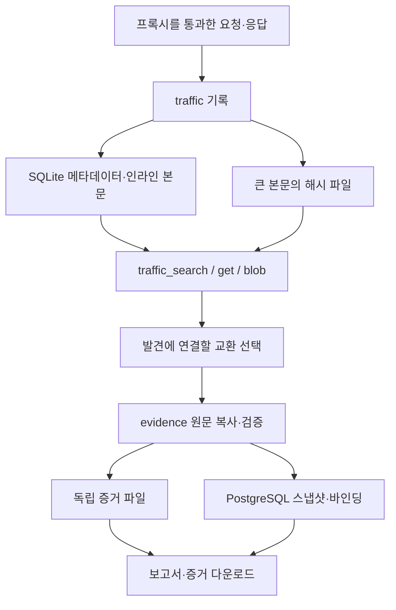
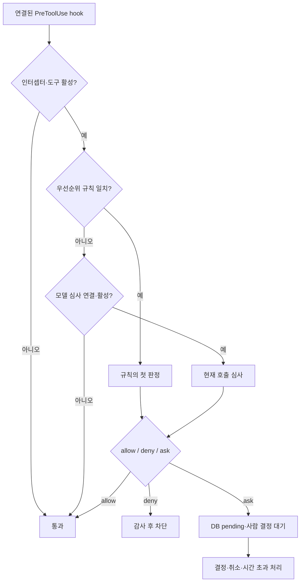

# 외부 서비스·트래픽·증거·승인 계층 읽기

이 문서는 `traffic`, `evidence`, `guard`, `intercept`, `mcphttp`, `notify`, `report`, `enrich`, `selfupdate`의 **58개 Go 파일**을 안내한다. 실행 코드 32개와 테스트 26개에 파일의 역할을 설명하는 한국어 주석을 붙였고, 이 범위의 **563개 함수**와 핵심 자료형 52개에 한국어 해설을 추가했다. 함수 이름·HTTP/JSON 계약·프롬프트·SQL·기존 주석은 원본을 유지한다.

설명의 기준은 가져온 원본 커밋 `b55ceb1fdd84a813d77de09a06af83d323a81f85`의 실제 구현이다. 오래된 원본 주석에 현재 코드와 다른 설계 설명이 있으면 그 아래 한국어 안내에서 차이를 밝혔다. 테스트 설명은 **해당 테스트가 무엇을 검사하는지**를 뜻하며, 이 문서에 모든 통합 테스트를 실행했다는 의미는 없다.

## 1. 이 계층이 맡는 일

에이전트가 다음 행동을 정하는 것과 실제 네트워크·파일·DB·메신저를 다루는 것은 서로 다른 책임이다. 이 묶음은 외부 효과를 프로그램으로 연결하고, 그 결과를 나중에 검토할 수 있게 보관한다.

| 패키지 | 주된 입력 | 만드는 결과 | 책임의 경계 |
| --- | --- | --- | --- |
| `traffic` | 프록시를 통과한 HTTP 교환 | SQLite 기록, 큰 본문 파일, 검색 도구 | 프록시를 우회한 요청이나 투명 통과한 HTTPS 본문은 수집하지 못한다. |
| `evidence` | 발견에 연결할 traffic ID와 역할/설명 | 독립 본문 사본, 스냅샷, finding 바인딩 | 바이트 무결성을 확인한다. 취약점 주장 자체의 진위를 증명하지 않는다. |
| `guard` | Norma 실행 전후 hook | 실행 차단/통과, 짧은 감사, 결과 분류 | 실제 hook이 연결된 세션 경로에서만 작동한다. |
| `intercept` | 현재 도구 이름·인자, DB 규칙 | `allow` / `deny` / `ask`, 승인 이력 | 도구 호출 승인 조정기다. 네트워크 방화벽이나 OS 격리기가 아니다. |
| `mcphttp` | 원격 MCP 주소·헤더·도구 인자 | JSON-RPC 도구 목록과 결과 | 전송 형식을 맞춘다. 원격 도구의 내부 구현까지 검증하지 않는다. |
| `notify` | 사건 스냅샷, 채널 설정, 메시지 | HTTP/SMTP 요청과 전송 결과 | DB 큐와 재시도 시각은 `db` / `server`가 관리한다. |
| `report` | 이미 조회된 발견과 증거 메타데이터 | Markdown / CSV | 내용의 진위 검증이나 원문 본문 복사는 다른 계층의 책임이다. |
| `enrich` | 명시적으로 큐에 넣은 도메인/URL | DNS·HTTP 자산 메타데이터 | 생성만으로 자동 동작하지 않으며 큐가 가득 차면 작업을 버린다. |
| `selfupdate` | GitHub 릴리스와 현재 실행 파일 | 준비본·백업·교체·재시작 상태 | Git 소스 동기화와 다르다. 기본 업데이트 출처도 원본 저장소다. |

## 2. 트래픽과 증거를 따로 저장하는 이유

원시 트래픽은 많은 디스크를 차지하므로 운영 중 지울 수 있어야 한다. 반면 특정 발견의 근거로 사용한 요청·응답은 원시 기록을 지운 뒤에도 남아야 한다. ARTEX는 두 수명을 다른 저장소로 나눈다.



### 2.1 `traffic`의 실제 기록 흐름

진입점은 [`traffic/traffic.go`](../../../traffic/traffic.go)의 `Open`이다. 내부 디렉터리를 만들고 SQLite를 열며 `go-mitmproxy`의 응답 콜백을 등록한다. `Open`은 준비만 하고 실제 리스닝은 `Start`에서 시작한다. 수집 켜짐/꺼짐의 애플리케이션 설정은 [`server/manager.go`](../../../server/manager.go)에서 조립한다. 기본 설정에서 트래픽 수집은 꺼져 있다.

프록시가 응답을 완성하면 `sink.Response`가 `record`를 부른다. `record`는 먼저 쓰기 mutex인 `wmu`를 얻는다. 이 잠금은 기록뿐 아니라 호스트 삭제·원시 blob 수거와 공통으로 사용한다. 기록 중 큰 본문 파일은 만들어졌지만 참조 SQL은 아직 없는 짧은 순간에 GC가 파일을 지우는 경쟁을 막기 위해서다.

이후 요청/응답 헤더를 만들고 `spill`로 본문의 저장 위치를 정한다. 파일 쓰기를 먼저 끝낸 다음 SQL 트랜잭션에서 메타데이터, 본문, blob 참조, FTS 행을 기록한다. 따라서 **SQL 기록끼리는 한 트랜잭션**이지만 파일시스템과 SQLite가 하나의 원자적 트랜잭션인 것은 아니다. 파일 준비 후 SQL 실패가 나면 무참조 파일 정리가 필요하다.

| 구성 | 실제 위치/계약 | 읽는 이유 |
| --- | --- | --- |
| 교환 메타데이터 | `_index/index.sqlite`의 `exchanges` | ID·호스트·URL·시각·상태·길이로 먼저 찾는다. |
| 헤더·작은 본문 | `exchange_bodies` | 일반 요청을 다수의 작은 파일로 만들지 않는다. |
| 큰 본문 | `_blobs/sha256/<앞 2자리>/<해시>.bin` | 내용이 같으면 파일을 공유하고 스트리밍/범위 읽기가 가능하다. |
| 본문 참조 | `blob_refs` | 마지막 참조가 사라진 본문만 정리한다. |
| 전문 검색 | FTS5 `ex_fts`, trigram tokenizer | 단어 내부 부분 문자열 및 다중 바이트 문자를 검색한다. |
| 과거 형식 | 행의 `path`와 `request.http` / `response.http` | 옛 수집 자료를 강제 변환 없이 읽는다. 신규 기록의 기본 경로가 아니다. |

### 2.2 보존량과 모델에 보여 주는 양은 다르다

| 값/기능 | 이 코드의 기본값 또는 한도 | 정확한 의미 |
| --- | --- | --- |
| `maxInlineBody` | 256 KiB | 이 크기 이하는 SQLite에 본문을 둔다. 전체 수집 한도가 아니다. |
| `blobPreview` | 8 KiB | 큰 텍스트 본문에서 SQLite에 남기는 앞부분이다. |
| `maxIndexBody` | 4 MiB | 본문 한쪽이 FTS에 기여하는 최대 텍스트다. 파일 전체 보존량과 다르다. |
| `traffic_search` | 기본 3건, 최대 10건/페이지 | 모델에는 ID·method·URL·status·resp_len만 전달한다. `host`가 필수다. |
| `traffic_get` | 요청 2,500 / 응답 4,000바이트 표시 | 큰 출력은 짧아지고 `@blob` 포인터로 이어 읽는다. |
| `traffic_blob` | 한 번에 최대 8 KiB | `offset`으로 필요한 부분만 읽는다. 내부 `BlobRange` 자체와 도구 래퍼의 한도를 구분한다. |
| trigram 검색어 | 3문자 이상 | 짧은 단어의 동작은 웹 `Page`와 에이전트 `query`에서 다르다. |

이 구조에서 배울 핵심은 **저장은 충분히 하되 모델 문맥에는 필요한 일부만 가져온다**는 것이다. 원문을 모두 프롬프트에 넣지 않아도 ID와 검색/읽기 도구를 통해 근거를 추적할 수 있다.

본문은 기본적으로 평문이며 자동 비밀 마스킹을 하지 않는다. SHA-256 기반 파일명도 암호화가 아니다. 또한 MITM의 프로토콜 오류로 호스트가 `pass` 집합에 들어가면 이후 연결을 투명 터널로 보낸다. 이때 요청의 도달성은 유지할 수 있지만 본문 기록은 남지 않는다. 단순히 수집 기능이 켜져 있다는 이유로 모든 요청이 증거화된다고 가정하면 안 된다.

### 2.3 삭제와 공간 회수

`DeleteHost`는 호스트 **부분 문자열**, `DeleteHostsExact`는 호스트 **정확한 이름 목록**을 사용한다. UI나 다른 서비스에 재사용할 때 이 차이를 지켜야 비슷한 접미사의 다른 호스트를 지우지 않는다.

삭제는 FTS → 본문 → blob 참조 → 메타데이터 순서다. 하위 삭제 질의가 `exchanges`를 참조하므로 마지막에 메타데이터를 지운다. 옛 형식의 폴더는 먼저 같은 파일시스템의 `_delete_staging`으로 옮긴다. 이동은 되돌릴 수 있고, 커밋 뒤 실제 다수 파일 삭제는 백그라운드로 처리한다.

작업 아카이브는 PostgreSQL과 SQLite를 함께 다루므로 `HostDeleteStage`와 `journal.json`을 사용한다. 상위 DB가 커밋되기 전 중단이면 롤백하고, 이미 아카이브 커밋이 끝났다면 재시작 복구가 SQLite 쪽 남은 삭제를 마친다. 이 원리는 [`traffic/archive_test.go`](../../../traffic/archive_test.go)의 두 중단 시나리오로 읽을 수 있다.

행을 지운 것과 파일 크기가 줄어든 것은 다르다. `reclaim`은 FTS tombstone을 병합하고 SQLite 빈 페이지를 작은 단계로 반환한다. 한 번에 5분/512단계 예산과 한 개의 실행만 허용하여 기록을 오래 막지 않는다. 옛 `auto_vacuum=0` DB는 일반 incremental 회수만으로 전환되지 않는다. `DeleteAll` 뒤 전체 `VACUUM`이 이 전환을 처리한다.

### 2.4 발견의 증거로 확정하는 흐름

[`traffic/evidence.go`](../../../traffic/evidence.go)의 `ReadEvidence`는 검색용 미리보기 대신 **완전한 본문 Reader**를 콜백에 전달한다. 콜백 동안 원시 쓰기 잠금을 유지하고 종료 전에 파일을 닫는다.

[`evidence/store.go`](../../../evidence/store.go)의 `prepare`는 이 Reader를 받아 요청·응답을 별도 증거 저장소에 복사한다. `writeBody`는 임시 파일에 쓰면서 SHA-256과 길이를 계산한다. 기대 길이 또는 원본 해시가 맞지 않으면 실패한다. `Sync`, `rename`, 디렉터리 `Sync` 뒤 공개 경로에 놓고, 같은 해시 파일이 이미 있으면 다시 검증해 재사용한다.

`Record`는 작업 잠금 뒤 finding·탐색 노드·바인딩을 함께 기록한다. `Bind`는 기존 finding에 증거를 추가한다. DB 측 계약은 [`db/finding_traffic.go`](../../../db/finding_traffic.go)에 있다.

증거에는 서로 다른 ID가 있으므로 구분해야 한다.

| 값 | 가리키는 것 |
| --- | --- |
| traffic ID | 원시 수집 교환의 식별자 |
| snapshot ID | 정규화한 증거 메타데이터와 본문 해시에 대응하는 스냅샷 |
| binding ID | 특정 finding이 그 스냅샷을 어떤 역할/설명으로 사용하는지의 연결 |
| request/response hash | 각 본문 바이트의 내용 주소 |
| `evidence_version` | 바인딩/설명 등 현재 증거 구성이 변경된 버전 |
| `report_evidence_version` | 저장된 상세 보고서가 기준으로 삼은 증거 버전 |

같은 본문이 여러 finding에 쓰일 수 있으므로 하나의 발견을 삭제해도 공유 본문을 즉시 지우지 않는다. `Collect`는 무참조 스냅샷과 파일에 24시간 유예를 적용하고 `RunGC`는 매시간 실행한다. 다운로드 시에는 `Binding`으로 메타데이터만 짧게 잠금 아래 읽은 뒤 잠금을 놓고 `OpenBody`로 전송한다. 느린 다운로드가 증거 쓰기 전체를 막지 않도록 책임을 나눈 것이다.

## 3. 승인 규칙과 감사의 동작

기본 읽기 순서는 [`guard/guard.go`](../../../guard/guard.go) → [`intercept/intercept.go`](../../../intercept/intercept.go) → [`intercept/review_context.go`](../../../intercept/review_context.go) → [`intercept/prompt.go`](../../../intercept/prompt.go) → [`intercept/trace.go`](../../../intercept/trace.go)다.



### 3.1 규칙을 적용하는 지점

`Guard.Hooks()`가 Norma 세션 옵션에 실제로 연결되어야 한다. 원본에서 worker와 일반 chat에 연결되는 것과 planner/mainagent의 세션 구성이 같다고 가정하지 않는다. 역할별 연결은 [`agent/worker.go`](../../../agent/worker.go), [`agent/chat.go`](../../../agent/chat.go), [`agent/planner.go`](../../../agent/planner.go), [`agent/mainagent.go`](../../../agent/mainagent.go), [`server/intercept.go`](../../../server/intercept.go)에서 확인한다.

규칙 적용 도구의 기본 목록은 `Bash`, `WebFetch`, `web_search`, `shell_open`, `shell_send`, `Write`, `Edit`, `MultiEdit`다. 새 도구나 내부 위임 도구가 생겼다고 자동으로 목록에 들어가지는 않는다. 특정 도구의 메타데이터에 `AskUser`가 있다는 것, 세션 permission 모드, 실제 hook 연결은 각각 다른 확인 지점이다.

규칙은 우선순위 순서에서 **처음 맞는 하나**가 결정한다. 도구 이름 또는 전체 JSON 인자에 대한 정규식/부분 문자열 검사다. 명령의 AST나 모든 네트워크 목적지를 해석하는 정책 엔진은 아니다.

### 3.2 모델 심사기의 기본값과 입력 계약

| 설정 | 코드 기본값/동작 |
| --- | --- |
| 모델 심사 활성화 | 기본 `false` |
| 모델 프로필 | `0`이면 활성 기본 프로필 |
| 모델 대기 제한 | 15초 |
| 모델 오류/파싱 실패 | 기본 `allow`, 설정으로 변경 가능 |
| 모델 `ask`의 사람 대기 | 300초 |
| 사람 대기 시간 초과 | 기본 `deny` |
| 현재 인자 JSON이 유효하지 않음 | 충실한 심사가 불가능하므로 `ask` |

모델이 받는 `ReviewInput` version 4는 현재 `tool_name`, 완전한 `arguments`, 선택적 `working_directory`, 명시적으로 선택한 `user_message` 출처의 `background`다. 배경은 최대 4,000바이트이지만 현재 인자는 이 함수에서 자르지 않는다. worker의 요약이나 전체 탐색 상황, 감사 이력을 자동으로 심사 입력에 넣지 않는다.

`EffectiveJudgePrompt`는 사용자 정책 본문을 보존하면서 입력 경계와 출력 계약을 붙인다. `ParseVerdict`는 `decision`과 `comment` 두 문자열만 있는 완전한 JSON을 검사한다. 중복 키·추가 필드·여러 JSON 객체·잘린 응답·앞뒤 설명을 거절한다. 완전히 닫힌 코드 블록만 제거할 수 있고 잘린 JSON을 추측해 복구하지 않는다.

실행 프롬프트에 중국어가 남는 이유가 여기 있다. 파서는 설명의 `实际操作：…；成功后的后果：…；命中规则：…` 구분 문구까지 계약으로 확인한다. 이 문자열만 번역하면 파싱 실패와 실패 정책의 연쇄 효과가 생길 수 있다. 주석 한국어화는 원문 실행 계약을 바꾸지 않고 독해를 돕는다.

### 3.3 사람 승인과 감사 연결

`HandleAsk`는 먼저 DB에 pending을 만든 뒤 해당 ID의 대기 채널을 등록한다. 두 단계 사이에 사용자가 아주 빨리 결정할 수 있으므로 **채널 등록 뒤 DB를 한 번 더 읽는다**. 이런 작은 경쟁 조건을 테스트 가능한 경계로 다룬다는 점을 배울 수 있다.

`Trace`는 한 번의 Prompt 실행마다 별도 runID를 만든다. hook에서 tool-use ID를 직접 못 받는 경우 도구 이름과 JSON을 정규화한 해시를 사용한다. 동일 인자의 동시 호출이 여러 개면 결과 도착 순서로 억지 연결하지 않고 `ambiguous`로 남긴다. 결과가 끝내 없으면 `unknown`이다.

감사의 `allow`도 실행 성공과 다르다. 정확히 연결된 허용 호출은 `awaiting_result`에서 실제 결과를 기다린다. 큰 원시 문맥은 일반 허용 이력에서 제거하지만 실제 모델 심사 입력과 해시는 보존한다. 파일 해시처럼 여기의 해시도 당시 입력의 식별/무결성 수단이지 모델 판단이 옳다는 증거는 아니다.

## 4. 원격 MCP를 같은 도구 인터페이스로 맞추기

[`mcphttp/client.go`](../../../mcphttp/client.go)는 SDK를 수정하지 않고 외부 MCP를 `CoreTool` 형태로 맞춘다. 도구 이름은 `mcp__<server>__<tool>`로 정규화한다.

| 경로 | 전송 방식 | 응답이 오는 곳 |
| --- | --- | --- |
| `New` | Streamable HTTP, 프로토콜 `2025-06-18` | POST의 JSON 또는 SSE 응답 |
| `NewSSE` | 이전 SSE, 프로토콜 `2024-11-05` | GET 스트림이 알려 준 endpoint에 POST한 뒤 원래 GET 스트림으로 결과 수신 |

생성자는 `initialize` 및 `notifications/initialized`를 완료한다. `Tools`가 `tools/list`를 조회하고 각 항목을 감싼다. 모델용 래퍼의 결과는 `actool.Capture`를 통과하므로 긴 MCP 텍스트가 세션의 출력 한도/파일 저장 규칙을 따른다. 원격 content 블록의 텍스트를 합치는 구현이므로 이미지·리소스 링크 등 모든 MCP 표현을 완전히 보존하는 범용 멀티모달 클라이언트로 확대 해석하지 않는다.

`Call`은 backend 배치 작업의 직접 호출 경로다. `Tools` 래퍼의 AskUser를 거치지 않는다. 따라서 응용 코드가 이 함수를 사용하면 승인 책임을 그 호출부에서 설계해야 한다. `insecure=true`는 인증서 검증 생략이며 오류를 해결하는 중립적인 연결 옵션처럼 다루면 안 된다.

이전 SSE는 요청을 직렬화하고 ID별 응답 채널을 등록한다. 세션이 끝나면 `Close`가 스트림을 취소·닫는다. 일반 HTTP는 세션 ID가 있으면 DELETE 종료 통지를 보낸다. 연결 수명과 모델에 도구 설명을 늦게 공개하는 수명은 별개다.

## 5. 알림은 사건·큐·채널을 나눠 이해하기

알림의 중심은 `notify` 하나가 아니라 다음 세 계층의 조합이다.

1. [`db/notification.go`](../../../db/notification.go)가 발견 시점의 `Snapshot`과 이벤트를 만들고 필터에 맞는 채널별 delivery로 분배한다.
2. [`db/notification_delivery.go`](../../../db/notification_delivery.go)와 [`server/notifier.go`](../../../server/notifier.go)가 임대·속도 제한·실시간/묶음·실패 재시도·성공 상태를 관리한다.
3. [`notify/channel.go`](../../../notify/channel.go)의 각 `Channel`이 한 번의 외부 HTTP/SMTP 전송을 수행한다.

현재 delivery 큐에는 `FOR UPDATE SKIP LOCKED`와 임대를 사용하는 경로가 있다. 이를 worker의 intent 선점 방식과 혼동하지 않는다. 에이전트의 intent 선점은 별도의 조건부 UPDATE다.

### 5.1 왜 발생 시점의 스냅샷을 보관하는가

발견의 이름·심각도·처리 상태는 나중에 바뀔 수 있다. 알림을 보낼 때 현재 findings를 다시 읽으면 당시 `critical`이었던 사건이 나중에 수정된 `low`로 보일 수 있다. `Snapshot`은 당시 필드를 복사해 보관한다. 표시 자산명·상세 링크는 server가 `Item`으로 조립한다.

### 5.2 채널별 전송 계약

아래 한도와 rate는 **이 코드가 채택한 값**이다. 각 플랫폼의 현재 공식 정책을 자동으로 반영한 표는 아니다.

| 채널 | 메시지 형태 | 비밀 필드 | 자격 증명 수신 위치 | 코드의 주요 제한/분류 |
| --- | --- | --- | --- | --- |
| DingTalk | Markdown / 단일 ActionCard | webhook, secret | webhook | 기본 분당 20, 본문 보호 한도 20,000바이트, `errcode` 검사 |
| Feishu/Lark | interactive 카드 | webhook, secret | webhook | 기본 분당 100, 묶음 카드 예산 24,000바이트, `code`/`StatusCode` 검사 |
| WeCom | Markdown | webhook | webhook | 기본 분당 20, 4,096바이트, 45009는 일시 제한 |
| Telegram | Bot API의 HTML | bot_token | base_url | 기본 분당 20, 4,096문자, 429는 재시도 가능 |
| Webhook | 사용자 JSON 템플릿 | url, headers | url | 기본 rate 0, 본문 비절단, GET은 본문 없는 신호 |
| SMTP 메일 | HTML을 MIME/base64로 전송 | password | host, port, tls | 기본 분당 60, 본문 비절단, SMTP 4xx와 5xx 구분 |

서명 알고리즘도 비슷해 보이지만 다르다. DingTalk는 `key=secret`, `message=timestamp+개행+secret`이다. Feishu는 `key=timestamp+개행+secret`, `message=빈 값`이다. [`notify/sign_test.go`](../../../notify/sign_test.go)는 구현과 독립적으로 계산한 기준값을 사용해 이 차이를 고정한다.

### 5.3 실제 포함 수 `kept`가 필요한 이유

50개 알림을 하나로 합친 뒤 문자열만 잘라 보내면 뒤쪽 항목은 메시지에서 사라진다. 그런데 큐에서 50개 전부를 성공 처리하면 그 알림은 다시 오지 않는다. `Send`는 실제 포함한 앞부분의 항목 수를 반환한다. `Notifier.send`는 그 수만 성공으로 표시하고 나머지는 실패 예산을 소비하지 않은 상태로 다시 대기시킨다.

`packItemCount`는 실제 렌더링된 길이로 항목별 예산을 계산한다. 다중 바이트 문자열의 byte와 rune을 구분하며 머리말·꼬리말 자리도 남긴다. 한 항목이 지나치게 크면 최소 하나를 선택하고 최종 절단에 맡기는 현재 정책이 있다. 따라서 kept는 모든 상세 텍스트가 한 글자도 빠짐없이 보였다는 보증과는 다르다.

HTTP는 408/429/5xx와 네트워크 오류를 일시 실패로, 나머지 거절을 영구 오류로 분류한다. SMTP의 **4xx는 일시 실패, 5xx는 영구 실패**이므로 두 프로토콜의 숫자만 보고 같은 정책을 적용하면 안 된다. 상위 Notifier는 채널별 토큰 버킷, 한 tick의 전송 예산, 임대와 재시도 횟수를 함께 관리한다.

외부 수신 성공과 DB 성공 기록은 하나의 트랜잭션이 아니다. 외부로 메시지가 전달된 뒤 성공 상태 저장 전에 중단되면 중복 전달 가능성은 남는다. 다른 분야로 재사용할 때 정확히 한 번 처리 효과가 필요하면 수신 측의 사건 ID 기반 중복 방지를 함께 설계한다.

### 5.4 비밀 마스킹과 템플릿 경계

`MaskConfig`는 API 표시용 복사본에서 비밀만 `__masked__`로 바꾼다. `MergeConfig`는 이 값을 기존 비밀 유지로, 빈 문자열을 삭제로 해석한다. 하지만 대상 주소만 새 서버로 바꾸면서 비밀은 유지하면 기존 자격 증명을 새 서버에 보낼 수 있다. `PrepareConfigUpdate`는 대상이 바뀔 때 비밀 필드를 새 값 또는 명시적 빈 값으로 다시 제시하도록 요구한다.

Webhook 템플릿에는 메서드 없는 데이터 구조체와 `json`, `jsons`만 노출한다. Go `text/template`는 공개 메서드도 호출할 수 있기 때문에 DTO에 편의 메서드를 붙이는 일조차 능력의 범위를 바꿀 수 있다. [`notify/webhook_template_test.go`](../../../notify/webhook_template_test.go)의 reflection 검사가 이 경계를 고정한다.

연결 IP 제한은 루프백·링크 로컬·미지정·멀티캐스트를 대상으로 하고 RFC1918 사설 주소는 허용한다. 마스킹, 연결 IP 제한, 리다이렉트 제한, 템플릿 데이터 경계는 각각 다른 문제를 다룬다. 하나가 있다고 다른 보호까지 수행한다고 판단하지 않는다.

## 6. 보고서와 DNS/HTTP 보충

[`report/report.go`](../../../report/report.go)는 그래프 finding 노드의 간단한 작업 보고서를, [`report/findings.go`](../../../report/findings.go)는 발견 목록/개별 Markdown과 CSV를 만든다. 출력 전에 원문에 맞게 정렬하고 심각도 집계를 한다. CSV에는 UTF-8 BOM을 붙이고 큰 증거/상세 보고서 대신 요약과 증거 바인딩 ID를 넣는다.

`findingTrafficMarkdown`은 현재 증거 버전과 상세 보고서의 증거 버전을 비교한다. 다르면 보고서 재생성이 필요하다고 표시한다. 보고서에 HTTP 첨부 링크를 만드는 책임과 실제 첨부 파일을 복사하는 책임도 분리되어 있다.

[`enrich/enrich.go`](../../../enrich/enrich.go)는 LLM 없이 DNSX와 HTTP로 자산 정보를 보충할 수 있는 worker 풀이다. 기본 worker 4개, 큐 1,024개, 같은 `kind:id`의 냉각 기간 5분을 둔다. DNS는 A/AAAA/CNAME을 읽어 IP/subdomain을 UPSERT한다. HTTP는 GET 결과를 최대 1 MiB 읽어 상태·읽힌 길이·title을 HTTPService에 저장한다.

다음 사항은 이름이나 오래된 주석보다 실제 호출부를 기준으로 읽어야 한다.

- `New`로 엔진을 만들었다고 DNS/HTTP 요청이 자동 발생하지 않는다. `ResolveDomain`/`ProbeSite`의 실제 호출이 있어야 한다. 이 원본 스냅샷에서는 생성·인터페이스 주입과 별개로 자산 삽입 경로에서 이 두 함수를 실제 호출하는 연결이 확인되지 않는다.
- 원본 상단에는 과거 RoE와 별도 edge 생성 설명이 남아 있지만 현재 `doHTTP`에는 RoE 판정 호출이 없고 자산 UPSERT를 사용한다.
- HTTP ContentLength로 저장하는 값은 제한해서 읽은 바이트 수다. 응답 전체가 1 MiB를 넘으면 실제 원본 전체 길이와 다를 수 있다.
- 메모리 큐가 가득 차면 작업을 버리고, 프로세스 재시작으로 큐와 냉각 기록이 초기화된다. 영속 배치 큐로 사용하려면 별도 저장/재시도 설계가 필요하다.

## 7. 자가 업데이트와 독립 저장소의 관계

**독립 저장소로 소스를 가져왔어도 기본 원클릭 업데이트 출처는 `Autumn-27/artex`다.** [`selfupdate/github.go`](../../../selfupdate/github.go)의 `Repo` 상수는 실행 동작 보존을 위해 원본 그대로 둔다. 원클릭 업데이트는 원본 릴리스 바이너리를 설치하므로 이 저장소를 수정해 빌드한 프로그램도 원본 바이너리로 교체될 수 있다. 한국어 주석과 자체 수정이 반영된 실행본은 이 저장소 소스로 다시 빌드하여 배포한다.

업데이트는 다음 세 프로세스 시작에 걸쳐 진행된다.

1. 실행 중인 서버가 릴리스 ZIP과 SHA256SUMS를 내려받아 대조하고, 실행 파일을 추출·`-h` 확인한 뒤 `.new`로 준비한다. 종료 코드 75로 시작 스크립트에 재실행을 요청한다.
2. 재실행된 이전 바이너리의 `Bootstrap`이 `.new`의 해시와 실행 가능성을 재검사한다. 현재 파일을 `.old`로 옮기고 준비본을 현재 위치로 바꾼 다음 다시 75로 종료한다.
3. 새 바이너리가 시작되면 마커의 시도 횟수를 누적한다. HTTP 시작 뒤 `SettleDelay`를 지나 `Settle`가 호출되면 마커를 지운다. 안정화에 실패한 시작이 3번 누적되면 다음 부트스트랩에서 백업으로 되돌린다.

모든 임시 파일은 실행 파일과 같은 폴더에 둔다. CWD가 다르거나 `/tmp`가 다른 마운트여도 잘못된 위치에 준비하지 않도록 한다. ZIP의 basename을 검사해 `artex` 또는 `artex.exe`만 고정 목적지로 추출하고, 추출 크기는 512 MiB 이하이며 빈 바이너리는 거절한다. ZIP 안에 포함된 `skills`를 이 경로가 함께 설치하는 것은 아니다.

SHA-256 목록과 바이너리는 같은 릴리스 출처에서 가져오므로 이것은 독립 서명 체계와 다르다. `-h` 실행 확인도 아키텍처·실행 가능성의 검사이지 모든 업무 기능의 정상성 검증은 아니다. 컨테이너에서 자가 교체한 파일은 이미지 자체를 갱신하지 않으므로 컨테이너를 이미지로 재생성하면 이미지에 포함된 실행 파일을 사용한다.

## 8. 모든 파일의 읽기 지도

각 파일 위의 `[한국어 파일 안내]`는 위치와 범위를, 각 함수 직전의 `한국어 해설`은 동작·오류·잠금 또는 테스트 목적을 설명한다. 아래에서 파일을 열고 함수 이름으로 검색하면 세부 구현을 따라갈 수 있다.

### 트래픽·증거

| 파일 | 읽을 핵심 |
| --- | --- |
| [`traffic/traffic.go`](../../../traffic/traffic.go) | Open, record/spill, 검색, 두 종류의 호스트 삭제, stage/복구, FTS·SQLite 공간 회수 |
| [`traffic/archive.go`](../../../traffic/archive.go) | traffic.json/blob 아카이브와 현재 ID 우선 복원 |
| [`traffic/evidence.go`](../../../traffic/evidence.go) | 잠금 아래 완전한 본문 Reader를 증거 복사에 전달 |
| [`traffic/traffic_store_test.go`](../../../traffic/traffic_store_test.go) | 인라인/대형/바이너리 저장, FTS, 목록 필터, 동시 쓰기 |
| [`traffic/traffic_test.go`](../../../traffic/traffic_test.go) | Host 복원, 부분/정확 삭제, SQL/파일 실패 롤백, 공유 blob |
| [`traffic/archive_test.go`](../../../traffic/archive_test.go) | 아카이브 왕복, PostgreSQL 커밋 전후 중단 복구 |
| [`traffic/reclaim_test.go`](../../../traffic/reclaim_test.go) | 실제 파일 크기, tombstone, 옛 auto_vacuum, 전체 삭제 |
| [`traffic/upgrade_test.go`](../../../traffic/upgrade_test.go) | 옛 DSN으로 만든 데이터의 업그레이드/다운그레이드 호환 |
| [`traffic/proxy_test.go`](../../../traffic/proxy_test.go) | 출구 프록시 스킴, 설정 유지/초기화, 접속용 주소 |
| [`traffic/passthrough_test.go`](../../../traffic/passthrough_test.go) | MITM 오류만 투명 통과로 전환하는 분류 |
| [`evidence/store.go`](../../../evidence/store.go) | 해시/길이, durable 쓰기, finding 바인딩, 버전, 독립 복사, GC |
| [`evidence/store_test.go`](../../../evidence/store_test.go) | 바인딩 수명, 실패 원자성, 동시 삭제, 유예/복원 잠금 |
| [`evidence/testmain_test.go`](../../../evidence/testmain_test.go) | 명시적 PostgreSQL DSN과 통합 테스트 suite 잠금 |

### 승인·MCP

| 파일 | 읽을 핵심 |
| --- | --- |
| [`guard/guard.go`](../../../guard/guard.go) | 실행 전 규칙 연결, 실행 후 Bash 휴리스틱, 짧은 감사 |
| [`guard/guard_test.go`](../../../guard/guard_test.go) | 인터셉터 없는 경로의 통과 계약; 명령은 실행되지 않는 문자열 |
| [`intercept/intercept.go`](../../../intercept/intercept.go) | 캐시·첫 규칙 일치·Judge fallback·사람 대기·취소/시간 초과 |
| [`intercept/review_context.go`](../../../intercept/review_context.go) | 현재 인자와 명시적 사용자 배경의 입력 계약 |
| [`intercept/prompt.go`](../../../intercept/prompt.go) | 실행 프롬프트 보존과 엄격한 JSON/3부분 설명 파서 |
| [`intercept/trace.go`](../../../intercept/trace.go) | 실행 ID·인자 해시·모호한 동시 호출·결과 누락 |
| [`intercept/prompt_test.go`](../../../intercept/prompt_test.go) | 잘린/모호한 응답 거절, 닫힌 코드 블록만 해제 |
| [`intercept/review_context_test.go`](../../../intercept/review_context_test.go) | 감사와 모델 입력 분리, 원문 출처·배경 한도 |
| [`intercept/trace_test.go`](../../../intercept/trace_test.go) | 정확 연결, 동일 병렬 호출, 문맥 한도, unknown |
| [`mcphttp/client.go`](../../../mcphttp/client.go) | HTTP/SSE 전송 차이, 초기화, 도구 래퍼/직접 Call, Close |
| [`mcphttp/client_sse_test.go`](../../../mcphttp/client_sse_test.go) | 로컬 서버로 구 SSE의 endpoint·세션·목록·호출 검증 |

### 알림

| 파일 | 읽을 핵심 |
| --- | --- |
| [`notify/notify.go`](../../../notify/notify.go) | 채널/사건 ID, 등급 순위와 처리 상태 라벨 |
| [`notify/channel.go`](../../../notify/channel.go) | 무상태 Channel, registry, kept, 영구 오류, JSON 설정 helper |
| [`notify/event.go`](../../../notify/event.go) | 발생 시점 Snapshot, 렌더링 Item, 단일/묶음 Message |
| [`notify/filter.go`](../../../notify/filter.go) | 쓰기 검증·관대한 읽기·제외 우선·상태 변경 opt-in |
| [`notify/http.go`](../../../notify/http.go) | 연결 IP 검사, 응답 제한, HTTP 오류 분류, URL 축약 |
| [`notify/mask.go`](../../../notify/mask.go) | 마스크 유지·빈 값 삭제·목적지 변경과 비밀 재명시 |
| [`notify/render.go`](../../../notify/render.go) | byte/rune/HTML 경계, 항목별 예산, 자산 표시 |
| [`notify/markdown.go`](../../../notify/markdown.go) | 외부 Markdown 이스케이프, 공통 제목, 묶음 kept |
| [`notify/html.go`](../../../notify/html.go) | 메일 인라인 HTML, 텍스트와 href 속성 이스케이프 |
| [`notify/dingtalk.go`](../../../notify/dingtalk.go) | ActionCard/Markdown, 밀리초 HMAC, errcode |
| [`notify/feishu.go`](../../../notify/feishu.go) | interactive 카드, 다른 HMAC 인자, 카드 예산 |
| [`notify/wecom.go`](../../../notify/wecom.go) | URL key, 4,096바이트, 제한과 키 오류 |
| [`notify/telegram.go`](../../../notify/telegram.go) | Bot API 경로 토큰, HTML, 문자 수, API/대화 구분 |
| [`notify/webhook.go`](../../../notify/webhook.go) | JSON 템플릿, 제한된 문맥/함수, GET과 본문 메서드 |
| [`notify/email.go`](../../../notify/email.go) | TLS/STARTTLS, SMTP 단계, deadline, MIME/base64 |
| [`notify/channels_test.go`](../../../notify/channels_test.go) | 채널별 실제 요청 형식, 업무 오류, MIME/HTML, registry |
| [`notify/email_test.go`](../../../notify/email_test.go) | 최소 SMTP 서버로 실제 명령 순서와 단계별 거절 확인 |
| [`notify/filter_test.go`](../../../notify/filter_test.go) | 등급·범위·분류·상태 변경의 경계 사례 |
| [`notify/http_test.go`](../../../notify/http_test.go) | HTTP 오류 계층과 짧고 한 줄인 진단 |
| [`notify/mask_test.go`](../../../notify/mask_test.go) | 비밀 표시, 부분 갱신, 대상 교체, 반복 빈 값 저장 |
| [`notify/pack_test.go`](../../../notify/pack_test.go) | 초과 항목의 kept 일치와 외부 Markdown 구조 차단 |
| [`notify/redact_test.go`](../../../notify/redact_test.go) | 전송 실패/URL 오류/리다이렉트의 비밀 노출 방지 |
| [`notify/render_test.go`](../../../notify/render_test.go) | 모든 UTF-8 절단 위치와 HTML 태그/엔티티 끝부분 |
| [`notify/sign_test.go`](../../../notify/sign_test.go) | 독립 서명 기준값과 두 플랫폼의 알고리즘 차이 |
| [`notify/ssrf_test.go`](../../../notify/ssrf_test.go) | 기본 로컬 제한, 명시적 해제, SMTP 포함, 사설 주소 범위 |
| [`notify/webhook_template_test.go`](../../../notify/webhook_template_test.go) | 메서드/함수 능력 경계, 알 수 없는 데이터 접근, JSON 강제 |

### 보고서·보충·업데이트

| 파일 | 읽을 핵심 |
| --- | --- |
| [`report/report.go`](../../../report/report.go) | 그래프 finding의 간단한 작업 Markdown |
| [`report/findings.go`](../../../report/findings.go) | 발견 일괄/단일/CSV, 증거 버전 경고, 첨부 상대 링크 |
| [`enrich/enrich.go`](../../../enrich/enrich.go) | 메모리 큐, 냉각, DNS/HTTP UPSERT, 실제 연결 여부 |
| [`selfupdate/selfupdate.go`](../../../selfupdate/selfupdate.go) | 실행 폴더 경로, 버전 비교, 상태 마커, 컨테이너 판단 |
| [`selfupdate/github.go`](../../../selfupdate/github.go) | 원본으로 고정한 Repo, HTTPS/호스트 제한, 자산 이름 |
| [`selfupdate/stage.go`](../../../selfupdate/stage.go) | ZIP/체크섬 다운로드, 실행 파일 추출, -h 확인, .new 준비 |
| [`selfupdate/bootstrap.go`](../../../selfupdate/bootstrap.go) | 시작 전 교체, 시도 횟수, 안정화, 자동/수동 복구 |
| [`selfupdate/selfupdate_test.go`](../../../selfupdate/selfupdate_test.go) | 임시 가짜 바이너리로 검증·교체·실패 복구·ZIP/URL 계약 |

## 9. 테스트를 읽고 확장하는 방법

처음에는 외부 모델이나 스캔 없이도 이해 가능한 순수 함수/임시 저장소 테스트부터 읽는다. 채널의 실제 외부 송신은 로컬 `httptest`와 최소 SMTP fixture로 대체되어 있다. 다만 `notify/email_test.go`의 비로컬 SMTP 사례는 연결 실패를 받아들이는 제한적인 검사여서 TLS 안전성을 완전히 검증했다고 볼 수 없다.

개발 환경이 갖춰졌을 때 패키지별로 실행할 수 있는 예시는 다음과 같다. 모듈이 요구하는 Go 버전과 의존성 설치는 저장소의 빌드 안내를 먼저 따른다.

```bash
go test ./traffic ./guard ./intercept ./mcphttp ./notify ./selfupdate
```

`evidence` 통합 검사는 별도로 준비한 테스트용 PostgreSQL이 필요하다. `ARTEX_PG_DSN`이 없으면 skip될 수 있으므로 단순한 명령 종료 코드만으로 DB 통합 검증까지 됐다고 판단하지 않는다. 이 DSN이 실제 작업 데이터베이스를 가리키도록 설정하지 않는다. fixture가 행을 생성·변경·삭제하고 스키마 초기화를 수행하기 때문이다.

한글 주석 추가를 검증할 때 가장 직접적인 기준은 주석을 제외한 Go 토큰·문자열·빌드 지시문이 원본과 같은지 확인하는 것이다. 그 다음 문법/빌드와 필요한 기존 테스트를 실행한다. 새로운 기능을 만들지 않은 주석 변경에서 같은 구현을 복제한 새 테스트를 늘리는 것보다 변경 경계를 직접 확인하는 편이 목적에 맞다.

## 10. 다른 분야에 가져갈 수 있는 설계

이 계층의 가치는 특정 보안 도구 이름보다 **원문 수집, 장기 근거, 현재 호출 승인, 사건 전달, 교체 복구를 분리한 구조**에 있다.

| 응용 분야 | 재사용할 설계 | 바꾸어야 할 구체적인 부분 |
| --- | --- | --- |
| 소프트웨어 QA | 원시 실행 로그와 결함에 연결한 독립 증거 분리 | traffic 교환을 테스트 실행/스크린샷/로그로, finding을 결함으로 일반화한다. |
| 음향·영상 품질 검사 | content-addressed 본문과 보고서 증거 버전 | 원시 오디오/영상·측정 파라미터·분석 결과를 같은 버전의 스냅샷으로 묶는다. |
| ERP 장애 분석 | 발생 시점 Snapshot과 작업/자산 필터 | 발견을 이상 사건으로, asset을 주문/설비/업무 객체로 바꾸고 개인정보 표시 정책을 정의한다. |
| 문서/연구 검토 | 원문 ID → 검색 → 필요한 부분만 읽기 | HTTP 대신 문서 페이지/표/데이터셋의 출처와 구간 ID를 사용한다. |
| 운영 승인 도구 | 현재 호출 입력 계약과 명시적 `ask` | 범용 문자열 정규식에서 업무별 타입이 있는 작업/대상/효과 정책으로 확장한다. |
| 사내 알림 허브 | 순수 Channel 어댑터, kept, 사건 snapshot | 채널별 길이·비밀·대상 규칙을 선언하고 수신 측 사건 ID 중복 방지를 붙인다. |
| 데스크톱/에지 앱 배포 | 준비 → 검증 → 교체 → 안정화/복구 | 자체 릴리스 소스·서명 검증·버전 정책·실제 health check를 설계한다. |

수정할 때는 이름만 교체하지 말고 보장해야 하는 성질을 함께 옮긴다. 예를 들어 의료/제조/회계 결과를 장기 근거로 남긴다면 SHA-256만으로 판단의 정확성이나 승인된 처리임이 증명되지는 않는다. 검증 규칙과 원본 버전, 누가 어떤 근거로 판단했는지의 출처를 별도로 저장해야 한다.

기능 개선 후보를 구현과 혼동하지 않도록 명시하면 다음과 같다. 이 복제본의 주석 작업에서 아래 기능을 새로 구현한 것은 아니다.

- 트래픽 ID를 시각+순환 카운터에서 충돌 회피가 분명한 식별자로 바꾸고, 원시 blob 쓰기 실패를 더 명시적으로 기록한다.
- 원시 트래픽 아카이브 복원 시 큰 blob의 전체 색인 범위까지 재구성하여 검색 일관성을 검증한다.
- 모든 역할과 위임 도구가 통과하는 공통 실행 지점에 타입이 있는 승인/범위 검사를 연결한다.
- 승인 규칙의 잘못된 정규식·손상 설정·DB 읽기 실패에 대한 정책을 UI와 로그에서 명확히 드러낸다.
- `enrich`를 실제 자산 삽입 경로와 연결할 경우 명시적 범위·영속 큐·정확한 중복 방지와 종료 처리를 함께 추가한다.
- 원격 MCP 결과에서 텍스트 외 content 형식과 전송 취소/재연결의 필요한 부분을 명시적으로 지원한다.
- 자체 업데이트는 자신의 릴리스 정책과 독립 서명/health check를 설계한 뒤 변경한다. 원본 고정 URL만 바꾸는 것을 완성된 배포 설계로 보지 않는다.
