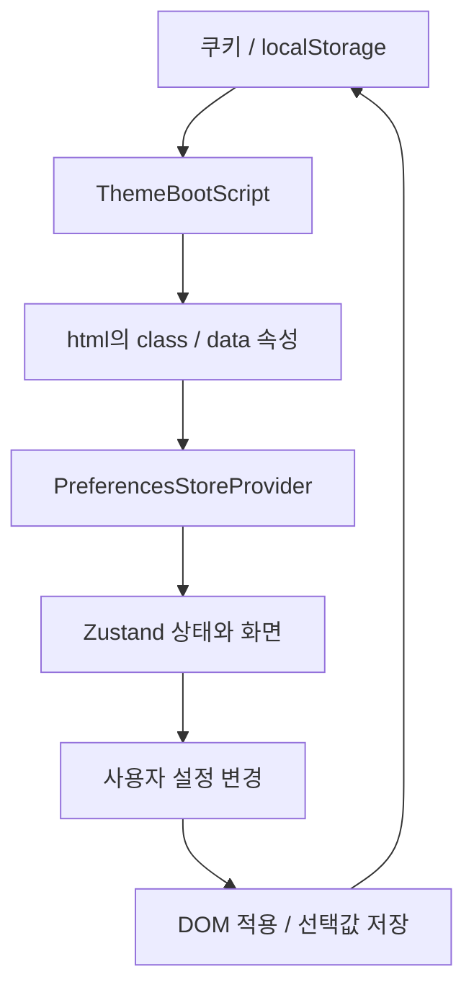

# 웹 공통 계층: API, 상태, 이벤트, 테마, 재사용 UI

이 문서는 `web/`에서 **페이지 사이에 공유되는 코드**를 설명합니다. 개별 페이지가 화면을 구성한다면 이 계층은 서버와의 통신, 데이터 계약, 브라우저 환경설정, 실시간 활동 병합, 공통 입력과 팝업의 동작을 제공합니다. 각 소스 파일 첫머리에 한국어 역할 설명을 추가했고, 상태가 바뀌거나 오류·중복·지연 응답을 처리하는 함수에는 별도의 설명을 붙였습니다.

분석 기준은 이 저장소에 가져온 원본 ARTEX 코드입니다. 한국어 설명은 읽기를 돕는 주석과 문서이며, API 경로·필드·상태값·UI 문구·모델에 전달하는 문자열·예제 데이터·실행 명령은 원래 값을 유지합니다. 특히 **중국어가 들어 있는 문자열도 프로그램의 입력 문법일 수 있습니다.** `@` 참조 토큰의 종류 이름이나 정규식, Skill 본문, 예제의 기대값을 설명 번역과 혼동하지 않아야 합니다.

## 1. 처음 읽을 때의 순서

1. [api.ts](../../../web/src/lib/api.ts)의 `http`, `sseUrl`, `api.createTask`를 읽습니다. 화면이 어떤 방식으로 Go 서버에 요청하는지 먼저 확인합니다.
2. [types.ts](../../../web/src/lib/types.ts)의 `Task`, `Asset`, `TaskNode`, `Finding`, `Activity`를 읽어 서로 다른 데이터 단위를 구분합니다.
3. [activity-merge.ts](../../../web/src/lib/activity-merge.ts)와 [use-side-questions.ts](../../../web/src/hooks/use-side-questions.ts)에서 중복 응답과 늦게 도착하는 응답을 처리하는 방식을 읽습니다.
4. [preferences-config.ts](../../../web/src/lib/preferences/preferences-config.ts), [theme-boot.tsx](../../../web/src/scripts/theme-boot.tsx), [preferences-provider.tsx](../../../web/src/stores/preferences/preferences-provider.tsx) 순서로 첫 화면과 React 상태가 맞춰지는 과정을 읽습니다.
5. [button.tsx](../../../web/src/components/ui/button.tsx), [dialog.tsx](../../../web/src/components/ui/dialog.tsx), [sidebar.tsx](../../../web/src/components/ui/sidebar.tsx)를 비교합니다. 얇은 표현 부품에서 상태를 공유하는 복합 부품으로 이해 범위를 넓힐 수 있습니다.
6. [mock/data.ts](../../../web/src/lib/mock/data.ts)와 [mock/handler.ts](../../../web/src/lib/mock/handler.ts)를 마지막에 읽어 실제 서버와 데모의 경계를 확인합니다.

## 2. 화면 요청이 서버에 도착하는 과정

### 2.1 공통 HTTP 경계

`api.ts`의 `http<T>(path, init)`는 다음 일을 합니다.

- `MOCK`이 켜져 있으면 브라우저 안의 `mockHandle`로 우회합니다.
- 실제 모드에서는 `/api` 접두사를 붙이고 브라우저 토큰을 `Authorization: Bearer …` 헤더에 넣습니다.
- 본문이 있으면 기본 `Content-Type: application/json`을 지정합니다. 호출자가 넘긴 헤더는 뒤에서 병합되므로 기본값을 덮어쓸 수 있습니다.
- `401`이면 localStorage와 쿠키를 비우고 로그인 화면으로 이동합니다.
- 다른 오류 상태는 서버 JSON의 `error` 문자열을 우선 사용하고, 파싱할 수 없으면 메서드·경로·HTTP 상태로 만든 메시지를 사용합니다.
- `204 No Content`는 `undefined`를 반환하고, 나머지 정상 응답은 JSON으로 읽습니다.

여기서 `T`는 **TypeScript가 개발 중 확인하는 반환 타입**입니다. 서버 JSON이 실제로 그 구조인지 검사하는 런타임 검증은 아닙니다. 예를 들어 `get<Task>`라고 선언했다고 해서 누락된 `id`나 잘못된 `status`가 자동으로 거부되지는 않습니다. 서버와 타입이 함께 바뀌어야 하는 이유입니다.

`get`, `post`, `put`, `patch`, `del`은 위 공통 함수를 짧게 부르기 위한 도우미입니다. `api` 객체의 개별 메서드는 화면의 입력을 서버 경로와 JSON 필드로 연결합니다. `createTask`가 `categoryId`를 `category_id`, `llmProfileIds`를 `llm_profile_ids`로 바꾸는 부분이 대표적입니다.

Go에서 빈 slice가 `null`로 직렬화되는 경우가 있어 `arr`가 `null` 또는 `undefined`를 빈 배열로 바꿉니다. 다만 모든 응답을 일괄 정규화하는 구조는 아니므로, 새 메서드를 추가할 때 기존 목록 소비자가 어떤 모양을 기대하는지 확인해야 합니다. [side-questions.ts](../../../web/src/lib/side-questions.ts)의 `history`는 별도로 `Array.isArray`, `null`, 숫자 커서를 검사하여 React 상태에 넣기 전에 응답을 정리합니다.

### 2.2 일반 요청과 SSE의 주소가 다른 이유

[SSE 주소 생성](../../../web/src/lib/api.ts)의 기본값은 실행 모드에 따라 다릅니다.

| 실행 모드 | 일반 API | SSE 기본 주소 | 읽을 설정 |
|---|---|---|---|
| 개발, `next dev` | Next.js의 `/api` rewrite를 거쳐 Go로 전달 | 현재 호스트의 Go `:8787`에 직접 연결 | `AUTOPENTEST_API`, `NEXT_PUBLIC_SSE_BASE` |
| 정적 운영 UI | 같은 origin의 Go API | 같은 origin | Go의 정적 UI/SSE 서빙과 외부 reverse proxy |
| `NEXT_PUBLIC_MOCK=1` 데모 | `mockHandle`이 응답 | 실제 모드와 같은 완전한 서버 스트림을 보장하지 않음 | 각 화면의 mock 분기 |

원본은 개발용 Next 프록시가 SSE를 버퍼링하는 상황을 피하려고 개발 중 스트림을 Go에 직접 연결합니다. 운영에서는 같은 origin을 기본으로 하므로 외부에 8787 포트를 추가 공개하지 않고 일반 HTTPS 경로 아래에서 UI와 SSE를 제공할 수 있습니다.

`NEXT_PUBLIC_SSE_BASE`를 명시하면 기본값을 덮어씁니다. 빈 문자열도 유효한 설정이므로 `??`를 사용합니다. 한편 `AUTOPENTEST_API`는 일반 API rewrite의 대상만 바꾸므로, 개발 백엔드를 다른 주소로 바꿀 때 SSE 설정도 함께 확인해야 합니다.

`http`에는 `/tasks`처럼 `/api`를 뺀 경로를 넘기지만, `sseUrl`에는 `/api/…`가 포함된 경로를 넘깁니다. 보조질문 클라이언트는 부모 경로에 `/api`가 이미 들어 있을 수 있어 일반 요청 전에 이를 제거합니다.

브라우저 기본 `EventSource` 생성자로 임의의 `Authorization` 헤더를 설정할 수 없기 때문에 현재 코드는 토큰을 URL 쿼리에 붙입니다. 따라서 요청 URL을 저장하는 프록시/접속 로그에도 인증 토큰이 들어갈 수 있다는 현재 설계 특성을 알아야 합니다. 이 한국어 주석 작업에서는 인증 프로토콜을 변경하지 않았습니다.

### 2.3 주요 API 영역

| 영역 | `api.ts`에서 찾을 대표 이름 | 실제 의미 |
|---|---|---|
| 인증 | `authStatus`, `login`, `initPassword`, `changePassword` | 서버 비밀번호/로그인 API |
| 작업 | `createTask`, `controlTask`, `controlIntent` | 작업과 개별 의도의 생성·상태 제어 |
| 분류/템플릿/보관 | `taskCategories`, `taskTemplates`, `taskArchives` | 목록 관리 및 작업 보관/복원 |
| 모델 선택 | `updateTaskLLMProfiles`, `taskLLMResolution` | 작업 체인과 역할별 실제 모델 결정 조회 |
| 목표/제약/범위 | `taskGoals`, `taskConstraints`, `taskScope` | 목표 및 운영 문구, 범위 레코드 |
| 자산/기업 | 자산 및 기업 메서드 구역 | 공유 자산, 작업 연결, 소유 범위 |
| 탐색 과정 | exploration 구역 | 그래프·노드·활동·발견 등의 조회 |
| HTTP/증거 | traffic 및 finding traffic 메서드 | 원본 수집 기록과 발견에 보관한 증거 |
| 대화/보조질문 | conversations 구역, `sideAPI` | 독립 대화와 부모에 붙은 별도 질문 |
| 모델/역할/도구 | LLM, agents, tools, MCP, skills 구역 | 서버가 사용할 실행 구성 |
| 승인/규칙 | intercept 구역 | 도구 판단 규칙·승인 이력·Judge 설정 |
| 기록/알림/업데이트 | commands, records, notify, update 구역 | 운영 이력과 서버 작업 요청 |

API가 제공된다는 것과 모든 실행 경로에 동일한 정책이 강제된다는 것은 다릅니다. 예를 들어 `taskConstraints`는 문구를 관리하고, `taskScope`는 범위 레코드를 관리합니다. 이들이 어떤 서버 도구에 실제로 적용되는지는 Go의 실행·인터셉터 연결 코드와 함께 읽어야 합니다.

## 3. 데이터 모델을 혼동하지 않는 방법

[types.ts](../../../web/src/lib/types.ts)의 154개 exported interface/type에 한국어 의미 설명을 붙였습니다. 가장 자주 헷갈리는 구분은 다음과 같습니다.

| 타입/필드 | 나타내는 것 | 다른 개념과의 구분 |
|---|---|---|
| `Task` | 실행할 요청·목표와 작업 생명주기 | 개별 worker가 받은 의도 하나와 다름 |
| `Asset` | 여러 작업에서 공유할 수 있는 대상 객체 | 탐색 과정의 사실 노드와 다름 |
| `Asset.task_ids` | 자산과 작업의 연결 | 자산이 작업마다 복제된다는 뜻이 아님 |
| `TaskNode` + `Edge` | 목표→의도→사실/발견 등의 과정 | 실제 HTTP 본문을 담는 저장소와 다름 |
| `Finding` | 별도 검토·조치 상태가 있는 발견 | 그래프 노드의 `confirmed`와 처리 상태 `pending`은 공존 가능 |
| `Activity.seq` | 활동 병합의 식별자/정렬 기준 | 연속된 숫자라는 보장이나 전송 누락 감지기가 아님 |
| `worker` | 실행자 이름, 예: `work#1` | 여러 의도를 재사용하므로 영구 세션 ID와 다름 |
| `SessionTokenUsage.session` | `main`, `plan`, `intent:<id>` 같은 안정된 세션 집계 키 | worker별 통계를 그대로 세션별 통계로 읽으면 안 됨 |
| `Task.source_task_ids` | 직접 연결한 출처 작업 | 전체 연관 그래프의 재귀 상속을 의미하지 않음 |
| `Finding.evidence_version` | 현재 증거 구성의 버전 | 증거의 진실성이나 재현 성공 보증이 아님 |
| `Finding.report_evidence_version` | 보고서가 참조한 증거 버전 | 현재 버전과 다르면 최신 증거 반영 여부를 확인해야 함 |
| `TrafficEvidenceSnapshot` | 별도로 보관한 HTTP 증거의 메타데이터/해시/크기 | 원본 traffic 항목과 별도 수명으로 관리되는 자료 |
| `InterceptAudit` | 판단 당시 입력과 후속 실행 기록 | 승인 여부와 실행 성공 여부를 따로 보관 |
| `FindingRetest.status` / `verdict` | 재검사 실행 상태 / 판정 내용 | `completed`만으로 `fixed`가 되는 것이 아님 |

원본에는 `AssetNode`, `AssetType`, `TaskAssetView` 같은 이전 자산 표현도 남아 있습니다. 현재 자산 API를 확장할 때는 이름이 익숙한 타입을 임의로 고르기보다 **호출 중인 API 메서드의 실제 반환 타입**을 확인해야 합니다. 현재 통합 모델의 종류는 `root_domain`, `ip`, `subdomain`, `app`, `service`, `endpoint`입니다.

`Settings`에서는 어떤 값이 읽기/쓰기 겸용인지도 중요합니다. 검색 API 키 등은 읽을 때 `*_key_set` 같은 설정 여부만 주고, 쓰기 요청에만 실제 값을 포함하는 필드가 있습니다. 알림 채널은 서버가 반환한 `secret_keys`에 따라 비밀 입력을 구성하고, 마스킹 값을 그대로 돌려보낼 때의 유지 계약을 사용합니다. 화면에 보이는 마스킹과 서버의 실제 저장 암호화는 별개의 문제입니다.

## 4. 활동 병합과 보조질문의 동시성

### 4.1 히스토리와 실시간 응답의 중복

[mergeActivities](../../../web/src/lib/activity-merge.ts)는 기존 배열과 새 배열을 `Map<seq, Activity>`에 넣고 seq 오름차순으로 반환합니다. 예를 들어 먼저 `[197, 198]`, 다음에 `[198, 199]`가 오면 결과는 `[197, 198, 199]`입니다. 늦게 온 과거 페이지가 새 메시지를 지우지 않으며 동일한 결과를 재전송받아도 토큰 합계가 중복되지 않도록 돕습니다.

이 함수는 **수신한 데이터 안의 중복·순서를 정리**합니다. 오지 않은 활동을 찾아 재조회하지는 않습니다. 안정된 식별자를 쓰는 것은 재연결의 기본이지만, 서버의 보관·커서 재조회·스트림 배압 처리까지 포함한 전달 보장은 별도의 계층입니다.

기존 [activity-merge.test.mjs](../../../web/src/lib/activity-merge.test.mjs)는 겹친 응답, 늦은 과거 페이지, result 토큰 중복, 입력 불변성을 검사합니다. 각 사례가 무엇을 확인하는지 한국어로 설명했습니다.

### 4.2 `/btw` 보조질문 훅

[useSideQuestions](../../../web/src/hooks/use-side-questions.ts)는 한 부모 대화의 보조질문을 관리합니다. UI가 열린 동안 2초마다 히스토리를 다시 읽고, 실행 중인 질문이 있으면 그 질문의 SSE `snapshot` 이벤트도 구독합니다. 두 경로가 겹칠 수 있으므로 **질문 ID + sequence + ordinal**을 각각 다른 용도로 사용합니다.

- `id`: 같은 질문인지 식별합니다.
- `sequence`: 같은 질문의 답변/상태 버전 중 더 오래된 응답이 최신 상태를 덮지 못하게 합니다.
- `ordinal`: 질문의 표시 순서를 정합니다.
- `epoch`: 부모를 바꾸거나 기록을 지운 뒤 도착한 이전 비동기 콜백을 무시합니다.
- `client_request_id`: 수락 여부가 불확실해 재전송할 때 서버가 같은 요청임을 식별할 수 있도록 합니다.
- `submitting`: 같은 브라우저에서 동시에 제출/삭제가 겹치지 않도록 하는 즉시 참조값입니다.

`epoch`가 바뀌었다고 이미 보낸 HTTP 요청이 취소되는 것은 아닙니다. **늦게 도착한 결과를 현재 화면에 적용하지 않는 방식**입니다. 부모가 바뀐 직후에는 `current` 비교를 통해 이전 부모의 목록을 잠깐 보여주는 것도 막습니다.

서버가 질문을 수락하면 초안을 비우고 질문 ID를 기억합니다. 이후 실패 또는 중단 상태가 도착하면 사용자가 다시 보낼 수 있게 원래 질문을 복구합니다. 반면 수락 전에 통신 오류가 나면 같은 질문에 같은 요청 ID를 유지합니다. 이를 통해 단순히 “에러 토스트 출력”에서 끝내지 않고 사용자의 입력과 중복 방지 정보를 함께 보존합니다.

`clear`는 epoch를 먼저 올리고 서버 삭제를 요청합니다. 이후 목록을 다시 조회하고 스트림 세대를 갱신합니다. 이 과정은 삭제 요청의 성공/실패가 이전 SSE 콜백과 경쟁할 때 화면 상태가 섞이지 않도록 설계되어 있습니다.

## 5. 로그인 화면과 실제 인증의 경계

[auth.ts](../../../web/src/lib/auth.ts)는 토큰을 localStorage와 쿠키에 함께 저장합니다. API 클라이언트는 localStorage에서 읽고, [proxy.ts](../../../web/src/proxy.ts)의 Next.js 페이지 리다이렉트는 쿠키가 존재하는지 확인합니다. 쿠키가 없으면 로그인으로, 쿠키가 있는데 로그인/초기화 화면으로 가면 작업 목록으로 이동합니다.

`getCurrentUser`는 JWT payload의 `sub`를 **표시용으로만** 해석합니다. 서명, 발급자, 만료를 검증하는 함수가 아닙니다. [use-current-user.ts](../../../web/src/hooks/use-current-user.ts)도 마운트 후 표시 상태를 한 번 설정하며 인증 상태 변경을 실시간으로 감시하지 않습니다. 실제 API 인증은 Go 서버 응답이 판단합니다.

정적 내보내기에는 Next.js 요청 서버가 없으므로 이 Proxy 코드가 모든 페이지 요청을 처리하지 않습니다. 클라이언트의 경로 가드와 API의 401 처리를 함께 이해해야 합니다. `proxy.disabled.ts`는 별도 예제이며 활성 구현을 대체하는 파일명이 아닙니다.

## 6. 환경설정: 초기 HTML과 React를 맞추기

정적 UI는 브라우저 쿠키를 빌드 시점에 알 수 없습니다. 그런데 React가 뜬 뒤에야 테마를 바꾸면 처음에는 밝은 화면이 보였다가 어두운 화면으로 바뀔 수 있습니다. ARTEX는 초기 적용과 React 상태 관리를 분리합니다.

[preferences-config.ts](../../../web/src/lib/preferences/preferences-config.ts)는 값 타입, 기본값, 저장 방법을 한 곳에서 정의합니다. 현재 기본 모드는 `light`, 프리셋은 `default`, 글꼴은 `geist`, 콘텐츠 폭은 `full-width`, 상단바는 `sticky`, 사이드바 형태는 `floating`, 접힘은 `icon`입니다. 현재 각 항목은 `client-cookie`로 저장됩니다.

[ThemeBootScript](../../../web/src/scripts/theme-boot.tsx)는 `<head>`에서 먼저 실행할 독립 JavaScript 문자열을 만듭니다. 쿠키 또는 localStorage에서 값을 읽어 `html.dark`, `data-theme-mode`, `data-theme-preset`, `data-font` 등의 속성을 적용합니다. 초기 화면에는 React store가 없어도 CSS가 이 속성을 바로 읽을 수 있습니다.

[PreferencesStoreProvider](../../../web/src/stores/preferences/preferences-provider.tsx)는 마운트한 뒤 이미 적용된 DOM 속성을 허용 목록으로 검사하여 store에 반영하고 `isSynced`를 켭니다. `system` 테마를 선택한 경우만 OS의 색상 모드 변경을 구독하고, 모드를 바꾸거나 해제할 때 구독을 정리합니다.

[preferences-store.ts](../../../web/src/stores/preferences/preferences-store.ts)의 setter는 **메모리 상태만 변경**합니다. 실제 지속 저장은 [persistPreference](../../../web/src/lib/preferences/preferences-storage.ts), 화면 속성 변경은 [layout-utils](../../../web/src/lib/preferences/layout-utils.ts)와 [theme-utils](../../../web/src/lib/preferences/theme-utils.ts)의 책임입니다. 설정 UI를 추가할 때 state만 바꾸고 저장 또는 DOM 적용을 빠뜨리면 새로고침 후 값이 사라지거나 화면과 설정값이 달라질 수 있습니다.

원본 타입에는 `server-cookie`도 있지만 현재 정적 배포 구현은 이를 브라우저 쿠키 쓰기로 처리합니다. 주석의 일반적인 설계 설명보다 실제 `switch` 분기가 현재 동작의 기준입니다.

## 7. 입력·팝업·스타일에서 배울 점

### 7.1 문자 조합과 Enter 전송

[chat-send-mode.ts](../../../web/src/lib/chat-send-mode.ts)는 한글 등 IME 조합 중 `Enter`를 메시지 전송으로 처리하지 않습니다. `isComposing`과 `keyCode === 229`를 먼저 확인합니다. 이 검사를 빼면 단어를 확정하려는 Enter가 메시지를 보내는 문제가 생길 수 있습니다.

전송 키 설정은 서버 계정 설정이 아니라 브라우저별 localStorage 값입니다. 같은 탭은 직접 리스너 집합으로, 다른 탭은 `storage` 이벤트로 알립니다. `storage` 이벤트만 기다리면 설정을 변경한 현재 탭의 입력창이 즉시 갱신되지 않는다는 점이 구현의 핵심입니다.

### 7.2 정렬 설정 복원

[sort-preference.ts](../../../web/src/lib/sort-preference.ts)는 저장한 열 이름이 현재 허용 목록 안에 있는지 검사하고 `asc`/`desc`만 받습니다. `hydrated`가 되기 전에는 저장 effect를 실행하지 않습니다. 그 결과 초기 기본값으로 렌더되는 짧은 순간에 기존 저장값을 덮어쓰지 않습니다.

### 7.3 중첩 팝업의 바깥 클릭

[utils.ts](../../../web/src/lib/utils.ts)는 `pointerdown` 캡처 단계에서 Radix 팝업이 열려 있었는지 기억합니다. 안쪽 Select가 먼저 닫히고 React가 즉시 DOM을 갱신하면, 바깥 Sheet가 같은 이벤트를 처리할 때는 “지금 열려 있는 팝업”을 찾을 수 없기 때문입니다. 같은 이벤트의 앞선 시점에 있던 상태를 기억해 **안쪽 팝업을 닫는 클릭과 바깥 패널을 닫는 클릭을 구분**합니다.

이 도우미의 사용 여부는 호출부가 결정합니다. `DialogContent` 자체가 모든 중첩 팝업 사례를 자동 처리한다고 가정하면 안 됩니다.

### 7.4 `cn`, `cva`, `Slot`, `data-slot`

UI 부품은 공통적인 조합 방법을 사용합니다.

| 구성요소 | 역할 | 읽는 요령 |
|---|---|---|
| `cn` | 조건부 클래스 조합 및 Tailwind 충돌 정리 | 뒤에서 전달한 className이 어떤 기본 스타일을 대체하는지 확인 |
| `cva` / `VariantProps` | `variant`, `size`, `orientation`과 클래스/타입 연결 | 데이터 의미와 시각 변형을 구분 |
| Radix `Slot`, `asChild` | 별도 DOM 래퍼 대신 자식의 실제 요소와 props를 합성 | Button으로 Link를 꾸밀 때 요소 중첩을 줄이는 방식 |
| `data-slot` | 부품의 역할을 스타일/조합에서 찾는 표식 | 백엔드 식별자나 권한 키가 아님 |
| `data-state`, `aria-*` | 열림·선택·포커스·접근성 의미 | 단순 색상 외에 키보드/보조 기술 동작과 연결 |
| Portal | 팝업 내용을 다른 DOM 위치에 배치 | 부모 overflow와 겹침을 피하지만 바깥 클릭 판정에 영향 |

작은 부품은 데이터를 직접 가져오지 않습니다. 예를 들어 `Progress`는 받은 숫자를 막대 길이로 표시하고, `SortableHead`는 선택한 열을 부모에 알리며, `Pagination`은 탐색 구조만 제공합니다. 서버 요청과 도메인 상태를 상위 화면에 두어 표현 부품을 다른 분야에도 재사용할 수 있습니다.

## 8. 복합 UI의 주요 동작

### 사이드바

[sidebar.tsx](../../../web/src/components/ui/sidebar.tsx)는 화면 부품 이상의 상태 관리가 있는 파일입니다. 데스크톱 펼침/접힘과 모바일 Sheet 열림을 별도 상태로 보관합니다. `open`/`onOpenChange`를 주면 외부가 제어하고, 없으면 내부 state를 사용합니다. Ctrl/Cmd+B와 표준 토글 버튼은 같은 `toggleSidebar`로 모입니다. 데스크톱 상태를 쿠키에 쓰지만, 쿠키를 다음 화면의 초기값으로 읽어 넣는 것은 사용하는 쪽의 연결도 확인해야 합니다.

`SidebarMenuButton`의 도움말은 데스크톱에서 접혀 아이콘만 보일 때 표시합니다. 메뉴 배지·그룹 제목·하위 메뉴 등은 접힘 상태에 맞춰 숨기거나 크기를 바꿉니다.

### 차트

[chart.tsx](../../../web/src/components/ui/chart.tsx)는 Recharts와 `ChartConfig`를 연결합니다. 설정은 데이터 키별로 표시 이름, 아이콘, 고정 색 또는 밝은/어두운 색을 지정합니다. `ChartStyle`은 차트 고유 ID 아래에 CSS 변수를 만들어 여러 차트의 스타일이 섞이는 것을 막습니다. 툴팁/범례는 payload의 키를 config에서 찾고 formatter가 있으면 그 표시 함수를 사용합니다.

여기서 다루는 것은 이미 계산된 시계열/집계의 표시입니다. 비용·성능·보안 성공률의 계산 규칙은 데이터를 만드는 API와 화면에서 확인해야 합니다.

### 두 종류의 캘린더

[ui/calendar.tsx](../../../web/src/components/ui/calendar.tsx)는 날짜를 고르는 `react-day-picker` 래퍼입니다. [event-calendar-views.tsx](../../../web/src/components/calendar/event-calendar-views.tsx)는 FullCalendar의 이벤트 보기 스타일 어댑터입니다. 전자는 날짜 입력, 후자는 일정/이벤트 렌더링이라는 목적이 다릅니다.

FullCalendar 파일은 공통 옵션 뒤에 각 `userViews`의 설정을 펼쳐 개별 보기 재정의를 허용합니다. 데이터 공급, 시간대, 일정 변경 저장은 호출자가 연결합니다. 모든 옵션이 들어 있는 큰 파일이지만 실제 이벤트 계산 엔진을 자체 구현한 것은 아닙니다.

### 긴 대화와 폼

`message-scroller.tsx`는 `@shadcn/react`의 자동 스크롤 상태와 이동 버튼을 감싸고 화면 밖 항목에 `content-visibility` 스타일을 적용합니다. 모든 대화 페이지가 반드시 이 부품을 사용한다고 가정하지 말고 사용처를 확인해야 합니다.

`field.tsx`는 입력 레이블·설명·오류 구조를 제공하고, `FieldError`는 같은 오류 메시지를 중복 제거합니다. 입력 검증 자체는 해당 폼 또는 범위 파서에서 일어납니다. `input-otp.tsx`도 코드 입력 UI만 제공하며 인증 코드 발급/검증 서버가 구현되었다는 뜻은 아닙니다.

## 9. 데모 데이터와 실제 엔진의 차이

`NEXT_PUBLIC_MOCK=1`이면 `http`가 [mockHandle](../../../web/src/lib/mock/handler.ts)로 우회합니다. [data.ts](../../../web/src/lib/mock/data.ts)는 가상의 Acme 작업, 자산, 발견, 그래프, 활동, 트래픽, 역할, 설정을 연결된 ID로 제공합니다. 큰 배열의 내용은 실제 검사 결과나 성능 측정치가 아닙니다.

라우터는 일부 fixture를 `structuredClone`하여 메모리 상태를 바꾸고, 호출 사이에 변경을 유지합니다. 인증 요청에는 데모 토큰을 돌려주고, 작업 보관/복원은 타이머로 진행 단계를 연출합니다. 실제 PostgreSQL 트랜잭션이나 압축 패키지를 생성하지 않습니다.

특히 다음 차이를 알고 있어야 합니다.

- `mockAssetMatchesDSL`은 연산자/필드 표기를 제거한 단어 검색입니다. 실제 서버 DSL의 비교 연산과 논리식을 완전히 구현한 것이 아닙니다.
- 증거 snapshot의 `req-…`, `resp-…`는 시연 식별자입니다. 실제 SHA-256 계산 결과가 아닙니다.
- 데모 재검사는 시간이 지난 뒤 다음 요청에서 `completed` / `inconclusive`로 바뀝니다. 실제 재현 성공이나 수정 완료를 확인하지 않습니다.
- `/btw`는 데모에서 지원하지 않는다는 오류를 명시적으로 돌려줍니다.
- 정의되지 않은 쓰기 경로는 `{ok:true}`로 돌아갈 수 있고, 읽기 경로는 빈 배열/객체로 돌아갈 수 있습니다. 따라서 데모 성공 화면만으로 백엔드 기능이 검증되었다고 결론 내릴 수 없습니다.

데모의 장점은 복잡한 그래프·발견·증거·상태 전환 화면을 서버 없이 탐색할 수 있다는 것입니다. 새 도메인 UI를 실험할 때도 fixture와 계약을 먼저 맞추는 방식은 유용합니다. 실제 기능을 구현할 때는 실패, 잘못된 입력, 중복 요청, 오래된 응답, 부분 결과를 실제 서버와 연결해 확인해야 합니다.

## 10. 빌드 구성·생성 파일·정적 자산

| 파일 | 설명 |
|---|---|
| [package.json](../../../web/package.json) | 스크립트와 직접 의존성 범위. `build:static`은 `NEXT_EXPORT=1 next build`, `generate:presets`는 테마 목록 생성 |
| [package-lock.json](../../../web/package-lock.json) | npm이 해석한 실제 의존성 트리. 소스 주석을 넣는 형식이 아니며 버전 재현에 사용 |
| [next.config.mjs](../../../web/next.config.mjs) | 정적 내보내기/데모/개발 프록시 분기, 이미지 최적화 및 Turbopack 기준 경로 |
| [postcss.config.mjs](../../../web/postcss.config.mjs) | Tailwind PostCSS 플러그인 등록 |
| [tsconfig.json](../../../web/tsconfig.json) | strict 타입 검사, 번들러 모듈 해석, `@/*` 별칭, Next JSX 설정 |
| [tsconfig.scripts.json](../../../web/tsconfig.scripts.json) | 테마 생성 스크립트를 CommonJS/Node 해석으로 실행하기 위한 별도 설정 |
| [biome.json](../../../web/biome.json) | 포맷/검사/정렬 규칙. UI·calendar 디렉터리는 includes에서 제외되어 있어 검사 범위를 확인해야 함 |
| [components.json](../../../web/components.json) | shadcn의 스타일, Tailwind CSS 위치, 아이콘과 경로 별칭 설정 |
| [.husky/pre-commit](../../../web/.husky/pre-commit) | 테마 프리셋 재생성, 생성 파일 스테이징, lint-staged 검사/자동 수정 |
| [web/LICENSE](../../../web/LICENSE) | 웹 코드에 포함된 원본 라이선스 고지. 루트 라이선스/원본 출처도 함께 보존 |
| `public/logo.png`, `public/logo.svg`, `media/dashboard.png` | 로고와 화면 이미지. 코드 주석 대신 사용 목적을 문서로 설명하고 원본 파일 유지 |

JSON에는 임의 주석을 넣으면 파서 호환성이 깨질 수 있어 위 표로 설명했습니다. lockfile·이미지·라이선스는 설명을 붙이기 위해 내용을 바꾸지 않습니다.

[generate-theme-presets.ts](../../../web/src/scripts/generate-theme-presets.ts)는 CSS 파일에서 이름/키 메타데이터 및 light/dark의 `--primary` 값을 정규식으로 추출합니다. [theme.ts](../../../web/src/lib/preferences/theme.ts)의 시작/끝 표시 사이만 교체하고 Biome으로 포맷합니다. 생성 영역 바깥에 한국어 해설을 두어 재생성으로 사라지지 않게 했습니다. 원문 상단 설명에는 pre-push라는 말이 남아 있지만 현재 파일 연결은 **pre-commit**입니다.

[fonts/registry.ts](../../../web/src/lib/fonts/registry.ts)는 원본부터 오프라인 빌드 fallback 상태입니다. 대부분의 일반 글꼴 이름이 같은 로컬 Geist Sans 파일을, 일부 고정폭 이름이 Geist Mono 파일을 사용합니다. 메뉴에 Noto/Inter 등이 보인다고 실제 해당 폰트 파일이 각각 포함되는 것은 아닙니다. 이 한국어 주석 추가에서 글꼴 연결을 바꾸지 않았습니다.

## 11. 다른 제품에 적용할 때의 변경 지점

이 공통 계층은 보안 도메인 밖에서도 상당 부분 재사용할 수 있습니다. 다만 표현 부품 재사용과 데이터 모델 이식은 변경 범위가 다릅니다.

| 응용 목표 | 그대로 활용하기 좋은 부분 | 반드시 바꿔야 할 부분 |
|---|---|---|
| 일반 업무 실행 대시보드 | 표·팝업·사이드바·테마·정렬 설정 | `Task`, 상태 의미, API 경로, 작업 제어 규칙 |
| 고객 지원/연구 보조 대화 | 활동 ID 병합, `/btw` 세대 번호 처리, 초안 복구 | 부모 문맥 구성, 답변 검증, 파일/사용자 권한 |
| 제조·DSP·소프트웨어 품질 분석 | 객체 목록·원인 그래프 표시·증거 상세 구조 | Asset→제품/부품, Finding→결함, HTTP 증거→측정/로그/파일 |
| ERP 이슈 조사 | 필터/검색/그룹/타임라인 표시 | 회사·거래·작업·증빙 계약과 접근 권한 |
| 오프라인 제품 데모 | fixture와 메모리 라우터, 상태 시나리오 | 데모가 지원하는 기능/검증 범위의 명시 |

확장 순서는 `types.ts`에 새 계약 정의 → `api.ts`에 요청/응답 연결 → 순수 변환 함수 분리 → fixture 갱신 → 화면 연결이 이해하기 쉽습니다. 서버와 클라이언트가 같은 스키마에서 타입을 생성하게 하거나 Zod 같은 런타임 검증을 실제로 도입하는 것은 향후 개선안입니다. 현재 `http<T>`만으로 외부 응답 검증이 구현되어 있다고 볼 수는 없습니다.

원본 UI 문구를 한국어로 실제 변경하고 싶다면 별도의 국제화 작업으로 진행하는 편이 명확합니다. 표시 메시지와 프로토콜 값·파일 경로·정규식·모델 입력을 분리하고, 표시 문구만 번역 사전의 키로 이동해야 합니다. 이 문서와 주석은 그 작업 전에 현재 코드가 무엇을 의미하는지 이해하도록 준비한 자료입니다.

## 12. 전체 파일별 읽기 지도

아래 표는 이 문서가 맡는 공통 소스 파일 전체를 빠짐없이 연결합니다. 각 파일의 한국어 머리말에서 출발하고, 중요한 함수 바로 위의 주석으로 내려가면 됩니다. 개별 화면 파일(`src/app`) 및 최상위 도메인 컴포넌트(`src/components/*.tsx`)는 페이지/화면 가이드에서 이어서 읽습니다.

### 통신·데이터·입력 도우미

| 소스 | 한국어 읽기 안내 |
|---|---|
| [src/lib/activity-merge.test.mjs](../../../web/src/lib/activity-merge.test.mjs) | 활동 병합의 회귀 테스트: 겹치는 응답, 늦게 도착한 페이지, 토큰 중복, 입력 불변성을 검증한다. |
| [src/lib/activity-merge.ts](../../../web/src/lib/activity-merge.ts) | 히스토리 조회와 실시간 응답에서 겹친 활동을 seq 기준으로 병합한다. |
| [src/lib/api.ts](../../../web/src/lib/api.ts) | Go HTTP API와 웹 화면 사이의 공통 클라이언트 및 도메인별 요청 모음. |
| [src/lib/auth.ts](../../../web/src/lib/auth.ts) | 브라우저 인증 토큰 저장과 표시용 JWT 해석. |
| [src/lib/chat-mentions.test.mjs](../../../web/src/lib/chat-mentions.test.mjs) | @ 참조의 커서 처리·이메일 제외·중국어/영어 별칭·토큰 삭제 위치를 검사한다. |
| [src/lib/chat-mentions.ts](../../../web/src/lib/chat-mentions.ts) | 대화 입력의 @ 참조 문법을 해석하고 자산/발견 선택 토큰으로 직렬화한다. |
| [src/lib/chat-send-mode.ts](../../../web/src/lib/chat-send-mode.ts) | Enter/Ctrl+Enter 전송 방식의 브라우저별 환경설정과 키 입력 판정. |
| [src/lib/company-scope.ts](../../../web/src/lib/company-scope.ts) | 기업 범위 입력을 줄 단위로 분류·검사·정규화하는 순수 함수 모음. |
| [src/lib/cookie.client.ts](../../../web/src/lib/cookie.client.ts) | 브라우저 document.cookie에 대한 작은 읽기·쓰기·삭제 도우미. |
| [src/lib/local-storage.client.ts](../../../web/src/lib/local-storage.client.ts) | 브라우저 localStorage 접근 실패를 흡수하는 환경설정 저장 도우미. |
| [src/lib/side-questions.ts](../../../web/src/lib/side-questions.ts) | 보조질문 API 계약과 /btw 명령 인식. |
| [src/lib/sort-preference.ts](../../../web/src/lib/sort-preference.ts) | 표의 정렬 열/방향을 브라우저에 보관하는 제네릭 훅. |
| [src/lib/status.ts](../../../web/src/lib/status.ts) | 작업·의도·발견·심각도·승인·알림 상태의 표시 이름과 색상 의미를 통일한다. |
| [src/lib/task-assets.ts](../../../web/src/lib/task-assets.ts) | 자산 종류와 작업 연결 출처를 화면 표시 문자열로 바꾼다. |
| [src/lib/types.ts](../../../web/src/lib/types.ts) | 프런트엔드가 기대하는 API 데이터 계약을 모은 타입 사전. |
| [src/lib/utils.ts](../../../web/src/lib/utils.ts) | UI 공통 도우미: Tailwind 클래스 병합, 팝업 닫힘 조정, 복사, 이니셜, 통화 포맷. |

### 데모

| 소스 | 한국어 읽기 안내 |
|---|---|
| [src/lib/mock/data.ts](../../../web/src/lib/mock/data.ts) | 화면 데모용 정적 자료와 파생 데이터. |
| [src/lib/mock/enabled.ts](../../../web/src/lib/mock/enabled.ts) | NEXT_PUBLIC_MOCK=1인 빌드에서만 데모 데이터 경로를 여는 공통 플래그. |
| [src/lib/mock/handler.ts](../../../web/src/lib/mock/handler.ts) | 데모 모드에서 HTTP 요청을 흉내 내는 메모리 라우터. |

### 훅

| 소스 | 한국어 읽기 안내 |
|---|---|
| [src/hooks/use-current-user.ts](../../../web/src/hooks/use-current-user.ts) | 브라우저 마운트 후 JWT의 표시용 사용자 정보를 화면 상태에 반영하는 훅. |
| [src/hooks/use-lg.ts](../../../web/src/hooks/use-lg.ts) | 화면 너비가 1024px 이상인지 구독하는 반응형 레이아웃 훅. |
| [src/hooks/use-mobile.ts](../../../web/src/hooks/use-mobile.ts) | 화면 너비가 768px 미만인지 구독하여 모바일 UI 분기를 결정한다. |
| [src/hooks/use-side-questions.ts](../../../web/src/hooks/use-side-questions.ts) | 주 대화에 붙은 /btw 보조질문 패널의 비동기 상태 관리. |

### 테마·저장소·생성 스크립트

| 소스 | 한국어 읽기 안내 |
|---|---|
| [src/lib/fonts/registry.ts](../../../web/src/lib/fonts/registry.ts) | 글꼴 선택 키·표시 이름·Next.js 글꼴 변수의 연결표. |
| [src/lib/preferences/layout-utils.ts](../../../web/src/lib/preferences/layout-utils.ts) | 레이아웃 선택을 document.documentElement의 data-* 속성으로 적용한다. |
| [src/lib/preferences/layout.ts](../../../web/src/lib/preferences/layout.ts) | 사이드바 형태·접힘 방식·콘텐츠 폭·상단바 배치의 허용 선택값 정의. |
| [src/lib/preferences/preferences-config.ts](../../../web/src/lib/preferences/preferences-config.ts) | 환경설정 키마다 값 타입·기본값·저장 방식을 지정하는 중심 설정. |
| [src/lib/preferences/preferences-storage.ts](../../../web/src/lib/preferences/preferences-storage.ts) | 선택한 환경설정의 지속 저장만 담당하는 어댑터. |
| [src/lib/preferences/theme-utils.ts](../../../web/src/lib/preferences/theme-utils.ts) | 선택한 테마와 운영체제의 다크 모드를 실제 DOM 상태로 연결한다. |
| [src/lib/preferences/theme.ts](../../../web/src/lib/preferences/theme.ts) | 테마 모드와 프리셋 선택 목록의 타입/값 정의. |
| [src/scripts/generate-theme-presets.ts](../../../web/src/scripts/generate-theme-presets.ts) | CSS 테마 메타데이터에서 TypeScript 프리셋 목록을 생성하는 개발 스크립트. |
| [src/scripts/theme-boot.tsx](../../../web/src/scripts/theme-boot.tsx) | React hydration 전에 테마·글꼴·레이아웃을 적용하는 초기 스크립트 생성 컴포넌트. |
| [src/stores/preferences/preferences-provider.tsx](../../../web/src/stores/preferences/preferences-provider.tsx) | 컴포넌트 트리별 Zustand 저장소를 만들고 초기 DOM 테마와 동기화한다. |
| [src/stores/preferences/preferences-store.ts](../../../web/src/stores/preferences/preferences-store.ts) | 테마·레이아웃·글꼴 선택의 메모리 상태와 setter를 정의하는 Zustand 저장소 팩터리. |
| [src/styles/flag-icons/flags.css](../../../web/src/styles/flag-icons/flags.css) | 국가/지역 코드에 대응하는 깃발 표시 스타일. |
| [src/styles/presets/brutalist.css](../../../web/src/styles/presets/brutalist.css) | 강한 대비와 선명한 강조색의 Brutalist 테마 토큰 정의. |
| [src/styles/presets/soft-pop.css](../../../web/src/styles/presets/soft-pop.css) | 둥근 모양과 부드러운 강조색의 Soft Pop 테마 토큰 정의. |
| [src/styles/presets/tangerine.css](../../../web/src/styles/presets/tangerine.css) | 주황 계열 강조색의 Tangerine 테마 토큰 정의. |

### 빌드·탐색·설정

| 소스 | 한국어 읽기 안내 |
|---|---|
| [next.config.mjs](../../../web/next.config.mjs) | Next.js 빌드·개발 서버의 실행 방식 선택. |
| [postcss.config.mjs](../../../web/postcss.config.mjs) | CSS 빌드 시 Tailwind CSS의 PostCSS 플러그인을 등록한다. |
| [src/config/app-config.ts](../../../web/src/config/app-config.ts) | 사이트 이름·메타 태그·저작권 표시의 공통 설정. |
| [src/navigation/sidebar/sidebar-items.ts](../../../web/src/navigation/sidebar/sidebar-items.ts) | 사이드바 메뉴의 계층·경로·아이콘을 한 곳에서 정의한다. |
| [src/proxy.disabled.ts](../../../web/src/proxy.disabled.ts) | 항상 요청을 통과시키는 Next.js Proxy 예제 파일. |
| [src/proxy.ts](../../../web/src/proxy.ts) | Next.js 서버가 처리하는 페이지 요청의 로그인 화면 이동 규칙. |

### 기반 UI·캘린더

| 소스 | 한국어 읽기 안내 |
|---|---|
| [src/components/calendar/event-calendar-views.tsx](../../../web/src/components/calendar/event-calendar-views.tsx) | FullCalendar의 여러 보기 형식을 ARTEX 테마에 맞추는 시각적 어댑터. |
| [src/components/ui/accordion.tsx](../../../web/src/components/ui/accordion.tsx) | 여러 항목을 접고 펴는 Radix Accordion 래퍼. |
| [src/components/ui/alert-dialog.tsx](../../../web/src/components/ui/alert-dialog.tsx) | 삭제 등 결정이 필요한 확인 대화상자의 구조와 스타일. |
| [src/components/ui/alert.tsx](../../../web/src/components/ui/alert.tsx) | 인라인 안내/오류 메시지의 본문·제목·작업 영역. |
| [src/components/ui/aspect-ratio.tsx](../../../web/src/components/ui/aspect-ratio.tsx) | 컨텐츠의 가로세로 비율을 유지하는 Radix 컨테이너. |
| [src/components/ui/attachment.tsx](../../../web/src/components/ui/attachment.tsx) | 대화 첨부파일 카드·미리보기·제목·설명·작업 버튼의 조립 부품. |
| [src/components/ui/avatar.tsx](../../../web/src/components/ui/avatar.tsx) | 사용자 이미지·로드 실패 대체 표시·배지·아바타 그룹. |
| [src/components/ui/badge.tsx](../../../web/src/components/ui/badge.tsx) | 짧은 상태/개수 표시 배지와 시각 변형. |
| [src/components/ui/breadcrumb.tsx](../../../web/src/components/ui/breadcrumb.tsx) | 현재 페이지의 계층을 나타내는 경로 탐색 부품. |
| [src/components/ui/bubble.tsx](../../../web/src/components/ui/bubble.tsx) | 대화 메시지 말풍선의 묶음·본문·반응 영역. |
| [src/components/ui/button-group.tsx](../../../web/src/components/ui/button-group.tsx) | 서로 붙어 있는 버튼 묶음의 방향·테두리·구분자 스타일. |
| [src/components/ui/button.tsx](../../../web/src/components/ui/button.tsx) | 사이트 전반의 버튼 표현과 크기 규칙. |
| [src/components/ui/calendar.tsx](../../../web/src/components/ui/calendar.tsx) | 날짜 선택용 react-day-picker를 공통 버튼·테마로 감싼 컴포넌트. |
| [src/components/ui/card.tsx](../../../web/src/components/ui/card.tsx) | 카드의 헤더·제목·설명·작업·본문·푸터 구조. |
| [src/components/ui/carousel.tsx](../../../web/src/components/ui/carousel.tsx) | Embla 기반 가로/세로 캐러셀과 이전/다음 버튼. |
| [src/components/ui/chart.tsx](../../../web/src/components/ui/chart.tsx) | Recharts 차트를 테마·반응형 크기·범례·툴팁과 연결하는 계층. |
| [src/components/ui/checkbox.tsx](../../../web/src/components/ui/checkbox.tsx) | 선택/미선택/중간 상태를 표현하는 Radix 체크박스. |
| [src/components/ui/collapsible.tsx](../../../web/src/components/ui/collapsible.tsx) | 단일 영역을 접고 펼치는 Radix Collapsible 조립 부품. |
| [src/components/ui/combobox.tsx](../../../web/src/components/ui/combobox.tsx) | 검색 가능한 선택 및 여러 값의 칩 표시를 위한 Base UI Combobox 래퍼. |
| [src/components/ui/command.tsx](../../../web/src/components/ui/command.tsx) | cmdk 명령 팔레트의 검색 입력·목록·항목·단축키 표시. |
| [src/components/ui/context-menu.tsx](../../../web/src/components/ui/context-menu.tsx) | 마우스 보조 클릭으로 여는 Radix 컨텍스트 메뉴. |
| [src/components/ui/dialog.tsx](../../../web/src/components/ui/dialog.tsx) | 일반 모달 대화상자의 열기·닫기·Portal·본문·제목/설명 구조. |
| [src/components/ui/direction.tsx](../../../web/src/components/ui/direction.tsx) | Radix 컴포넌트에 LTR/RTL 문서 방향을 공유한다. |
| [src/components/ui/drawer.tsx](../../../web/src/components/ui/drawer.tsx) | Vaul 기반 드래그 가능한 서랍형 패널. |
| [src/components/ui/dropdown-menu.tsx](../../../web/src/components/ui/dropdown-menu.tsx) | 버튼 트리거에서 여는 Radix 드롭다운 메뉴. |
| [src/components/ui/empty.tsx](../../../web/src/components/ui/empty.tsx) | 데이터가 없을 때 보여줄 아이콘·제목·설명·추가 작업 구조. |
| [src/components/ui/field.tsx](../../../web/src/components/ui/field.tsx) | 폼 필드의 묶음·레이블·설명·구분선·오류 표시. |
| [src/components/ui/hover-card.tsx](../../../web/src/components/ui/hover-card.tsx) | 요소 위에 포인터를 올렸을 때 부가 정보를 표시하는 Radix HoverCard. |
| [src/components/ui/input-group.tsx](../../../web/src/components/ui/input-group.tsx) | 아이콘·버튼·부가 텍스트를 입력/textarea와 하나의 테두리 안에 묶는다. |
| [src/components/ui/input-otp.tsx](../../../web/src/components/ui/input-otp.tsx) | 일회용 코드의 입력을 칸별로 표시하는 input-otp 어댑터. |
| [src/components/ui/input.tsx](../../../web/src/components/ui/input.tsx) | 한 줄 입력 요소의 기본 크기·포커스·오류·비활성 스타일. |
| [src/components/ui/item.tsx](../../../web/src/components/ui/item.tsx) | 목록 행의 미디어·제목·설명·추가 작업·머리/바닥 영역. |
| [src/components/ui/kbd.tsx](../../../web/src/components/ui/kbd.tsx) | 키보드 키와 키 조합을 표시하는 작은 의미 요소. |
| [src/components/ui/label.tsx](../../../web/src/components/ui/label.tsx) | 입력 요소와 연결하는 Radix Label의 공통 스타일. |
| [src/components/ui/marker.tsx](../../../web/src/components/ui/marker.tsx) | 대화나 목록의 구분 표식·아이콘·본문 부품. |
| [src/components/ui/menubar.tsx](../../../web/src/components/ui/menubar.tsx) | 데스크톱 앱 형태의 수평 메뉴 바와 하위 메뉴. |
| [src/components/ui/message-scroller.tsx](../../../web/src/components/ui/message-scroller.tsx) | 긴 대화의 스크롤 영역·메시지 항목·끝/처음 이동 버튼. |
| [src/components/ui/message.tsx](../../../web/src/components/ui/message.tsx) | 대화 메시지의 묶음·아바타·본문·머리/바닥·작업 영역. |
| [src/components/ui/native-select.tsx](../../../web/src/components/ui/native-select.tsx) | 브라우저 기본 select/option/optgroup의 스타일 래퍼. |
| [src/components/ui/navigation-menu.tsx](../../../web/src/components/ui/navigation-menu.tsx) | 사이트 상단 등의 탐색 메뉴와 드롭다운 viewport. |
| [src/components/ui/pagination.tsx](../../../web/src/components/ui/pagination.tsx) | 페이지 번호·이전/다음·생략 부호의 탐색 구조. |
| [src/components/ui/popover.tsx](../../../web/src/components/ui/popover.tsx) | 클릭으로 여는 작은 부가 패널의 Root·Trigger·Content·Anchor. |
| [src/components/ui/progress.tsx](../../../web/src/components/ui/progress.tsx) | 0~100 값에 대응하는 수평 진행 막대. |
| [src/components/ui/radio-group.tsx](../../../web/src/components/ui/radio-group.tsx) | 하나만 고르는 Radix 라디오 그룹과 항목. |
| [src/components/ui/resizable.tsx](../../../web/src/components/ui/resizable.tsx) | 드래그로 크기를 조정하는 패널 그룹·패널·핸들. |
| [src/components/ui/scroll-area.tsx](../../../web/src/components/ui/scroll-area.tsx) | 일정 영역 내부에 맞춤 스크롤바를 표시하는 Radix ScrollArea. |
| [src/components/ui/select.tsx](../../../web/src/components/ui/select.tsx) | Radix Select 기반 단일 값 선택 부품. |
| [src/components/ui/separator.tsx](../../../web/src/components/ui/separator.tsx) | 레이아웃 영역 사이의 수평/수직 구분선. |
| [src/components/ui/sheet.tsx](../../../web/src/components/ui/sheet.tsx) | 화면 가장자리에서 열리는 Radix Dialog 기반 패널. |
| [src/components/ui/sidebar.tsx](../../../web/src/components/ui/sidebar.tsx) | 반응형 사이드바의 상태 저장소와 표시 부품 전체. |
| [src/components/ui/skeleton.tsx](../../../web/src/components/ui/skeleton.tsx) | 데이터 로딩 중 자리와 크기를 보여주는 펄스 애니메이션 요소. |
| [src/components/ui/slider.tsx](../../../web/src/components/ui/slider.tsx) | 하나 또는 여러 손잡이로 수치를 고르는 Radix Slider. |
| [src/components/ui/sonner.tsx](../../../web/src/components/ui/sonner.tsx) | Sonner 토스트 알림의 테마·아이콘·색상 통일. |
| [src/components/ui/sortable-head.tsx](../../../web/src/components/ui/sortable-head.tsx) | 표의 정렬 가능한 열 제목과 현재 정렬 방향 표시. |
| [src/components/ui/spinner.tsx](../../../web/src/components/ui/spinner.tsx) | 작업 중임을 표시하는 회전 아이콘. |
| [src/components/ui/switch.tsx](../../../web/src/components/ui/switch.tsx) | 켜짐/꺼짐 설정을 위한 Radix Switch. |
| [src/components/ui/table.tsx](../../../web/src/components/ui/table.tsx) | 가로 스크롤 가능한 표와 thead/tbody/tfoot/tr/th/td/caption 부품. |
| [src/components/ui/tabs.tsx](../../../web/src/components/ui/tabs.tsx) | 여러 패널을 전환하는 Radix Tabs의 목록·트리거·내용. |
| [src/components/ui/textarea.tsx](../../../web/src/components/ui/textarea.tsx) | 여러 줄 입력의 자동 높이와 공통 폼 스타일. |
| [src/components/ui/toggle-group.tsx](../../../web/src/components/ui/toggle-group.tsx) | 같은 크기·모양·간격을 공유하는 토글 버튼 그룹. |
| [src/components/ui/toggle.tsx](../../../web/src/components/ui/toggle.tsx) | 눌림/해제 상태가 있는 Radix 토글 버튼. |
| [src/components/ui/tooltip.tsx](../../../web/src/components/ui/tooltip.tsx) | 포인터/포커스 시 짧은 설명을 보여주는 Radix Tooltip. |
