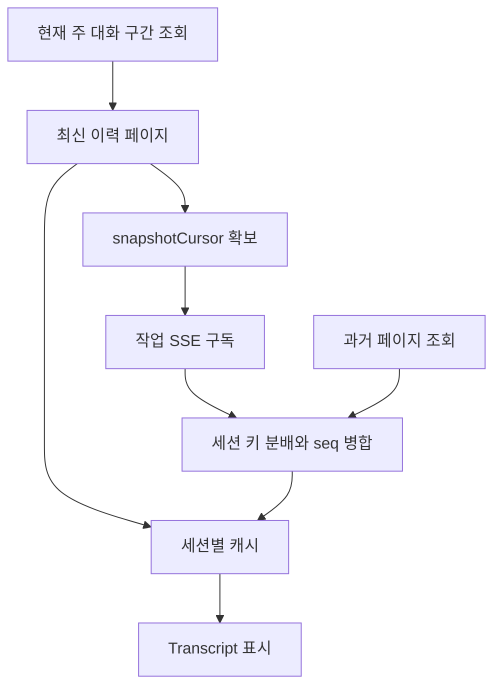

# 웹 화면과 공통 컴포넌트 읽기

이 문서는 `web/src/app/**`와 `web/src/components/*.tsx`의 **90개 파일**을 읽기 위한 한국어 안내다. 각 파일의 첫 설명은 역할과 데이터 흐름을 정리하고, 복잡한 함수에는 별도의 한국어 흐름 주석을 추가했다. 기초 UI 위젯, 공통 훅, API 클라이언트, 타입, 상태 저장소는 이 화면들이 의존하는 별도 계층이다.

원본의 실행 로직, API 이름, JSON 키, JSX 문구, 프롬프트와 기존 주석은 보존했다. 따라서 화면의 중국어 문구는 아래 용어표로 이해하면서 코드를 읽을 수 있다. 설명을 추가하는 일과 제품 UI 전체를 번역하는 일은 런타임에 미치는 영향이 다르므로, 화면 문자열을 번역할 때 확인할 연결 지점도 뒤에 정리했다.

## 1. 먼저 구분해야 할 세 계층

| 계층 | 역할 | 대표 위치 |
| --- | --- | --- |
| 페이지와 표시 컴포넌트 | 입력을 받고 조회 결과·활동·증거를 보여 준다. | `web/src/app`, `web/src/components` |
| 프런트 공통 계층 | HTTP 요청, 응답 타입 변환, 인증 토큰, 환경설정, 재사용 훅을 제공한다. | `web/src/lib/api.ts`, `types.ts`, `auth.ts`, `web/src/hooks`, `web/src/stores` |
| Go 서버와 실행 엔진 | DB 저장·접근 검사·작업 실행·도구 호출·LLM 요청·트래픽 수집을 수행한다. | `server`, `agent`, `db`, `traffic`, `evidence` |

예를 들어 작업 화면의 일시정지 버튼은 `api.controlTask`를 호출한다. 버튼의 `paused` 상태를 바꾼다고 서버의 goroutine이 직접 멈추는 것은 아니다. 서버가 요청을 받아 해당 작업 엔진에 제어 신호를 전달해야 실제 동작이 바뀐다. 같은 원리로 자산 그래프를 접는 동작은 표시 노드를 줄이는 것이고, DB 자산을 삭제하는 API와 다르다.

확인 위치: [작업 상세 페이지](../../../web/src/app/(main)/function/tasks/detail/page.tsx), [API 클라이언트](../../../web/src/lib/api.ts), [탐색 그래프](../../../web/src/components/exploration-graph.tsx).

### Next의 경로 구조

`app/(main)/function/tasks/page.tsx`의 실제 주소는 `/function/tasks`다. `(main)`과 `(auth)`는 레이아웃을 나누는 라우트 그룹이므로 URL에 들어가지 않는다. `page.tsx`는 경로 진입점이고 `layout.tsx`는 그 아래 페이지에 공통으로 적용되는 외곽 구조다.

작업·발견·에이전트 상세 화면은 `detail?id=...` 같은 검색 매개변수를 이용한다. `useSearchParams`를 사용하는 내부 컴포넌트를 `Suspense`로 감싼 파일은 정적 내보내기 환경을 고려한 구조다. 루트 레이아웃은 테마·폰트·토스트·Tooltip·환경설정 Provider를 제공한다.

대부분의 화면 첫 줄에 있는 `"use client"`는 브라우저 상태와 이벤트를 사용하는 컴포넌트라는 Next 지시문이다. 파일 앞에 설명을 붙여도 이 문자열의 지시문 역할을 유지해야 한다. 한국어 주석 추가에서는 해당 문자열과 위치 의미를 보존했다.

확인 위치: [루트 레이아웃](../../../web/src/app/layout.tsx), [주 화면 레이아웃](../../../web/src/app/(main)/layout.tsx), [발견 상세](../../../web/src/app/(main)/function/findings/detail/page.tsx).

## 2. 화면 지도로 전체 기능 보기

| 주소 | 한국어 의미 | 주요 데이터와 조작 |
| --- | --- | --- |
| `/` | 첫 진입 | 작업 목록으로 이동 |
| `/setup` | 최초 설정 | 서버 초기화 여부 조회, 관리자 비밀번호 설정 |
| `/login` | 로그인 | 사용 조건 확인, 토큰 저장, 작업 목록 이동 |
| `/dashboard` | 운영 현황 | 작업·발견·자산·활동·트래픽·토큰 집계 |
| `/chat` | 일반 대화 | 에이전트 선택, 대화 생성, 이력, 첨부, 중단, 보조 질문 |
| `/function/tasks` | 작업 목록 | 생성, 분류, 고정, 제어, 삭제, 아카이브와 복구 |
| `/function/tasks/detail?id=...` | 작업 상세 | 세션부터 보고서까지 열 개 탭 |
| `/function/assets` | 전역 자산 | 기업, 자산 종류, 범위, DSL 검색 |
| `/function/findings` | 전역 발견 | 평탄/작업 그룹/자산 트리 보기, 검토·내보내기 |
| `/function/findings/detail?id=...` | 발견 상세 | 심각도·상태·계보·증거·재검증 |
| `/function/traffic` | HTTP 수집 기록 | 조건 검색, 요청·응답 미리보기, 증거 연결 |
| `/function/commands` | 도구 실행 기록 | 명령/도구 이력과 통계 |
| `/function/llm-records` | LLM 원문 기록 | 기록 설정, 요청·응답·토큰·지연 조회 |
| `/function/sync` | 자산 가져오기 | ScopeSentry 연결과 프로젝트/작업 단위 동기화 |
| `/function/workspace` | 작업 공간 | 서버 파일 탐색, 텍스트 편집, 업로드, 다운로드 |
| `/system/llm` | 모델 설정 | 프로필·연결 테스트·모델 풀·재시도 정책 |
| `/system/agents` | 에이전트 관리 | 기본/사용자 에이전트와 편집 서랍 |
| `/system/agents/detail?key=...` | 에이전트 직접 편집 | 에이전트 키로 공통 편집기에 연결 |
| `/system/tools` | 도구 관리 | 기본 Schema 설명/기본값, 사용자 Python/HTTP 도구 |
| `/system/skills` | Skill 관리 | 파일 트리, 편집, ZIP 업로드, 가시성과 MCP 연결 |
| `/system/mcp` | MCP 연결 | stdio/HTTP/SSE 서버 설정, 도구 조회, 에이전트 가시성 |
| `/system/intercept` | 도구 실행 승인 정책 | 규칙, 대상 도구, LLM Judge와 사용량 |
| `/system/intercept/assets` | 전역 자산 규칙 | 자산 허용/차단 조건 |
| `/system/intercept/approvals` | 전역 승인 기록 | 대기·완료 기록, 판단 내용, 허용/거부 |
| `/system/notify` | 알림 관리 | 채널·필터·전달 이력·테스트·재전송 |
| `/system/logs` | 서버 로그 | SSE와 과거 기록 조회 |
| `/system/settings` | 시스템 설정 | 수집·검색·프록시·Worker·실험 기능·버전 업데이트 |

실제 API 주소와 응답 변환은 페이지에서 사용하는 `api.<메서드>()`를 [api.ts](../../../web/src/lib/api.ts)에서 찾으면 이어진다. 페이지 함수 이름만 보고 DB 저장 구조를 추측하기보다는 이 연결을 따라 읽는 편이 정확하다.

## 3. 처음 읽을 때 추천하는 순서

1. [작업 상세 진입점](../../../web/src/app/(main)/function/tasks/detail/page.tsx)에서 열 개 탭과 `taskId` 전달을 확인한다.
2. [세션 탭](../../../web/src/app/(main)/function/tasks/detail/_tabs/sessions-tab.tsx)에서 활동이 어디서 오고 어떻게 세션별로 나뉘는지 읽는다.
3. [Transcript](../../../web/src/components/transcript.tsx)에서 활동 하나가 말풍선·도구 행·승인 카드로 바뀌는 과정을 본다.
4. [탐색 그래프](../../../web/src/components/exploration-graph.tsx)에서 같은 작업 정보를 관계 중심으로 읽는다.
5. [발견 상세](../../../web/src/app/(main)/function/findings/detail/page.tsx)와 [증거 패널](../../../web/src/components/finding-traffic-panel.tsx)로 결과와 근거가 어떻게 이어지는지 확인한다.
6. [작업 생성 화면](../../../web/src/app/(main)/function/tasks/page.tsx)의 `CreateTaskSheet`로 돌아와 이 흐름을 시작하는 입력을 읽는다.
7. [에이전트 편집기](../../../web/src/components/agent-editor.tsx), [모델 설정](../../../web/src/app/(main)/system/llm/page.tsx), [시스템 설정](../../../web/src/app/(main)/system/settings/page.tsx)을 읽어 실행에 영향을 주는 구성값을 연결한다.

## 4. 이 코드에서 반복되는 React 패턴

### 입력 초안과 서버 데이터의 분리

`profileIDs`, `scopeText`, `description` 같은 입력 상태는 저장 전의 초안이다. 저장 API 성공 후 응답을 적용하거나 목록을 다시 읽어 실제 서버 값과 맞춘다. 입력할 때마다 곧바로 서버가 변경되는 가시성 토글과, 저장 버튼을 눌러야 적용되는 프롬프트 폼은 동작 방식이 다르다.

`CreateTaskSheet`가 수천 줄짜리 작업 목록 바깥 상태를 매 키 입력마다 바꾸지 않고 자체 상태를 가진 것은 성능상의 의미가 있다. 입력과 관계없는 표·대화상자·고정 열까지 다시 계산하는 비용을 줄인다. 이와 함께 작업 행에는 `React.memo`가 사용된다.

### 상태를 보관하는 도구의 의미

| 도구 | 이 프로젝트의 용도 | 읽을 때 확인할 점 |
| --- | --- | --- |
| `useState` | 입력·선택·로딩·조회 결과처럼 화면에 직접 보이는 값 | 어떤 API나 사용자 동작이 값을 바꾸는가 |
| `useRef` | 최신 커서·진행 중 요청·스크롤 상태·타이머 | 비동기 응답 사이에서 유지되지만 즉시 렌더링할 필요가 없는가 |
| `useEffect` | 초기 조회·주기 갱신·SSE·이벤트 연결 | 의존성 변경과 해제 시 연결/타이머/오래된 응답을 정리하는가 |
| `useMemo` | 필터된 목록·그룹·토큰 집계·그래프 변환 | 원본 데이터를 바꾸는지, 표시용 파생값인지 |
| `useCallback` | 하위 컴포넌트 또는 Effect가 재사용하는 함수 | 함수가 읽는 값과 의존성이 맞는가 |
| `useLayoutEffect` | 스크롤 위치 보정 | 새 DOM 높이가 적용된 직후 무엇을 보정하는가 |

### 늦은 응답과 주기 갱신

검색어 A의 응답이 검색어 B보다 늦게 올 수 있다. 자산 페이지와 발견 페이지는 요청 번호·필터 지문을 확인해 오래된 결과를 버린다. 단순 화면에서는 `alive` 또는 `active` 변수를 두어 컴포넌트가 해제된 뒤 응답을 적용하지 않는다. 이 두 방식은 같은 목적의 서로 다른 수준이다.

`setInterval`로 일정 간격을 유지하는 화면도 있고, 조회가 끝난 뒤 `setTimeout`으로 다음 조회를 예약하는 화면도 있다. 이미 진행 중인 요청을 막는 ref가 있는지, 필터 변경 시 이전 반복을 정리하는지에 따라 실제 중복 요청 특성이 달라진다. 모든 화면이 같은 실시간 전송 방식을 쓰는 것은 아니다. 작업 세션은 SSE, 일반 대화의 메시지는 증분 폴링, 보고서 탭은 마운트/작업 ID 변경 시 조회다.

확인 위치: [전역 자산](../../../web/src/app/(main)/function/assets/page.tsx), [발견 목록](../../../web/src/app/(main)/function/findings/page.tsx), [일반 대화](../../../web/src/app/(main)/chat/page.tsx), [보고서 탭](../../../web/src/app/(main)/function/tasks/detail/_tabs/report-tab.tsx).

## 5. 작업 생성부터 결과 검토까지

### 5.1 작업 생성

`CreateTaskSheet`는 이름·설명·최종 목표·기업/범위·상속할 작업·모델 프로필 체인·제약·첨부 등 생성에 필요한 상태를 모은다. 템플릿은 설명과 목표, 분류, 규칙을 폼에 채우는 도구다. 템플릿을 선택한 시점에는 작업이 실행되지 않는다.

첨부는 임시 `staging` 위치로 먼저 업로드하고 반환 참조를 생성 요청에 포함한다. 생성 폼의 heartbeat·timeout 같은 값은 UI의 입력 단위와 API의 단위를 확인해야 한다. 주석에 설명된 기본값만 바꾸고 서버의 하한/기본값을 그대로 두면 표시와 실제 동작이 달라질 수 있다.

작업 목록의 **동시 작업 수 제한**과 시스템 설정의 **작업별 Worker 수**도 다르다. 전자는 여러 작업을 동시에 얼마나 수용할지, 후자는 한 작업 내부에서 몇 개의 Worker 실행 슬롯을 둘지를 설정한다.

확인 위치: [작업 목록과 생성](../../../web/src/app/(main)/function/tasks/page.tsx), [템플릿 컨트롤](../../../web/src/components/task-template-controls.tsx), [시스템 설정](../../../web/src/app/(main)/system/settings/page.tsx).

### 5.2 작업 상세의 열 개 탭

| 원본 탭 | 한국어 의미 | 읽는 관점 |
| --- | --- | --- |
| 会话 | 세션 | 주 대화, Planner, 의도별 Worker, 시스템 감사 |
| 总览 | 개요 | 목표·제약·범위·진행·토큰·작업별 규칙 |
| 探索链路 | 탐색 관계 | 사실·의도·발견이 어떻게 연결되었는가 |
| 播报板 | 활동판 | 언제 어떤 탐색 노드가 생기거나 바뀌었는가 |
| 发现 | 발견 | 현재 작업의 발견과 처리 상태 |
| 复测 | 재검증 | 발견에 대해 어떤 별도 검증을 수행했는가 |
| 测试资产 | 작업 자산 | 현재 작업에서 연결/참조하는 자산과 출처 |
| 资产覆盖图 | 자산 커버리지 그래프 | 범위 안팎 자산과 연결된 테스트 상태 |
| 拦截审批 | 실행 승인 | 규칙과 판단, 대기 중 요청, 결정 기록 |
| 报告 | 보고서 | 서버가 제공하는 Markdown 보고서 |

상단의 작업 정보는 `task` 응답과 `stats.active_task`를 합친다. 전자는 영속 정보, 후자는 실행 중 엔진이 제공하는 상태가 포함된 정보이므로 `in_flight`, `engine_mode`, `paused` 등을 보완한다. 완료된 작업에서도 주 에이전트와 후속 대화가 가능하므로 모델 체인을 바꾸는 기능은 종료 상태라고 모두 막지 않는다.

아카이브 버튼은 압축 완료를 기다리는 버튼이 아니라 서버 큐 등록 요청이다. 작업 목록의 아카이브 패널이 대기·처리·완료·실패·복구 상태를 이어서 관찰한다. 서버가 반환하는 직접 상속 관계에 따라 아카이브가 제한될 수 있으며 프런트는 그 이유를 표시한다.

확인 위치: [상세 헤더](../../../web/src/app/(main)/function/tasks/detail/page.tsx), [아카이브 패널](../../../web/src/app/(main)/function/tasks/page.tsx).

## 6. 세션 이력이 동작하는 방식

### 6.1 한 작업에 여러 이력 창이 있다

| 저장 키 | 내용 | 특징 |
| --- | --- | --- |
| `main:<구간>` | 주 에이전트와 사용자의 대화 | 가장 최신 구간이 쓰기 대상이며 과거 구간은 읽기 이력 |
| `plan` | Goal Agent 초기 분해와 Planner 활동 | Worker의 개별 의도와 구분 |
| `intent:<번호>` | 하나의 의도를 처리한 Worker 활동 | 영구 Worker 프로세스 번호와 같은 개념이 아님 |
| `system` | 모델 전환 등 작업 전체 감사 이벤트 | 일반 에이전트 발화와 별도로 표시 |

이력 캐시의 `items`, `loaded`, `loadingMore`, `hasMore`, `earliestSeq`, `lastTs`, `unread`를 보면 역할이 나뉜다. 아직 열지 않은 세션은 전체 본문을 보관하지 않아도 최근 활동과 읽지 않은 개수를 표시할 수 있다. 처음에는 최신 200개를 읽고 위로 스크롤할 때 과거 페이지를 가져온다. 일반 세션의 실시간 캐시에는 `MAX_KEEP=4000` 제한이 있으며 잘린 오래된 기록은 다시 조회할 수 있다. 시스템 감사 세션에는 일반 활동을 500개씩 스캔하는 별도 경로가 있으므로 모든 종류가 완전히 같은 캐시 경로를 따르는 것으로 이해하면 안 된다.

### 6.2 최신 페이지와 SSE를 이어 붙인다

초기 조회와 실시간 구독 사이에 활동이 발생해도 연결할 수 있도록 서버의 `snapshotCursor`를 SSE의 `since`로 사용한다. 수신한 이벤트는 `sessionKeyOf`로 분배하고 `mergeBySeq`로 합친다. 최신 페이지 응답이 도착하기 전에 새 이벤트가 들어와도 기존 캐시를 통째로 덮어쓰지 않고 합치는 것이 핵심이다.

중복 제거 키는 `seq`다. 도구 호출과 결과를 짝짓는 키는 뒤에서 설명할 `tool_use_id`다. 두 번호의 목적이 다르다. 또한 활동 번호는 전역 DB 번호일 수 있으므로 같은 작업의 번호가 연속하지 않는다는 이유만으로 유실이라고 단정할 수 없다.

EventSource의 재연결과 서버의 DB 재생이 이력 복원을 돕지만, 클라이언트 병합이 서버 이벤트 전달의 모든 실패를 해결하는 것은 아니다. 실제 전달 신뢰성을 바꾸려면 서버의 브로드캐스트 버퍼·저장·재생 커서까지 함께 검토해야 한다. 원본 주석의 신뢰성 목표와 구현 전체의 보장 범위는 구분해서 읽는다.

### 6.3 스크롤과 상세 조회

전체 활동은 짧은 요약을 먼저 보여 주고 긴 도구 결과나 답변은 필요할 때 읽는다. `useInView`는 스크롤 영역에 가까워졌을 때 원문을 가져오며 한 번 조건이 충족되면 true를 유지한다. 접힌 도구 행은 펼칠 때 입력과 결과를 함께 로드한다.

사용자가 맨 아래에 있을 때만 새 메시지에 맞춰 따라간다. 과거 기록을 읽는 중에는 강제로 아래로 이동하지 않는다. 상세 본문이 뒤늦게 도착해 높이가 커지는 경우도 `ResizeObserver`로 처리한다. 승인 기록에서 특정 호출을 찾는 중에는 해당 위치 탐색을 우선한다.

확인 위치: [세션 캐시와 SSE](../../../web/src/app/(main)/function/tasks/detail/_tabs/sessions-tab.tsx), [실행 기록 렌더러](../../../web/src/components/transcript.tsx), [승인 호출 위치 찾기](../../../web/src/components/approval-execution-focus.tsx).

### 6.4 도구 호출은 인접 행으로 짝짓지 않는다

병렬 도구 실행에서는 A의 입력, B의 입력, B의 결과, A의 결과 순서가 가능하다. `groupSteps`는 `tool_use_id`로 결과를 연결하므로 이런 순서에서도 A와 B를 구분한다. 결과만 남거나 입력이 현재 페이지 밖에 있으면 독립 결과 행으로 남겨 잘못된 호출과 묶지 않는다.

`usage` 활동은 토큰 통계용이어서 본문 행에서 제외한다. 일반 채팅에서는 `text`와 `result`가 답변으로 펼쳐지고, 실행 기록 보기에서는 생각/설명 조각을 압축해서 보여 줄 수 있다. Worker 첫 말풍선의 의도 설명은 사용자 직접 발화와 아이콘으로 구분한다.

주 대화 전송은 브라우저가 임시 `seq`를 만들지 않는다. 서버가 저장하고 보낸 활동을 같은 SSE로 받아 표시한다. 입력창은 반응성을 위해 먼저 비우지만 전송 실패 시 본문과 첨부를 복원한다. `/btw` 명령은 보조 질문 흐름으로 먼저 분기한다.

## 7. 두 그래프의 차이

### 탐색 그래프: 실행과 판단의 관계

`ExplorationGraph`는 목표·의도·사실·발견·힌트·digest 같은 탐색 노드와 관계를 받는다. 원본 그래프와 표시용 그래프를 구분하며 활성 digest의 `covers` 대상은 화면에서 대표 노드에 합친다. 접힌 원본은 전체 배열에 남아 상세에서 다시 찾을 수 있다.

표시용 연결을 다시 만들 때 자기 연결과 중복 관계를 줄인다. 접힘 결과 `yields`와 역방향 `derived_from`이 같은 두 노드 사이에 겹치면 중복된 역방향을 제거해 읽기 어렵게 교차하는 선을 줄인다. `computeLayout`은 순환을 배치용으로 끊고 최장 경로 깊이로 열을 나눈 뒤 이웃의 평균 위치를 이용해 순서를 조정한다. DB의 사실이나 관계를 수정하는 알고리즘은 아니다.

### 자산 커버리지 그래프: 대상과 범위

`CoverageGraphTab`은 자산 계층과 범위/테스트 상태를 G6로 그린다. 부모 아래 동일 종류의 자식이 많으면 기본 20개를 표시하고 나머지는 접힘 노드로 나타낸다. 더 보기는 해당 그룹의 표시 한도를 늘린다. 자산을 선택하면 해당 자산에 연결된 사실·발견 등을 별도 조회한다.

여기서 밝게 표시되는 `tested`는 서버가 산출한 지표다. 그 자산에 연결된 활동이 있다는 사실과 모든 취약점 종류를 완전하게 검증했다는 주장은 다르다. 커버리지 의미를 다른 제품에 재사용하려면 무엇을 분모/분자로 셀지와 완료 조건을 먼저 정의해야 한다.

확인 위치: [탐색 그래프](../../../web/src/components/exploration-graph.tsx), [자산 커버리지](../../../web/src/app/(main)/function/tasks/detail/_tabs/coverage-graph-tab.tsx), [발견 계보](../../../web/src/app/(main)/function/findings/detail/lineage.tsx).

## 8. 발견·증거·재검증 읽기

### 발견 목록의 세 보기

평탄 보기는 모든 작업의 발견을 페이지 단위로 보여 준다. 그룹 보기는 작업별로 접히고 각 그룹의 페이지 번호가 독립적이다. 자산 보기는 왼쪽 트리와 선택한 가지의 발견 목록을 결합한다. 자산 트리는 진입·필터 변경·행 수정 시 갱신되는 스냅샷이므로 다른 보기와 똑같은 폴링 방식이라고 추측하면 안 된다.

행의 식별자는 영속 `finding_id`를 우선한다. 아직 그 값이 없는 경우에는 `task_id`와 탐색 노드 번호를 함께 사용한다. 이 구분이 없으면 서로 다른 작업에서 같은 번호의 노드를 편집할 때 화면의 다른 행까지 갱신될 수 있다.

### HTTP 증거는 별도의 바인딩이다

| 원본 역할 값 | 한국어 의미 | 검토에서의 목적 |
| --- | --- | --- |
| `baseline` | 정상 대조 | 정상 조건에서의 응답과 비교 |
| `proof` | 증명 자료 | 발견 주장을 뒷받침하는 핵심 교환 |
| `verification` | 추가 검증 | 다른 조건이나 보강 확인 |
| `supporting` | 보조 자료 | 주변 맥락이나 참고 교환 |

원본 트래픽 페이지는 수집된 교환을 보여 준다. 발견 증거 패널은 **바인딩 시 보존된 스냅샷**을 보여 준다. 연결할 때의 서버 저장 덕분에 원본 트래픽 정리와 보존된 발견 증거의 수명이 분리된다. 브라우저는 해당 API를 호출하고 결과를 표시할 뿐 이 보존을 자체적으로 구현하지 않는다.

`FindingTrafficPanel`의 변경 요청은 현재 증거 묶음의 `version`을 보낸다. 순서 변경도 ID 배열 전체와 version을 함께 보낸다. 다른 화면이 먼저 수정했다면 서버가 오래된 버전을 판별할 수 있으며 실패 뒤에는 현재 상태를 다시 읽는다. `contextTask`와 `readOnly`는 상속된 증거를 어떤 작업 맥락에서 보고 수정 가능한지 구분하는 데 사용된다.

본문은 한 번에 모두 표시하지 않을 수 있다. `TrafficEvidenceViewer`는 `next_offset`으로 다음 조각을 요청해 이어 붙이고 바이너리나 전체 본문은 다운로드를 제공한다. `HttpCodeBlock`의 강조는 문자열을 React 텍스트로 나누어 색상을 붙이는 것으로, 수집한 HTML을 실제 웹페이지로 실행하는 기능이 아니다.

### 재검증은 별도 실행이다

재검증 시작 요청의 성공과 `fixed` 판정은 같은 일이 아니다. `FindingRetestDialog`는 검증 실행을 생성하고 `FindingRetestPanel`은 `pending/running/completed/failed/stopped` 상태와 `reproduced/fixed/inconclusive` 판정을 표시한다. 자세한 실행 대화는 `/chat?c=...`로 이동해 읽을 수 있다. 활성 실행이 종료될 때 부모에게 알려 발견의 표시 상태를 다시 읽을 수 있게 한다.

확인 위치: [발견 목록](../../../web/src/app/(main)/function/findings/page.tsx), [공통 발견 표](../../../web/src/app/(main)/function/findings/_components/findings-table.tsx), [증거 패널](../../../web/src/components/finding-traffic-panel.tsx), [증거 뷰어](../../../web/src/components/traffic-evidence-viewer.tsx), [재검증 패널](../../../web/src/components/finding-retest-panel.tsx).

## 9. 설정 화면에서 주의 깊게 읽을 연결

### 모델 프로필과 재시도

`thinking.type`과 `reasoning_effort`는 독립 설정이다. 일부 공급자는 한쪽 필드를 쓰지 않으므로 UI는 두 값을 묶지 않는다. 빈 저장값은 해당 요청 필드를 생략한다는 의미이며 빈 값이 허용되지 않는 Select에서는 `none` 표식과 서로 변환한다.

작업의 모델 체인은 후보 ID의 순서다. 현재 후보와 다음 후보, 소진 상태를 구분한다. 소진된 체인의 활성 커서가 비어 있는데 첫 항목을 자동으로 활성인 것처럼 표시하면 상태를 잘못 설명하게 된다. 원본 코드는 편집 초안의 기본 선택과 실제 현재 상태를 분리한다.

재시도는 접속·빈 응답·같은 provider 안전 창·풀 차단·의도 재실행의 다섯 계층이다. 횟수 0/빈 값은 기본값, -1은 해제, 양수는 지정값이다. 간격 0은 원래 backoff를 따른다. 모두 같은 요청을 같은 간격으로 재전송하는 단일 반복문으로 해석하지 않는다.

확인 위치: [모델 설정](../../../web/src/app/(main)/system/llm/page.tsx), [재시도 폼](../../../web/src/app/(main)/system/llm/_components/retry.tsx), [작업 모델 체인](../../../web/src/components/task-llm-profile-chain.tsx).

### 에이전트·도구·Skill·MCP

에이전트 편집기는 프롬프트 저장과 가시성/도구 연결을 구분한다. 프롬프트 미리보기의 diff는 줄 단위 LCS 비교이며 LLM이 변경 의미를 평가하는 기능이 아니다. 사용자 에이전트의 트리거는 시간 또는 이벤트 발생 시 서버가 실행을 시작할 조건을 설정한다.

기본 도구의 Schema 편집은 Go 핸들러와 맞아야 하는 이름·타입·필수 구조를 유지하면서 설명/일부 기본값을 바꾸도록 되어 있다. 사용자 도구의 테스트 버튼은 실제 서버 테스트 API를 호출한다. 단순히 폼이 유효한지 확인하는 버튼과 구별해야 한다.

Skill 파일 편집은 실제 실행 시 사용되는 문서와 스크립트를 바꾸는 기능이다. MCP 서버 활성화, 특정 에이전트에 보이는지, Skill이 어떤 MCP 도구를 해제하는지는 서로 다른 설정 연결이다. 화면에서 항목이 보인다는 사실만으로 서버의 모든 실행 경로에 같은 정책이 적용된다고 단정하지 않는다.

확인 위치: [에이전트 편집기](../../../web/src/components/agent-editor.tsx), [도구 관리](../../../web/src/app/(main)/system/tools/page.tsx), [Skill 관리](../../../web/src/app/(main)/system/skills/page.tsx), [MCP 관리](../../../web/src/app/(main)/system/mcp/page.tsx).

### 승인 정책·브라우저 인증·전역 설정

`/system/intercept`는 도구 규칙, 대상 도구 집합, 보조 Judge 설정을 편집한다. `/system/intercept/assets`는 자산 조건이고 작업 개요에는 작업 한정 자산 규칙이 있다. 각각의 범위가 다르며 전역 자산 차단 규칙을 OS 수준 네트워크 격리라고 해석하면 안 된다. 실제 호출 적용 범위는 서버 guard/assembly를 함께 확인한다.

클라이언트 레이아웃의 토큰 존재 검사는 화면 전환을 위한 것이다. 서버 API의 접근 검사를 대체하지 않는다. 로그인은 localStorage와 쿠키의 불일치로 반복 이동이 발생하지 않도록 동기화/정리하는 코드가 있다. 계정 메뉴의 로컬 사용자 선택도 서버 권한 변경 API와 같은 의미가 아니다.

시스템 설정의 낙관적 토글은 먼저 표시를 바꾸고 저장 실패 시 복원한다. `apply`는 서버가 실제로 반환한 값을 모든 입력에 다시 적용한다. 채팅 전송 키만 브라우저 선호로 관리하며 나머지 서버 기능 설정과 저장 범위가 다르다.

확인 위치: [승인 설정](../../../web/src/app/(main)/system/intercept/page.tsx), [주 화면 인증 분기](../../../web/src/app/(main)/layout.tsx), [로그인](../../../web/src/app/(auth)/login/page.tsx), [전역 설정](../../../web/src/app/(main)/system/settings/page.tsx).

## 10. 원본 UI를 읽는 한국어 용어표

| 원본 문구 | 한국어 | 코드에서 연결되는 개념 |
| --- | --- | --- |
| 任务 | 작업 | `Task`, 작업 엔진 단위 |
| 目标 | 목표 | `goal`, 달성해야 할 결과 |
| 意图 | 의도/실행 항목 | `intent`, Worker가 맡는 단위 |
| 事实 | 사실 기록 | `fact`, 관찰 또는 추론 내용 |
| 发现 / 漏洞 | 발견 / 취약점 | `Finding`, 검토와 증거 대상 |
| 提示 | 힌트 | `hint`, 다음 판단에 제공하는 정보 |
| 摘要 | 요약 | `digest` 또는 일반 요약 문구; 위치에 따라 다름 |
| 主 Agent | 주 에이전트 | 사용자가 작업과 대화하는 창구 |
| 规划 | 계획 | Planner 역할 |
| 会话 | 세션/대화 | 실행 이력 또는 일반 대화 |
| 资产 | 자산 | 도메인·IP·서비스·앱·엔드포인트 등 |
| 范围 | 범위 | 기업/작업에 연결한 대상 조건 |
| 继承 | 상속 | 다른 작업에서 참조하는 정보 |
| 流量 | 트래픽 | 수집한 HTTP 요청·응답 교환 |
| 证据 | 증거 | 발견에 연결해 보존한 자료 |
| 复测 | 재검증 | 현재 상태를 별도 실행으로 확인 |
| 拦截 | 실행 중재/차단 | 도구 규칙 문맥과 자산 규칙 문맥 구분 |
| 审批 | 승인 | 허용/거부 결정을 기다리거나 기록 |
| 允许 / 拒绝 | 허용 / 거부 | 실행 결정 |
| 待领取 | 수령 대기 | 열린 의도를 Worker가 아직 맡지 않은 상태 |
| 暂停 / 恢复 | 일시정지 / 재개 | 작업 또는 개별 실행 제어 |
| 耗尽 | 소진 | 단계 수 또는 모델 체인 등의 한도 소진 |
| 阻塞 | 막힘 | 오류/조건 때문에 진행하지 못함 |
| 归档 / 还原 | 아카이브 / 복구 | 작업의 저장 수명 관리 |
| 配置 | 설정 | 서버 프로필 또는 폼 값 |
| 轮询 | 폴링/모델 풀 순환 | 사용 위치에 따라 의미 확인 |
| 熔断 | 일시 차단 | 실패한 모델을 일정 기간 제외하는 상태 |
| 冷却 | 냉각 대기 | 재사용 전 기다리는 시간 |
| 提示词 | 프롬프트 | 모델에 전달하는 지시 |
| 可见性 | 가시성 | 특정 에이전트에게 보이는 자원 |
| 投递 | 알림 전달 | 외부 채널 전송과 이력 |

## 11. 여기서 배울 설계와 개선 방향

**긴 실행 이력을 작은 페이지와 필요할 때 조회하는 상세로 나누는 설계**를 먼저 배울 수 있다. 목록의 요약과 원문을 분리하면 수천 개의 도구 결과가 있는 작업도 초기 화면에서 모두 다운로드하지 않는다. 이 패턴은 CI 실행 로그, 고객 지원 대화, 데이터 처리 작업 이력에도 적용할 수 있다.

**도메인 데이터와 표시 모델을 분리하는 방식**도 유용하다. 서버의 탐색 노드는 React Flow용 배치/카드로, 자산은 G6용 계층으로 변환한다. 다른 분야에 적용한다면 서버의 사실/작업/증거 구조와 표시 어댑터를 나누어 바꿀 수 있다. 예를 들어 제조 검사에서는 intent를 검사 단계, finding을 불량 후보, evidence를 측정/사진, retest를 재측정으로 연결할 수 있다. 다만 판정 조건과 데이터 타입은 그 분야에 맞게 정의해야 한다.

다음 개선은 이 한국어 설명 작업에서 구현한 변경이 아니라 **후속 개발 제안**이다.

| 제안 | 이유 | 함께 바꿔야 할 범위 |
| --- | --- | --- |
| 조회 캐시/취소 패턴 공통화 | 페이지마다 요청 번호·alive·폴링 구현이 반복된다. | 화면 훅, API 취소 신호, 갱신 조건 |
| 큰 페이지를 기능별 컴포넌트와 훅으로 분해 | 작업·대화·세션 화면의 상태와 이벤트 연결이 길다. | 폼 상태 소유권과 렌더링 비용 유지 |
| UI 다국어 사전 도입 | 문자열을 한꺼번에 수정하면 파서와 표시 계약을 건드릴 수 있다. | 상태 라벨·날짜 형식·접근성 문구·오류 문구 |
| 구조화된 승인 ID/도구명 사용 | Transcript 일부는 중국어 summary 형식을 파싱한다. | 서버 이벤트 Schema와 프런트 파서 |
| 증거 버전 충돌을 더 명확히 안내 | 현재는 실패와 재조회 경로가 중심이다. | 서버 오류 코드, 충돌 메시지, 최신 값 비교 |
| 대형 그래프의 가시 영역 렌더링 검토 | 표시 접기는 데이터 증가에 유용하지만 전체 변환 비용은 남는다. | 실제 노드 수 측정, 그래프 라이브러리 생명주기 |
| 이벤트 전달/재생의 종단 간 점검 | 프런트의 seq 병합만으로 모든 서버 전달 실패를 해결할 수 없다. | DB 커서, 버퍼 초과 처리, 재연결·복원 검증 |

UI 번역을 추가한다면 `工具 X 请求审批 (#N)` 같은 요약 파서, `zh-CN` 날짜 형식, 상태 값과 표시 이름의 구분, `none` 같은 내부 표식, 모델에 전달하는 프롬프트를 각각 확인해야 한다. JSON 키·도구 이름·역할 식별자를 사람에게 보이는 문구와 함께 번역하면 서버 계약이 깨질 수 있다.

## 12. 전체 파일 찾아보기

아래 표의 모든 파일에 한국어 역할 설명을 넣었다. 큰 화면은 위 문단과 파일 내부의 `한국어 흐름` / `한국어 상태 흐름` 주석을 함께 읽으면 된다.

| 파일 | 한국어 역할 |
| --- | --- |
| [app/(auth)/layout.tsx](../../../web/src/app/(auth)/layout.tsx) | 인증 화면의 공통 배치 |
| [app/(auth)/login/page.tsx](../../../web/src/app/(auth)/login/page.tsx) | 로그인과 사용 조건 확인 |
| [app/(auth)/setup/page.tsx](../../../web/src/app/(auth)/setup/page.tsx) | 첫 실행의 관리자 비밀번호 설정 |
| [app/(external)/page.tsx](../../../web/src/app/(external)/page.tsx) | 루트 주소의 진입 경로 |
| [app/(main)/_components/main-content.tsx](../../../web/src/app/(main)/_components/main-content.tsx) | 공통 상단 바와 본문 크기 조절 |
| [app/(main)/_components/sidebar/account-switcher.tsx](../../../web/src/app/(main)/_components/sidebar/account-switcher.tsx) | 계정 표시와 비밀번호 메뉴 |
| [app/(main)/_components/sidebar/app-sidebar.tsx](../../../web/src/app/(main)/_components/sidebar/app-sidebar.tsx) | 사이드바의 조립 지점 |
| [app/(main)/_components/sidebar/change-password-dialog.tsx](../../../web/src/app/(main)/_components/sidebar/change-password-dialog.tsx) | 관리자 비밀번호 변경 폼 |
| [app/(main)/_components/sidebar/layout-controls.tsx](../../../web/src/app/(main)/_components/sidebar/layout-controls.tsx) | 테마와 레이아웃 개인 설정 |
| [app/(main)/_components/sidebar/nav-documents.tsx](../../../web/src/app/(main)/_components/sidebar/nav-documents.tsx) | 문서형 보조 탐색 메뉴 |
| [app/(main)/_components/sidebar/nav-main.tsx](../../../web/src/app/(main)/_components/sidebar/nav-main.tsx) | 활성 경로와 접힘 상태가 있는 주 탐색 |
| [app/(main)/_components/sidebar/nav-secondary.tsx](../../../web/src/app/(main)/_components/sidebar/nav-secondary.tsx) | 간단한 보조 링크 목록 |
| [app/(main)/_components/sidebar/nav-user.tsx](../../../web/src/app/(main)/_components/sidebar/nav-user.tsx) | 사이드바 사용자 메뉴 |
| [app/(main)/_components/sidebar/search-dialog.tsx](../../../web/src/app/(main)/_components/sidebar/search-dialog.tsx) | 화면 이동용 명령 검색 |
| [app/(main)/_components/sidebar/sidebar-support-card.tsx](../../../web/src/app/(main)/_components/sidebar/sidebar-support-card.tsx) | 사이드바의 지원 안내 카드 |
| [app/(main)/_components/sidebar/theme-switcher.tsx](../../../web/src/app/(main)/_components/sidebar/theme-switcher.tsx) | 밝음·어두움·시스템 테마 순환 |
| [app/(main)/_components/update-badge.tsx](../../../web/src/app/(main)/_components/update-badge.tsx) | 상단 바의 새 버전 알림 |
| [app/(main)/chat/page.tsx](../../../web/src/app/(main)/chat/page.tsx) | 작업 밖의 일반 에이전트 대화 화면 |
| [app/(main)/dashboard/page.tsx](../../../web/src/app/(main)/dashboard/page.tsx) | 여러 자원의 운영 현황 집계 |
| [app/(main)/function/assets/page.tsx](../../../web/src/app/(main)/function/assets/page.tsx) | 전역 자산과 기업 범위 관리 |
| [app/(main)/function/commands/page.tsx](../../../web/src/app/(main)/function/commands/page.tsx) | 실행 도구 기록 검색 |
| [app/(main)/function/findings/_components/asset-tree.tsx](../../../web/src/app/(main)/function/findings/_components/asset-tree.tsx) | 발견을 자산 계층으로 탐색하는 트리 |
| [app/(main)/function/findings/_components/findings-table.tsx](../../../web/src/app/(main)/function/findings/_components/findings-table.tsx) | 발견 목록의 공통 표 본문 |
| [app/(main)/function/findings/detail/lineage.tsx](../../../web/src/app/(main)/function/findings/detail/lineage.tsx) | 특정 발견의 도출 경로 |
| [app/(main)/function/findings/detail/page.tsx](../../../web/src/app/(main)/function/findings/detail/page.tsx) | 발견 하나의 상세 검토 화면 |
| [app/(main)/function/findings/page.tsx](../../../web/src/app/(main)/function/findings/page.tsx) | 전역 발견 목록과 검토 작업 |
| [app/(main)/function/llm-records/page.tsx](../../../web/src/app/(main)/function/llm-records/page.tsx) | LLM 요청과 응답의 기록 조회 |
| [app/(main)/function/sync/page.tsx](../../../web/src/app/(main)/function/sync/page.tsx) | ScopeSentry 자산 가져오기 |
| [app/(main)/function/tasks/detail/_tabs/assets-tab.tsx](../../../web/src/app/(main)/function/tasks/detail/_tabs/assets-tab.tsx) | 작업에 연결된 자산 |
| [app/(main)/function/tasks/detail/_tabs/broadcast-tab.tsx](../../../web/src/app/(main)/function/tasks/detail/_tabs/broadcast-tab.tsx) | 탐색 노드의 시간순 활동판 |
| [app/(main)/function/tasks/detail/_tabs/coverage-graph-tab.tsx](../../../web/src/app/(main)/function/tasks/detail/_tabs/coverage-graph-tab.tsx) | 자산 범위와 연결 사실의 그래프 |
| [app/(main)/function/tasks/detail/_tabs/findings-tab.tsx](../../../web/src/app/(main)/function/tasks/detail/_tabs/findings-tab.tsx) | 한 작업의 발견 목록 |
| [app/(main)/function/tasks/detail/_tabs/graph-tab.tsx](../../../web/src/app/(main)/function/tasks/detail/_tabs/graph-tab.tsx) | 전체 탐색 그래프를 읽는 탭 |
| [app/(main)/function/tasks/detail/_tabs/intercept-tab.tsx](../../../web/src/app/(main)/function/tasks/detail/_tabs/intercept-tab.tsx) | 작업 범위의 승인 기록 연결 |
| [app/(main)/function/tasks/detail/_tabs/overview-tab.tsx](../../../web/src/app/(main)/function/tasks/detail/_tabs/overview-tab.tsx) | 목표·제약·범위와 진행 상태의 총괄 |
| [app/(main)/function/tasks/detail/_tabs/report-tab.tsx](../../../web/src/app/(main)/function/tasks/detail/_tabs/report-tab.tsx) | 작업 Markdown 보고서 보기 |
| [app/(main)/function/tasks/detail/_tabs/retests-tab.tsx](../../../web/src/app/(main)/function/tasks/detail/_tabs/retests-tab.tsx) | 작업 발견의 재검증 모음 |
| [app/(main)/function/tasks/detail/_tabs/sessions-tab.tsx](../../../web/src/app/(main)/function/tasks/detail/_tabs/sessions-tab.tsx) | 주 대화·Planner·Worker 실행 이력 |
| [app/(main)/function/tasks/detail/page.tsx](../../../web/src/app/(main)/function/tasks/detail/page.tsx) | 작업 상세의 헤더와 열 개 탭 |
| [app/(main)/function/tasks/page.tsx](../../../web/src/app/(main)/function/tasks/page.tsx) | 작업 생성·목록·분류·아카이브 |
| [app/(main)/function/traffic/page.tsx](../../../web/src/app/(main)/function/traffic/page.tsx) | 수집된 HTTP 교환의 검색과 확인 |
| [app/(main)/function/workspace/page.tsx](../../../web/src/app/(main)/function/workspace/page.tsx) | 서버 작업 공간의 파일 탐색기 |
| [app/(main)/layout.tsx](../../../web/src/app/(main)/layout.tsx) | 로그인 이후 화면의 공통 셸 |
| [app/(main)/system/agents/detail/page.tsx](../../../web/src/app/(main)/system/agents/detail/page.tsx) | 에이전트 편집기의 직접 링크 |
| [app/(main)/system/agents/page.tsx](../../../web/src/app/(main)/system/agents/page.tsx) | 에이전트 목록과 사용자 에이전트 생성 |
| [app/(main)/system/intercept/approvals/page.tsx](../../../web/src/app/(main)/system/intercept/approvals/page.tsx) | 전역 승인 기록 페이지 |
| [app/(main)/system/intercept/assets/page.tsx](../../../web/src/app/(main)/system/intercept/assets/page.tsx) | 전역 자산 허용·차단 규칙 편집 |
| [app/(main)/system/intercept/page.tsx](../../../web/src/app/(main)/system/intercept/page.tsx) | 도구 실행 규칙과 LLM 판단 설정 |
| [app/(main)/system/llm/_components/retry.tsx](../../../web/src/app/(main)/system/llm/_components/retry.tsx) | 다섯 재시도 계층의 공통 입력 |
| [app/(main)/system/llm/page.tsx](../../../web/src/app/(main)/system/llm/page.tsx) | 모델 접속 프로필과 풀 상태 |
| [app/(main)/system/logs/page.tsx](../../../web/src/app/(main)/system/logs/page.tsx) | 서버 로그의 실시간 조회 |
| [app/(main)/system/mcp/page.tsx](../../../web/src/app/(main)/system/mcp/page.tsx) | MCP 서버와 에이전트 가시성 설정 |
| [app/(main)/system/notify/_components/channel-fields.ts](../../../web/src/app/(main)/system/notify/_components/channel-fields.ts) | 알림 채널의 입력 필드 사전 |
| [app/(main)/system/notify/_components/channel-form.tsx](../../../web/src/app/(main)/system/notify/_components/channel-form.tsx) | 알림 설정 입력과 필터 요약 |
| [app/(main)/system/notify/_components/delivery-list.tsx](../../../web/src/app/(main)/system/notify/_components/delivery-list.tsx) | 알림 전달 기록과 재전송 |
| [app/(main)/system/notify/_components/stat-tile.tsx](../../../web/src/app/(main)/system/notify/_components/stat-tile.tsx) | 알림 통계 숫자의 표시 조각 |
| [app/(main)/system/notify/page.tsx](../../../web/src/app/(main)/system/notify/page.tsx) | 알림 채널과 전송 정책 관리 |
| [app/(main)/system/settings/_components/update-card.tsx](../../../web/src/app/(main)/system/settings/_components/update-card.tsx) | 업데이트 확인과 재시작 추적 |
| [app/(main)/system/settings/page.tsx](../../../web/src/app/(main)/system/settings/page.tsx) | 서버 기능 설정과 브라우저 선호 |
| [app/(main)/system/skills/page.tsx](../../../web/src/app/(main)/system/skills/page.tsx) | Skill 파일과 가시성 편집기 |
| [app/(main)/system/tools/page.tsx](../../../web/src/app/(main)/system/tools/page.tsx) | 기본·사용자 도구 목록과 편집 |
| [app/globals.css](../../../web/src/app/globals.css) | 전역 디자인 토큰과 기본 스타일 |
| [app/layout.tsx](../../../web/src/app/layout.tsx) | 전체 문서의 루트 레이아웃 |
| [app/not-found.tsx](../../../web/src/app/not-found.tsx) | 존재하지 않는 경로의 안내 화면 |
| [components/agent-editor.tsx](../../../web/src/components/agent-editor.tsx) | 에이전트 프롬프트·도구·트리거 편집기 |
| [components/approval-execution-focus.tsx](../../../web/src/components/approval-execution-focus.tsx) | 승인 기록에서 정확한 실행으로 이동 |
| [components/approval-records.tsx](../../../web/src/components/approval-records.tsx) | 도구 승인 기록의 공통 검토 UI |
| [components/asset-dsl-search.tsx](../../../web/src/components/asset-dsl-search.tsx) | 자산 검색 DSL 자동 완성 입력 |
| [components/asset-intercept-rules-editor.tsx](../../../web/src/components/asset-intercept-rules-editor.tsx) | 자산 규칙의 여러 행 입력 |
| [components/copy-button.tsx](../../../web/src/components/copy-button.tsx) | 공통 클립보드 복사 버튼 |
| [components/date-range-picker.tsx](../../../web/src/components/date-range-picker.tsx) | 날짜 범위 선택 위젯 |
| [components/exploration-graph.tsx](../../../web/src/components/exploration-graph.tsx) | 탐색 과정과 발견 계보의 공통 캔버스 |
| [components/finding-retest-dialog.tsx](../../../web/src/components/finding-retest-dialog.tsx) | 발견 재검증 시작 대화상자 |
| [components/finding-retest-panel.tsx](../../../web/src/components/finding-retest-panel.tsx) | 발견별 재검증 이력 |
| [components/finding-traffic-panel.tsx](../../../web/src/components/finding-traffic-panel.tsx) | 발견 증거 묶음의 순서와 역할 관리 |
| [components/http-code-block.tsx](../../../web/src/components/http-code-block.tsx) | HTTP 메시지의 읽기 쉬운 표시 |
| [components/link-traffic-dialog.tsx](../../../web/src/components/link-traffic-dialog.tsx) | 선택 트래픽을 발견에 연결 |
| [components/markdown.tsx](../../../web/src/components/markdown.tsx) | Markdown의 공통 React 표시 |
| [components/mention-textarea.tsx](../../../web/src/components/mention-textarea.tsx) | 자산·작업 등 참조 삽입 입력 |
| [components/scope-text-editor.tsx](../../../web/src/components/scope-text-editor.tsx) | 범위 텍스트와 파싱 결과 표시 |
| [components/side-question-workspace.tsx](../../../web/src/components/side-question-workspace.tsx) | 보조 질문을 병렬로 보여 주는 작업 영역 |
| [components/simple-icon.tsx](../../../web/src/components/simple-icon.tsx) | Simple Icons의 SVG 래퍼 |
| [components/status-badge.tsx](../../../web/src/components/status-badge.tsx) | 도메인별 상태 표시 |
| [components/table-pagination.tsx](../../../web/src/components/table-pagination.tsx) | 표의 페이지 이동 컨트롤 |
| [components/task-llm-profile-chain.tsx](../../../web/src/components/task-llm-profile-chain.tsx) | 작업 LLM 순서 선택기 |
| [components/task-template-controls.tsx](../../../web/src/components/task-template-controls.tsx) | 작업 생성 템플릿 선택과 관리 |
| [components/todo-popover.tsx](../../../web/src/components/todo-popover.tsx) | 최근 TodoWrite 내용을 필요할 때 보기 |
| [components/traffic-evidence-viewer.tsx](../../../web/src/components/traffic-evidence-viewer.tsx) | 저장된 HTTP 증거와 원본 교환 미리보기 |
| [components/traffic-picker-dialog.tsx](../../../web/src/components/traffic-picker-dialog.tsx) | 발견에 추가할 원본 트래픽 선택 |
| [components/transcript.tsx](../../../web/src/components/transcript.tsx) | 활동 기록을 대화와 실행 흐름으로 렌더링 |

## 13. 이 설명 변경의 확인 범위

설명은 원본 코드 사이에 주석으로 추가했다. 담당 90개 파일에서 추가한 설명 조각만 제거했을 때 원본 파일의 바이트 내용이 복원되는지 확인하여, JSX의 문구·문자열·상수·API 인수·분기와 기존 주석이 유지됨을 점검했다. 파일 첫 지시문, lint의 다음 줄 무시 지시문과 실행 코드의 연결도 보존했다.

이 확인은 코드 변경 범위를 검사하는 것이며 실제 LLM 호출·외부 도구 실행·업데이트·알림 발송을 재현했다는 뜻은 아니다. 전체 저장소의 빌드/구문 비교 결과는 최상위 변경 요약과 검증 문서를 함께 확인한다.
