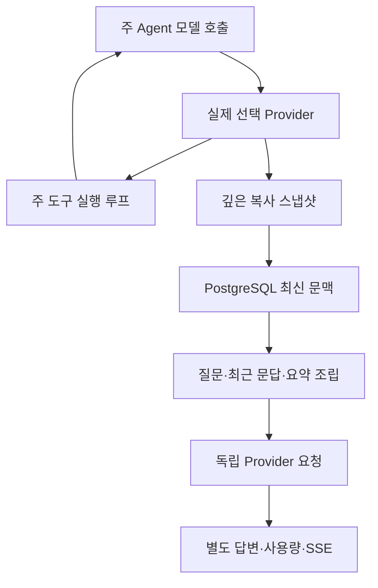

# ARTEX `/btw` — 실행을 방해하지 않는 독립 질문

일반 대화, 작업의 MainAgent, 현재 작업에 속한 Worker에서 **독립 질문**을 사용할 수 있습니다. 주 입력창에 `/btw 질문`을 입력하면 질문을 제출합니다. 질문 없이 `/btw`만 입력하거나 독립 질문 버튼을 누르면 이력이 열립니다. 데스크톱에서는 너비를 조절하는 옆 패널, 모바일에서는 Drawer로 표시합니다.

답변은 **제출 시 선택한 주 Agent 문맥 스냅샷**을 바탕으로 생성합니다. 스트리밍, 후속 질문, 중지, 이력 삭제를 지원합니다. 패널 닫기·페이지 새로고침·SSE 연결 종료는 모델 요청을 취소하지 않습니다. 중지는 해당 독립 질문만 취소합니다. 이력 삭제는 독립 질문을 취소하고 그 이력을 지우되 주 문맥의 최신 스냅샷은 유지합니다.

이 문서는 상위 저장소 설명의 한국어판입니다. [원본 README](../docs/upstream/sidequestion-README.md)를 함께 보존합니다. 원본의 구현 당시 설명에는 Norma v0.3.7이 언급되지만 **현재 저장소의 의존성 기준은 [go.mod](../go.mod)의 v0.4.3**입니다. 과거 검증 기록의 버전·결과를 이번 문서화 작업의 실행 결과로 해석하지 마세요.

## 1. 어떤 방식으로 분리하는가

기존 Go/Norma/Next.js와 Markdown, ResizablePanel, Drawer, AlertDialog 구성 요소를 사용합니다. 독립 질문을 위해 Norma 소스를 수정하거나 새로운 의존성을 추가하는 구조는 아닙니다. Planner, 다른 작업에서 상속된 Worker, 독립 질문을 도구 실행 하위 작업으로 승격하는 기능은 이 경로의 대상이 아닙니다.

핵심은 주 대화에 새 질문을 끼워 넣지 않고, **구조화된 요청의 복사본으로 별도의 모델 호출을 만드는 것**입니다.

- [capture.go](capture.go)의 `Attach`는 `Options.Deps.CallModel / CallModelSync`에만 주 루프 호출 표식을 붙입니다. 구체 모델을 감싼 `Bind`는 라우터가 실제 선택한 Provider 안쪽에서 이 표식을 읽습니다. 따라서 요약·압축의 보조 호출이 주 문맥을 덮어쓰지 않습니다.
- 요청 시작, 완전한 모델 응답, 정상적인 실행 종료 경계에서 스냅샷을 발행합니다. 생성 중인 반쪽 응답을 완료본으로 발행하지 않습니다. `MessagesForAPI`가 도구 호출과 결과의 짝을 맞추며, 마지막 도구 결과는 다음 주 모델 요청 또는 종료 경계에서 반영됩니다. 스트리밍 중 취소되면 직전 유효 경계를 보존합니다.
- JSON 깊은 복사는 메시지, system prompt, 도구 정의, 생성 매개변수를 보존합니다. 모델 추론 중에 스냅샷 mutex나 DB 트랜잭션을 잡고 있지 않습니다.
- [service.go](service.go)의 `SideQuestionService`는 구체 Provider를 호출합니다. [context.go](context.go)의 `Respond`가 필요할 때 먼저 독립 질문용 요약을 생성합니다. 답변이 처음 문맥 초과로 실패했고 아직 텍스트/도구 호출을 내보내지 않았을 때만 더 줄여 한 번 재시도합니다.
- 이 서비스에는 Agent Session, 도구 실행기, 주 transcript 작성기, 주 활동 스트림, 작업 그래프 쓰기, 작업 모델 전환 체인이 없습니다. 기존 구조화 문맥의 호환성을 위해 답변 요청에 도구 정의가 남아 있을 수 있지만, 새로 받은 tool use를 실제 실행하는 경로는 없습니다. 요약 요청은 도구를 제공하지 않습니다.
- 서버는 부모 세션 하나당 실행 요청 1개, 서비스 프로세스 전체 최대 4개, 요청당 120초 제한을 적용합니다. 독립 질문의 취소 context는 서비스 수명에 연결되어 주 실행의 중지와 분리됩니다.
- 요청에는 모델 설정 참조와 민감하지 않은 식별 정보만 보존합니다. 실제 자격증명은 기존 설정에서 읽습니다. 설정이 삭제되거나 모델·프로토콜·주소 등 신원이 바뀌면 주 Agent를 먼저 실행하여 새 스냅샷을 만들어야 합니다.

## 2. 파일을 읽는 순서

| 파일 | 먼저 볼 함수 | 읽을 때 확인할 내용 |
| --- | --- | --- |
| [capture.go](capture.go) | `Attach`, `Bind`, `Finish` | 주 요청만 포착하는 표식, 실제 모델 신원, 안정된 스냅샷 경계 |
| [request.go](request.go) | `EstimateInputTokens`, `BuildRequest` | Exchange 형식, 출력·입력 예산, 최근 성공 문답 조립 |
| [context.go](context.go) | `Respond`, `prepare`, `messageGroups` | 오래된 이력 요약, 도구 쌍 보존, 단 한 번의 초과 복구 |
| [service.go](service.go) | `Answer` | 실제 Provider 호출과 텍스트/사용량 누적, 도구 미실행 |
| [context_test.go](context_test.go) | `TestSide...` | 20문답 경계, 장문, 실패/취소, 요약 호출 상한 |
| [sidequestion_test.go](sidequestion_test.go) | `TestCheckpoint...`, `TestMainSide...` | 복사 불변성, 주/독립 질문의 동시성·취소 분리 |

전체 역할과 모델 호출 경로는 [Agent 모듈 해설](../docs/ko/modules/agents.md)을 참고하세요. HTTP 수락·동시성·SSE·영속 저장은 `server/`와 `db/`에 구현되어 있고 이 패키지는 요청·문맥의 핵심 로직을 담당합니다.

## 3. 저장과 재시작

[db/schema.sql](../db/schema.sql)은 `side_question_sessions`, `side_question_requests`를 만듭니다. 전자는 부모 리소스, 최신 스냅샷, run 번호, 버전, 정리 세대를 보존합니다. 후자는 질문, 누적 답변, 상태, 모델, 스냅샷 시각, 사용량, 이벤트 순서, 페이지 순번을 보존합니다.

부모 키에는 일반 대화의 conversation ID 또는 task ID + exploration ID + intent ID를 씁니다. 여러 작업에 재사용되는 Worker 슬롯 이름을 세션 식별자로 쓰지 않습니다.

스냅샷은 부모별 최신값으로 합쳐 최대 250ms 간격으로 저장합니다. DB는 `(run_id, version)`을 비교해 늦은 옛값이 새 스냅샷을 덮지 않게 합니다. 독립 질문을 받기 전에 선택한 스냅샷을 다시 저장합니다. 저장 성공 뒤에는 메모리의 큰 복사본을 놓고 실패하면 미저장 버전을 유지합니다. 답변 누적값도 스트림 도중 최대 250ms 간격, 종료 시 즉시 저장하며 DB 오류는 제한적으로 재시도합니다.

서비스가 재시작하면 남아 있는 `running` 요청을 `interrupted`로 바꾸고 이미 저장된 답과 사용량을 남깁니다. 요청을 자동 재전송하지 않습니다. 마지막으로 저장된 문맥으로 다음 질문을 할 수 있습니다. 오래된 세션에 스냅샷이 없다면 주 Agent를 먼저 실행해야 하며 UI 활동 로그를 이어 붙여 스냅샷을 꾸며내지 않습니다.

이력 삭제는 정리 세대를 올린 뒤 요청을 지웁니다. 조건부 갱신이 늦은 콜백의 부활 쓰기를 막습니다. 부모의 물리 삭제는 외래키 cascade를 사용하고 Worker 논리 삭제는 같은 트랜잭션에서 독립 질문 데이터를 제거하고 늦은 스냅샷을 거부합니다. 작업 아카이브는 새 요청 차단 → 주 실행 종료 대기 → 독립 질문 취소·저장 완료 대기 순서로 준비합니다. 아카이브 형식 v3는 독립 질문 데이터를 포함하며 해당 테이블이 없던 v1/v2도 읽습니다.

전체 이력은 보존하고 순번 cursor로 페이지당 최대 20개를 읽습니다. 모델에는 최근 성공 문답 최대 20개와 토큰 예산 안의 원문만 넣고, 더 오래된 부분은 독립 롤링 요약으로 관리합니다. 주 문맥이 너무 크면 **복사본의 오래된 구간만 요약**하고 최근 도구 호출·결과 구조를 보존합니다. 요약도 동일한 독립 질문의 동시성·취소·120초 예산에 포함합니다. 자세한 계산은 [문맥 예산](CONTEXT_BUDGET.md)에 있습니다.

## 4. HTTP 계약

다음 중 하나를 `{parent}`로 사용하며 기존 인증과 리소스 소유권 검사를 따릅니다.

- `/api/conversations/{id}`
- `/api/tasks/{id}/chat`
- `/api/tasks/{id}/intents/{iid}`

| 요청 | 반환 및 동작 |
| --- | --- |
| `GET {parent}/side-questions?before={ordinal}` | `items`는 최신순, 별도 `current` 실행 상태, `snapshot` 메타정보, `next_cursor`. 0은 최신 페이지 또는 다음 페이지 없음 |
| `POST {parent}/side-questions` | JSON `{ "question": "…", "client_request_id": "UUID" }`. 새 요청은 202, 같은 ID와 같은 질문은 기존 객체로 200 |
| `DELETE {parent}/side-questions` | 현재 부모의 독립 질문을 취소하고 이력 삭제 |
| `GET /api/side-questions/{requestID}/events` | `snapshot` SSE. 증가하는 `id`, 누적 요청 전체를 담은 `data`. 삭제 시 `cleared` |
| `POST /api/side-questions/{requestID}/cancel` | 명시적 취소. 최종 상태는 이력 또는 SSE로 확인 |

질문은 최대 4000자입니다. 스냅샷 없음, 모델 신원 변경, 같은 부모의 실행 중 요청, 멱등 ID 충돌은 409이며 전역 동시 실행 한도는 429입니다. SSE 연결마다 누적 상태를 먼저 보내므로 직전 텍스트 조각을 모두 수신했어야만 복구할 수 있는 구조가 아닙니다. 프런트엔드는 요청 ID와 순서로 합치고 부모 전환·삭제 시 옛 콜백을 폐기합니다.

## 5. 검증 기록과 설계 참고

상위 프로젝트의 실제 모델 테스트·엔지니어링 검증·제약은 [한국어 검증 기록](VALIDATION.md)에 있습니다. 이는 그 시점의 기록을 옮긴 것이며 이번 한국어 주석 작업에서 해당 외부 모델 테스트를 재실행했다는 뜻이 아닙니다.

독립 요청 설계 참고는 [고정 커밋의 Grok CLI side-question.ts](https://github.com/superagent-ai/grok-cli/blob/fb97af83f06dca873281d60168430f06c8de6324/src/utils/side-question.ts), 실행 분리 참고는 [고정 커밋의 OpenCode](https://github.com/anomalyco/opencode/tree/b3f1a96c6dd7adeb28b36dd11add1998fc84d67b)입니다. ARTEX는 프런트엔드 로그를 텍스트로 이어 붙이는 대신 Norma의 구조화 메시지를 사용합니다.
